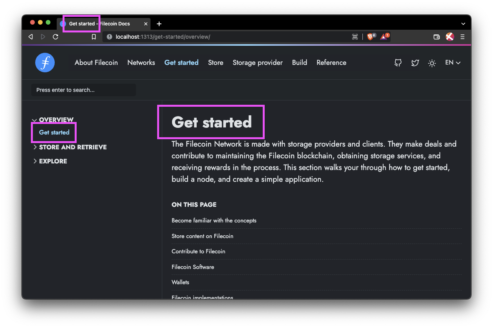
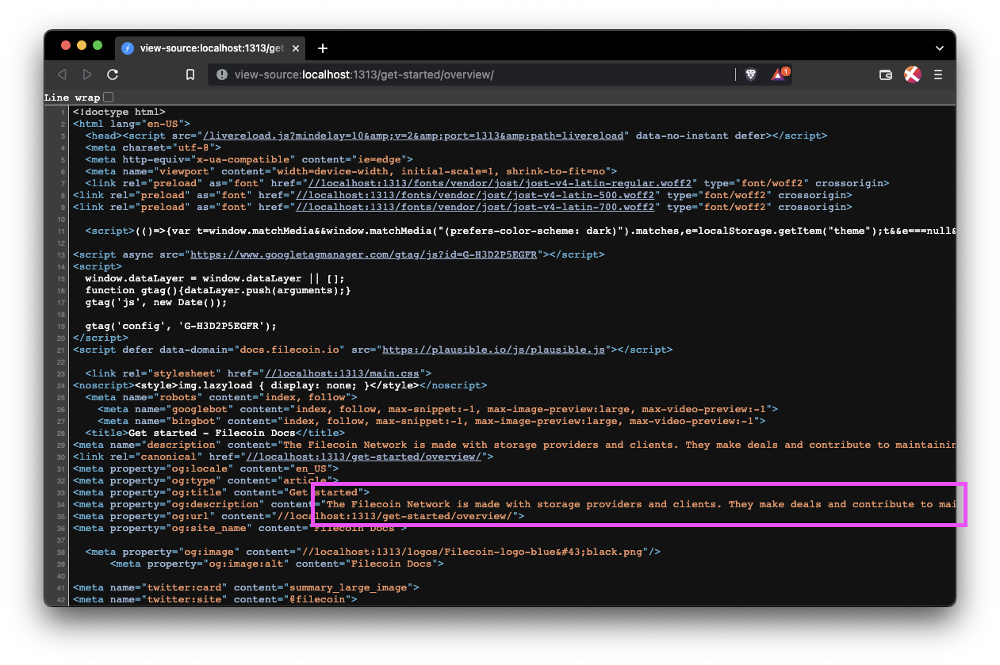
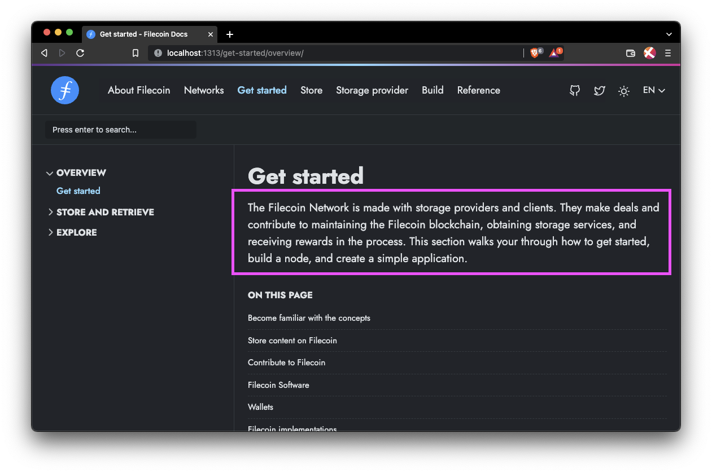
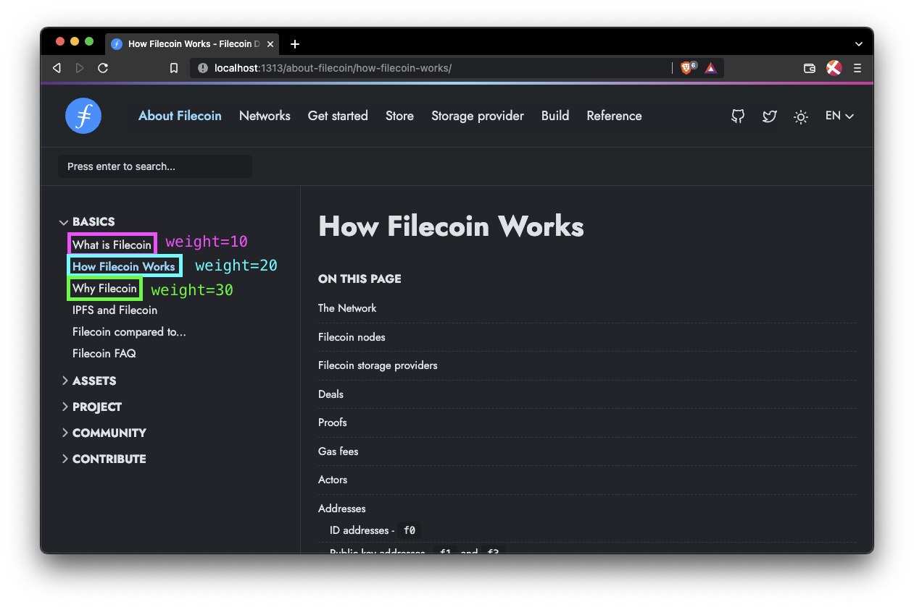
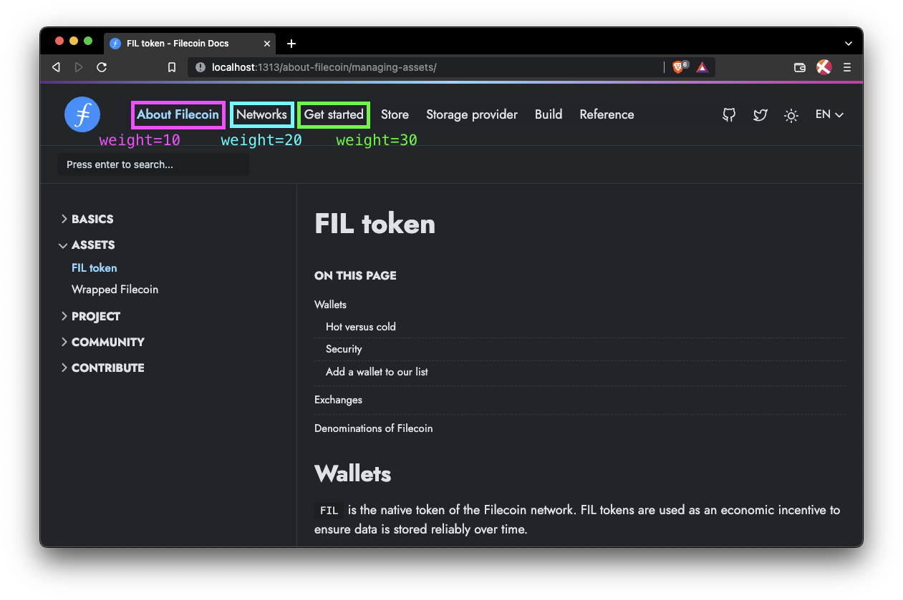
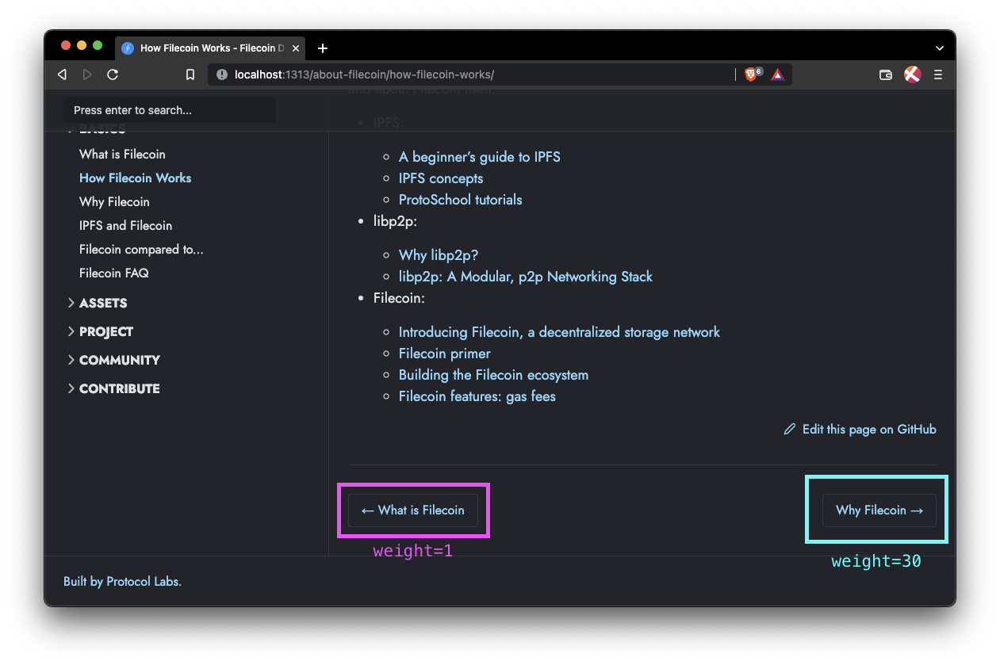
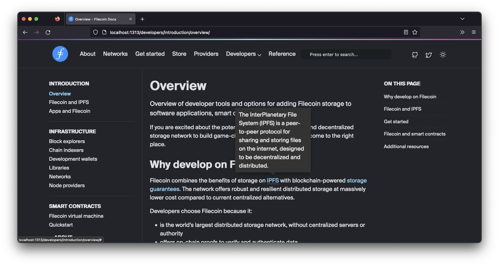

[![Contributors][contributors-shield]][contributors-url]
[![Forks][forks-shield]][forks-url]
[![Issues][issues-shield]][issues-url]
[![MIT License][license-shield]][license-url]
[![Website status][website-status]][website-status-url]

<br>

<picture align=center>
    <source media="(prefers-color-scheme: dark)" srcset="https://bafybeiaqdbd5zbl55x5vjmkwpjhqapt3ks3q4ykaclqkajhsdwyzlbz3g4.ipfs.w3s.link/Filecoin-logo-blue-white.svg">
    <source media="(prefers-color-scheme: light)" srcset="https://bafybeihuk3hsy6d43dn36tqnvf6tvzleiijd5idbf2q7maw3nshnfm6wiu.ipfs.w3s.link/filecoin-logo-black-type.svg">
    
</picture>

<br>
<br>

<h4 align="center"> This repository manages the documentation for the <a href="https://filecoin.io">Filecoin network</a>. This repo also contains the build scripts and tools to create the Filecoin docs website. <a href="https://docs.filecoin.io/">Explore the docs →</a></h4>

<!-- /HEADER -->


<!-- TABLE OF CONTENTS -->
## Table of contents

- [Getting started](#getting-started)
    - [Prerequisites](#prerequisites)
    - [Installation](#installation)
- [About the project](#about-the-project)
    - [Merge process](#merge-process)
    - [Files and folders](#files-and-folders)
- [Contributing](#contributing)
    - [Video guides for site management](#video-guides-for-site-management)
    - [Front-matter variables](#front-matter-variables)
        - [Title](#title)
        - [Description](#description)
        - [Lead](#lead)
        - [Weight](#weight)
        - [Menu](#menu)
            - [Sidebar menu](#sidebar-menu)
            - [Sub-menu](#sub-menu)
        - [Aliases](#aliases)
        - [Draft](#draft)
    - [Features](#features)
        - [Archived content](#archived-content)
        - [Code tabs](#code-tabs)
        - [Tooltips](#tooltips)
- [Issues](#issues)
    - [Priority](#priority)
- [License](#license)
- [Acknowledgments](#acknowledgments)
<!-- /TABLE OF CONTENTS -->


<!-- GETTING STARTED-->
## Getting Started

Follow these simple example steps to get a local version of the site up and running.
<!-- /GETTING STARTED-->


<!-- PREREQUISITES -->
### Prerequisites

To run these commands, you must have [NPM installed](https://www.npmjs.com/). If you already have NPM installed, make sure you are running the latest version:

```shell
npm install npm@latest -g
```
<!-- /PREREQUISITES -->


<!-- INSTALLATION -->
### Installation

Follow these steps to run a copy of this site on your local computer. 

1. Clone this repo:

    ```shell
    git clone https://github.com/filecoin-project/filecoin-docs
    ```

1. Move into the new folder and download the dependencies:

    ```shell
    cd filecoin-docs
    npm install
    ```

1. Build and serve the project locally: 

    ```shell
    npm run start
    ```
    
1. Visit [localhost:1313](http://localhost:1313) to view the site.
1. Press `CTRL` + `c` in the terminal to stop the local server.

If you want to just build the site but _not_ serve it locally, run:

```shell
npm run build
```

A static site will be built and stored in the `/public` directory.
<!-- /INSTALLATION -->


<!-- ABOUT THE PROJECT -->
## About the project

<picture align=center>
    <source media="(prefers-color-scheme: dark)" srcset="https://ipfs.io/ipfs/QmWMouW8v6Rp9mAdmLJAtGD1nS4GfVUE51fYWE4ZCt7WWw">
    <source media="(prefers-color-scheme: light)" srcset="https://ipfs.io/ipfs/QmPDzxTqqPKKwhEys2Ah9hRCowNDx2fbXGj8yKB7T5Qiby">
    
</picture>

This repository manages the documentation for the Filecoin project. This repo also contains the build scripts and tools to create the Filecoin docs website and the API documentation. If you want to learn about Filecoin, how it works, or how to build on it, then you're in the right place.

### Merge process

This project receives _a lot_ of pull requests from many individual contributors. Because of this, the Filecoin Docs team merges any new changes into `main` on Thursdays only. Any commits or PRs into docs any other day will go into the `staging` branch. This has several benefits:

- Reviewing and editing content becomes easier.
- Mass formatting, spelling, and grammar changes can happen on a single branch.
- Breaking changes are much less likely.

Only issues and PRs tagged as `p0` will be merged directly into `main` outside of the Thursday merge window. Take a look at the [Priority section](#priority) for information on how we tag issues.

### Files and folders

This section lists the various files and folders and defines the purpose for each of them.

| Name | Purpose |
| --- | --- |
| `.git`, `.github` | Manage the git configurations and contain information for GitHub constant integrations. |
| `README.md` | This file. Acts as an introduction to this repo and how to spin up a local copy of the `docs.filecoin.io` site. |
| `archetypes/` | Used by Hugo to programmatically create new pages. |
| `assets/` | Assets like JavaScript and fonts used by Hugo to create the static site. These assets are not explorable in a built site. You must reference them in the code before building the site. |
| `babel.config.js` | A configuration file used for the Babel JS compiler. |
| `config/` | Contains the configuration files for Hugo. You can manage things like the top-bar menu and site title within this directory. |
| `content/` | This is where all the `.md` files live that control the content of this site. Most contributions happen in this directory. |
| `data/` | You can supply extra variables for Hugo to use when building pages in this directory. These variables act just like front-matter variables. See [Data Templates](https://gohugo.io/templates/data-templates/) in the Hugo docs for more info. |
| `functions/` | Functions callable from any template, partial, or shortcode within Hugo. |
| `i18n/` | Contains files specific to managing different languages. |
| `layouts/` | This is where web developers will likely spend most of their time. This folder contains the shortcodes and partials that Hugo uses to scaffold and build the site. |
| `node_modules/` | Where NPM throws its packages. If you see this in GitHub, something's gone wrong. It should only exist on your computer after you run `npm install`. |
| `package-lock.json` | One of the NPM configuration files. Specify which version of packages to download. |
| `package.json` | Another one of the NPM configuration files. Specifies which packages to download but doesn't specify which _version_ of the package to grab.
| `resources/` | A cache where Hugo throws generated files like CSS and JSON after `npm run build` has been called. Unless `npm run clean` is called, Hugo will re-use these files when calling `npm run build`. |
| `static/` | Images, CSS, fonts, and other misc files that are available at `docs.filecoin.io/` when the site is built. For example, `docs.filecoin.io/site.webmanifest`.
| `theme.toml` | A Hugo configuration file that specifies which theme to use. This file should not change that often. |
<!-- /ABOUT THE PROJECT -->


<!-- CONTRIBUTING -->
## Contributing

Want to help out? Pull requests (PRs) are always welcome! If you want to help out but aren't sure where to start, check out the [issues board](https://github.com/filecoin-project/filecoin-docs/issues).

### Front-matter variables 

The front-matter is that small section of metadata you can find at the top of each `.md` file within the [`/content` folder](https://github.com/filecoin-project/filecoin-docs/tree/main/content/en). Each variable has a specific purpose, and while not all are necessary, it's useful to know what they do and why they exist. 

```YAML
---
title: "Get started"
description: "The Filecoin Network is made with storage providers and clients. They make deals and contribute to maintaining the Filecoin blockchain, obtaining storage services, and receiving rewards in the process. This section walks you through how to get started, build a node, and create a simple application."
lead: "The Filecoin Network is made with storage providers and clients. They make deals and contribute to maintaining the Filecoin blockchain, obtaining storage services, and receiving rewards in the process. This section walks your through how to get started, build a node, and create a simple application."
menu:
    getstarted:
        parent: "getstarted-overview"
aliases:
    - /get-started
    - /how-to/install-filecoin
---
```

It's also good to note that we use the YAML as our front-matter format. We could use [JSON or TOML](https://gohugo.io/content-management/front-matter#front-matter-formats) if we really wanted, but we found YAML the easiest to read. Plus, _yammal_ is fun to say.

This list has been created in order of commonality; variables you will come across most often are closer to the top of this list.

#### Title

The `title` variable defines what the `<h1>` tag on this page will say, along with the contents of `<title>` in this page's `<head>`. This variable also defines what is shown as the sidebar item; however, this can be overwritten in the `menus` config file.

```YAML
---
title: "Get started"
---
```



#### Description

The `description` variable defines what is in the [meta `<description>`](https://moz.com/learn/seo/meta-description) tag within the `<head>` tag of this page's HTML. This description often shows up in search engine results and social network embeds. This description is meant to give the reader an idea of the content on this page and how it relates to their search query.

```YAML
---
description: "The Filecoin Network is made with storage providers and clients. They make deals and contribute to [...]"
---
```



#### Lead

The `lead` variable defines the content of the first paragraph on a page. This is usually an introduction, informing the reader what this page is referring to, what they're about to learn, and any prerequisites for understanding the content on this page. Often, the content of this variable is the same as the `description` variable.

```YAML
---
lead: "The Filecoin Network is made with storage providers and clients. They make deals and contribute to [...]"
---
```



#### Weight

The `weight` variable defines where this page or menu item should be in a menu. The lower the number, the closer to the start of the menu this page will be. If set, `weight` should be non-zero, as `0` is interpreted as an unset weight. There is no upper limit for a weight value.

In the top-bar menu, a lower number will cause the menu item to be further to the left in a regular view or further to the top in a mobile view.

This example is from the `/config/_default/menus/menus.en.toml` file:

```
[[main]]
  name = "About Filecoin"
  url = "/about-filecoin/what-is-filecoin"
  weight = 10
  
[[main]]
  name = "Networks"
  url = "/networks/overview"
  weight = 20

[[main]]
  name = "Get started"
  url = "/get-started/overview"
  weight = 30
```



In the sidebar menu, a lower number will cause the menu item or page to be higher up.



The weight of a page also defines the _next_ and _previous_ buttons at the bottom of the page. The _previous_ page will be the page with the closest weight _below_ the current page's weight. The _next_ page will be the page with the closest weight _above_ the current page's weight.



#### Menu

The `menu` variable defines which sidebar menu this page is assigned to, along with which sub-menu this page falls under. This variable is made of three parts:

1. The `menu` delimiter. This tells Hugo that were are about to define the menu object for this page.
1. The section/top-bar menu that this page falls under.
1. The sub-menu within the sidebar that this page falls under.

```YAML
---
menu:
    store:
        parent: "store-filecoin-plus"
---
```

##### Sidebar menu

Each section has its own sidebar menu. The name of each sidebar menu is usually a lowercase version of the name of the section. For sections that contain a space, the sidebar menu name is a lowercase version of the section without the space:

| Section | Sidebar menu name |
| --- | --- |
| Basics | `basics` |
| Store | `store` |
| Storage providers | `providers` |
| Nodes | `nodes` |
| Smart contracts| `smart-contracts` |
| Networks | `networks` |
| Reference | `reference` |


```YAML
menu:
  smart-contracts:
    parent: "smart-contracts-fundamentals"
    identifier: "overview-3c010e7c403589b274c1d6d9dd0311c5"
```

##### Sub-menu

You can think of a sub-menu as the dropdown item in the sidebar menu. Sub-menus are defined in `/config/\_default/menus/menus.en.toml`. 
Each sub-menu is a _child_ of a sidebar menu. A sidebar menu can contain multiple sub-menus, but a sub-menu can only belong to one sidebar menu.

Sub-menus are made up of:

- `name`: The visible text shown to the user.
- `weight`: How high or low this sub-menu is shown within the sidebar.
- `identifier`: A unique string used in the front-matter to specify this particular sub-menu.
- `url`: The default page a user will go to if they click on this sub-menu link.

```YAML
[[main]]
  name = "Smart Contracts"
  url = "/smart-contracts/fundamentals/the-filecoin-virtual-machine/"
  weight = 40
  identifier= "main-smart-contracts"

    [[main]]
      name = "Fundamentals"
      url = "/smart-contracts/fundamentals/the-filecoin-virtual-machine/"
      weight = 10
      parent = "main-smart-contracts"

    [[main]]
      name = "Filecoin EVM runtime"
      url = "/smart-contracts/filecoin-evm-runtime/actor-types/"
      weight = 20
      parent = "main-smart-contracts"
```

To assign a page to a sub-menu, you must supply both the menu object name and the `identifier` value into the front-matter:

```YAML
menu:
    getstarted:
        parent: "getstarted-overview"
```

The identifier of each sub-menu is usually the menu object name and the title of the sub-menu, all in lowercase with dashes `-`:


#### Aliases

The `aliases` variable defines URLs that will redirect to this page. Each page can have multiple `aliases`, but each alias can only appear once throughout all the `.md` files within the `/content` folder.

For example, the `/get-started/overview` page can list `/get-started` as one of its aliases. However, no other page can list `/get-started` as an alias. If you attempt to assign another page the `/get-started` alias, Hugo will throw an error when you or Fleek try to build the website.

Aliases only work for internal links. You cannot assign a redirect to an external website using an alias.

```YAML
---
aliases:
    - /get-started
    - /how-to/install-filecoin
---
```

#### Draft

The `draft` variable, when set to `true`, will hide the page from all site navigation. The page will still be accessible by visiting its URL. If this variable is not set, Hugo will assume that it is set to `false`.

```YAML
draft: true
```

This feature is generally used when we need to share content that isn't fully complete, but some users could benefit from its information at this exact moment.

### Features

This project contains some handy features you can include within your project.

<!-- Archived content -->
#### Archived content

Old pages can be archived and hidden from the sidebar view. However, they can still be accessed for historical purposes. 


To archive a page:

1. Move the page and any associated images into the `/content/en/archive` directory.
1. Add an alias redirect using the original location of this file:

    ```markdown
    ---
    ...
    aliases:
        - "/build/tools/filecoin-pinning-services/"
    ---
    ```

1. Add the following shortcode to the top of the page, just below the front-matter

    ```markdown
    ---

    

    ...
    ```

Take a look at the `/content/en/archive` directory for examples.
<!-- /Archived content -->

<!-- Code tabs -->
#### Code tabs

We can use code tabs to split a section or instruction into different parts based on programming language, operating system, or something else.

The following code creates three code tabs called _JavaScript_, _Go_, and _Rust_:

```markdown



<pre>
function main() {
    console.log("Hello world");
}
</pre>




<pre>
package main
import "fmt"

func main() {
    fmt.Println("Hello world")
}
</pre>





<pre>
fn main() {
    println!("Hello World");
}
</pre>



```
<!-- /Code tabs -->

<!-- Tooltips -->
#### Tooltips

To make understanding terms in the docs a bit easier, users can hover over certain terms to get a short definition. These descriptions are located within a `dict` variable at the top of the `layouts/shortcodes/tooltip.html` shortcode:

```go
<!-- Create an array/map of all possible tooltips. -->
{{ $tooltips := dict
    "dApps" "Decentralized applications that don't rely on centralized infrastructure."
    "IPFS" "The InterPlanetary File System (IPFS) is a peer-to-peer protocol for sharing and storing files on the internet, designed to be decentralized and distributed."
    "Lotus" "The reference node implementation for the filecoin network."
    "Lily" "Software designed to simplify the recording of blockchain data."
    "web3" "A new iteration of the World Wide Web which incorporates concepts such as decentralization, blockchain technologies, and token-based economics."
}}
```

Within your markdown, you can use one of these tooltips with the following syntax:

```markdown
[...] storage on  with blockchain-powered [...]
```

The tooltip should show up once the site has been built:


<!-- /Tooltips -->

<!-- /CONTRIBUTING -->


<!-- ISSUES -->
## Issues 

Found a problem with the Filecoin docs site? [Please raise an issue](https://github.com/filecoin-project/filecoin-docs/issues/new). Be as specific and descriptive as possible; screenshots help!

### Priority

We use `p` tags to define the priority of an issue. The priority is defined by the docs team using the following definitions:

| Label | Impact | Due date | Example |
| ----- | ------ | -------- | ------- |
| P0 | Severely business-impacting | Same day. Drop everything and fix it immediately. | The website is down. |
| P1 | Business-impacting. | Within three days. | The API endpoint for a project is about to change. |
| P2 | Planned project request. | Within two weeks. | A new method will soon be added to a project API. |
| P3 | Suggestion or conceptual update. | No due date. | A blog post discussing the benefits of decentralization for web developers. |
| P4 | Deprioritized suggestions. These will not be addressed unless significat activity or community requests are received. | No due date. | Add a dark theme to the docs. |
<!-- /ISSUES -->


<!-- LICENSE -->
## License

Dual-licensed: [MIT](./LICENSE-MIT), [Apache Software License v2](./LICENSE-APACHE), by way of the [Permissive License Stack](https://protocol.ai/blog/announcing-the-permissive-license-stack/).
<!-- /LICENSE -->


<!-- ACKNOWLEDGMENTS -->
## Acknowledgments

- [Fleek](https://fleek.co) web hosting
- [Hugo](https://gohugo.io) static site generator 
- [Doks](https://getdoks.org) starter theme 
<!-- /ACKNOWLEDGMENTS -->


<!-- MARKDOWN LINKS & IMAGES -->
[contributors-shield]: https://img.shields.io/github/contributors/filecoin-project/filecoin-docs.svg?style=for-the-badge
[contributors-url]: https://github.com/filecoin-project/filecoin-docs/graphs/contributors
[forks-shield]: https://img.shields.io/github/forks/filecoin-project/filecoin-docs.svg?style=for-the-badge
[forks-url]: https://github.com/filecoin-project/filecoin-docs/network/members
[stars-shield]: https://img.shields.io/github/stars/filecoin-project/filecoin-docs.svg?style=for-the-badge
[stars-url]: https://github.com/filecoin-project/filecoin-docs/stargazers
[issues-shield]: https://img.shields.io/github/issues/filecoin-project/filecoin-docs.svg?style=for-the-badge
[issues-url]: https://github.com/filecoin-project/filecoin-docs/issues
[license-shield]: https://img.shields.io/badge/license-MIT-blueviolet?style=for-the-badge
[license-url]: https://github.com/filecoin-project/filecoin-docs/blob/master/LICENSE.txt
[product-screenshot]: ./static/images/filecoin-docs-homepage.png
[website-status]: https://img.shields.io/website.svg?down_color=red&style=for-the-badge&url=https%3A%2F%2Flotus.filecoin.io
[website-status-url]: https://docs.filecoin.io/
<!-- /MARKDOWN LINKS & IMAGES -->

<!-- markdownlint-disable-file -->

