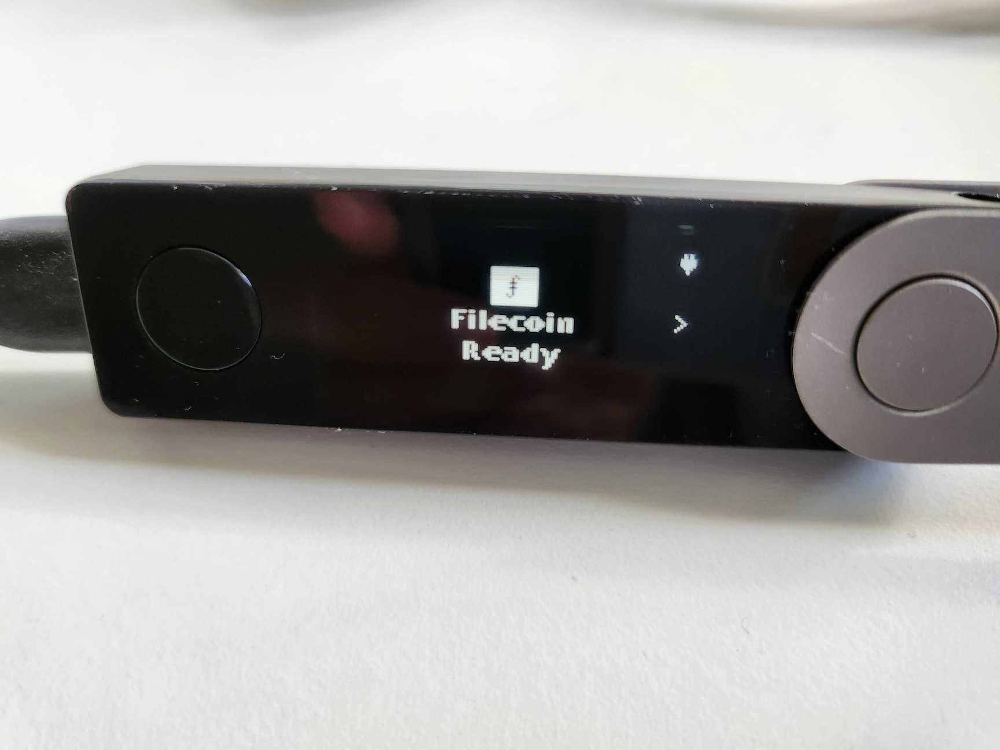
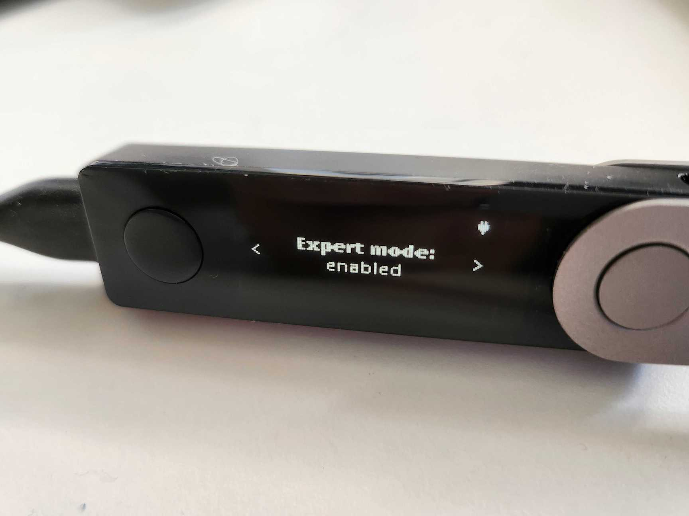
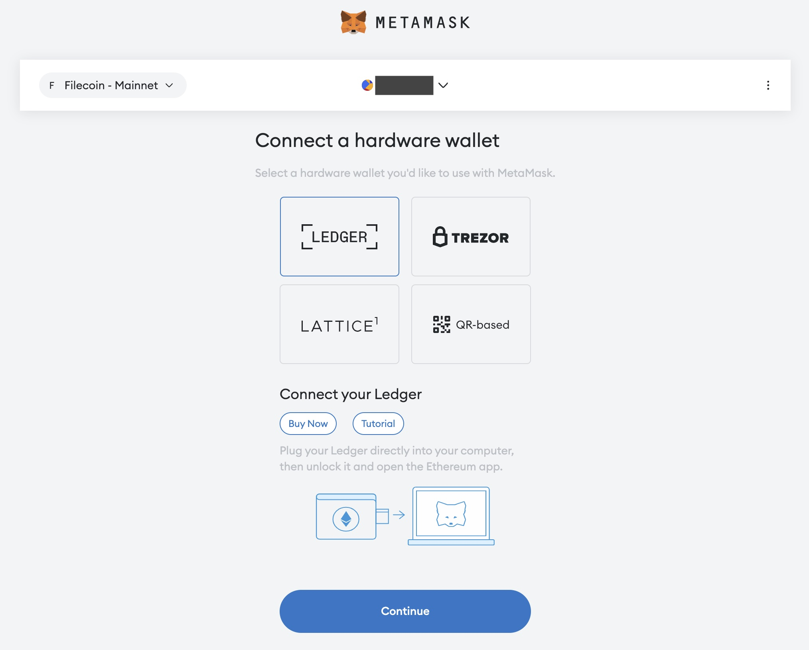
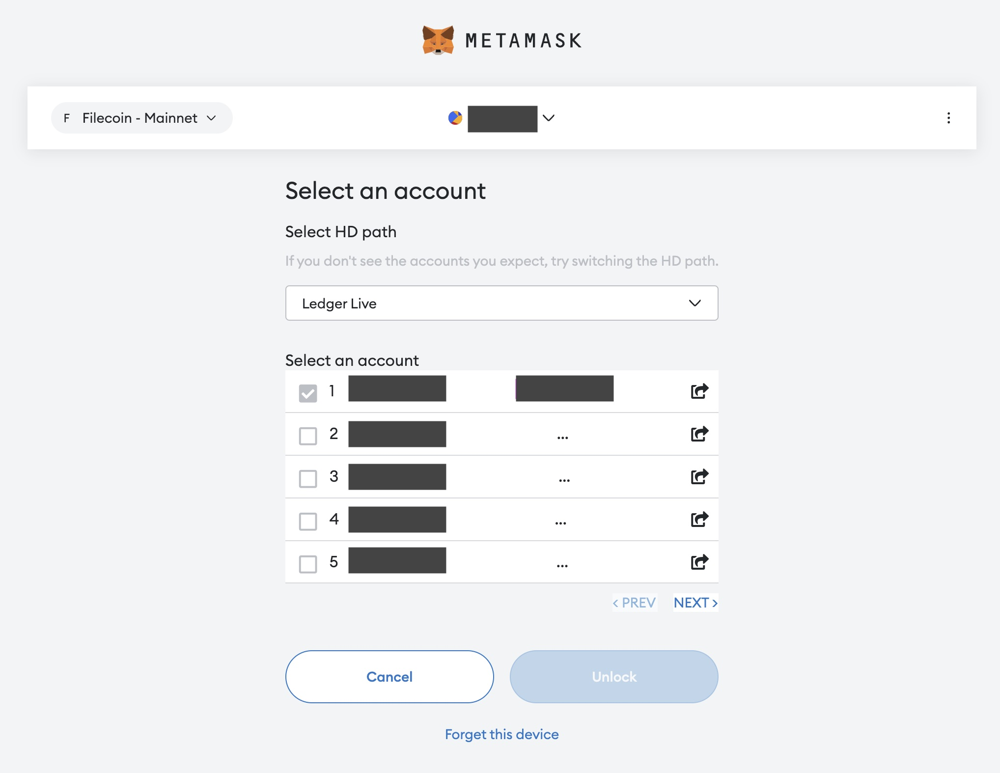
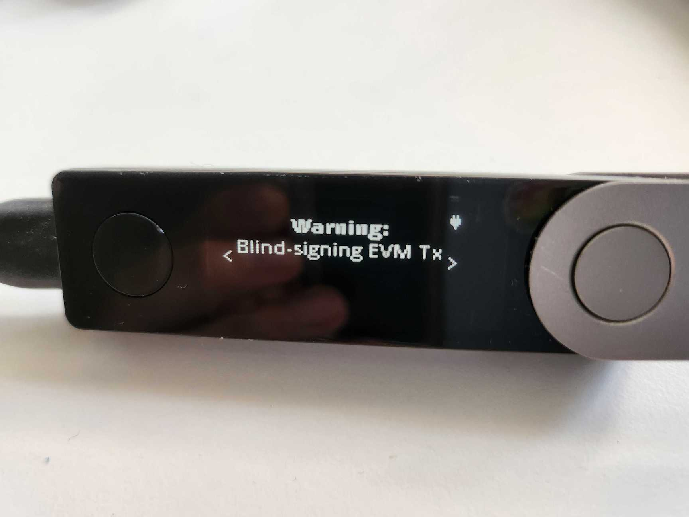

# Metamask setup

## Using ChainID

ChainID.network is a website that lets users easily connect their wallets to EVM-compatible blockchains. ChainID is the simplest way to add the Filecoin network to your MetaMask wallet.



1. Navigate to [chainid.network](https://chainid.network).
2. Search for `Filecoin Mainnet`.
3. Click **Connect Wallet**.
4. Click **Approve** when prompted to _Allow this site to add a network_.
5. Click **Switch network** when prompted by MetaMask.
6. Open MetaMask from the browser extensions tab.
7. You should see _Filecoin_ listed at the top.

You can now use MetaMask to interact with the Filecoin network.



1. Navigate to [chainid.network](https://chainid.network).
2. Search for `Filecoin Calibration`.
3. Click **Connect Wallet**.
4. Click **Approve** when prompted to _Allow this site to add a network_.
5. You may be shown a warning that you are connecting to a test network. If prompted, click **Accept**.
6. Click **Switch network** when prompted by MetaMask.
7. Open MetaMask from the browser extensions tab. You should see _Filecoin Calibration_ listed at the top.

You can now use MetaMask to interact with the Filecoin network.



1. Navigate to [chainid.network](https://chainid.network).
2. Search for `Filecoin Local testnet`.
3. Click **Connect Wallet**.
4. Click **Approve** when prompted to _Allow this site to add a network_.
5. You may be shown a warning that you are connecting to a test network. If prompted, click **Accept**.
6. Click **Switch network** when prompted by MetaMask.
7. Open MetaMask from the browser extensions tab. You should see _Filecoin Local testnet_ listed at the top.

You can now use MetaMask to interact with the Filecoin network.



## Manual process

If you can't or don't want to use ChainID, you can add the Filecoin network to your MetaMask manually.

### Prerequisites

Before we get started, you’ll need the following:

* A [Chromium-based browser](https://en.wikipedia.org/wiki/Chromium\_web\_browser#Browsers\_based\_on\_Chromium), or [Firefox](https://www.mozilla.org/en-CA/firefox/products/).
* A browser with [MetaMask](https://metamask.io/) installed.

### Steps

The process for configuring MetaMask to use Filecoin is fairly simple but has some very specific variables that you must copy exactly.

1. Open your browser and open the MetaMask plugin. If you haven’t opened the MetaMask plugin before, you’ll be prompted to create a new wallet. Follow the prompts to create a wallet.
2. Click the user circle and select **Settings.**
3. Select **Networks**.
4. Click **Add a network**.
5. Scroll down and click **Add a network manually**.
6. Enter the following information into the fields:



<table><thead><tr><th width="159">Field</th><th>Value</th></tr></thead><tbody><tr><td>Network name</td><td><code>Filecoin</code></td></tr><tr><td>New RPC URL</td><td>Either: - <code>https://api.node.glif.io/rpc/v1</code> - <code>https://filecoin.chainup.net/rpc/v1</code> - <code>https://rpc.ankr.com/filecoin</code></td></tr><tr><td>Chain ID</td><td><code>314</code></td></tr><tr><td>Currency symbol</td><td><code>FIL</code></td></tr></tbody></table>



<table><thead><tr><th width="176">Field</th><th>Value</th></tr></thead><tbody><tr><td>Network name</td><td><code>Filecoin Calibration testnet</code></td></tr><tr><td>New RPC URL</td><td>Either: - <code>https://api.calibration.node.glif.io/rpc/v1</code> - <code>https://filecoin-calibration.chainup.net/rpc/v1</code></td></tr><tr><td>Chain ID</td><td><code>314159</code></td></tr><tr><td>Currency symbol</td><td><code>tFIL</code></td></tr></tbody></table>



<table><thead><tr><th width="201">Field</th><th>Value</th></tr></thead><tbody><tr><td>Network name</td><td><code>Filecoin Local testnet</code></td></tr><tr><td>New RPC URL</td><td><code>http://localhost:1234/rpc/v1</code></td></tr><tr><td>Chain ID</td><td><code>31415926</code></td></tr><tr><td>Currency symbol</td><td><code>tFIL</code></td></tr></tbody></table>



7. Pick one block explorer from the [Networks section](../../networks/mainnet/), and enter the URL into the **Block explorer (optional)** field.
8. Review the values in the fields and click **Save**.
9. The Filecoin network should now be shown in your MetaMask window.
10. Done!

You can now use MetaMask to interact with the Filecoin network.

## Ledger hardware wallet

MetaMask is compatible with the Ledger hardware wallet. There are 2 options for Ledger apps that support Filecoin:
- **Filecoin Ledger App** - compatible with MetaMask or the [Glif.io](https://glif.io/wallet) wallet 
- **Ethereum Ledger App** - ***currently deprecated*** for Filecoin as of v1.15.0 (previous versions will work) until Ledger enables their upcoming Dynamic Networks feature (see [this Ledger issue](https://github.com/LedgerHQ/app-ethereum/issues/765#issuecomment-2813565683) for more info)

Follow the instructions below to connect your Filecoin addresses within MetaMask to your Ledger wallet. This guide assumes you have [Ledger Live](https://www.ledger.com/ledger-live) and [MetaMask](https://metamask.io/) installed on your computer.

### Install the Ledger app

Before you can connect MetaMask to your Ledger, you must install the Filecoin Ledger app on your Ledger device.

1. Open Ledger Live and navigate to **My Ledger**.
2. Connect your Ledger device and unlock it.
3. Confirm that you allow My Ledger to access your Ledger device. You can do that by clicking both buttons on your Ledger device simultaneously.
4. Go back to Ledger Live on your computer.
5. In **My Ledger**, head over to **App catalog** and search for **Filecoin**.
6. Click **Install**.

For more details on the official Filecoin Ledger app, [check out the Ledger documentation](https://support.ledger.com/article/4402721277329-zd?redirect=false).

### Enable expert-mode

MetaMask requires that the Filecoin app on your Ledger device is set to _Expert mode_.

1.  Open the Filecoin app on your Ledger device.

    
2.  Use the buttons on your device to navigate to **Expert mode**.

    
3. Press both buttons simultaneously to _enable_ **Expert mode**.

### Connect to MetaMask

Once you have installed the Filecoin app on your Ledger device and enabled expert mode, you can connect your device to MetaMask.

1. Open your browser and open the MetaMask extension.
2.  In the **Accounts** menu, select **Add hardware wallet**.

    
3.  Select **Ledger**

    
4.  A list of accounts should appear. Select an `0x...` account.

    
5. Done!

That's it! You've now successfully connected your Ledger device to MetaMask. When you submit any transactions through MetaMask using this account, the Filecoin Ledger app will prompt you for a confirmation on the Ledger device.

You may see a _blind signing_ warning on your MetaMask device. This is expected, and is the reason why **Expert Mode** must be enabled before you can interact with the Filecoin Ledger app.

[Was this page helpful?](https://airtable.com/apppq4inOe4gmSSlk/pagoZHC2i1iqgphgl/form?prefill\_Page+URL=https://docs.filecoin.io/basics/assets/metamask-setup)
