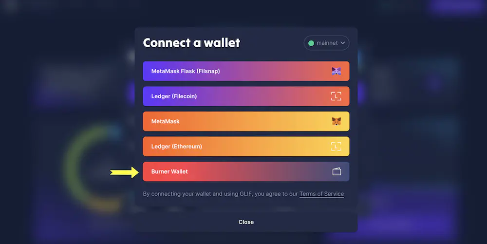
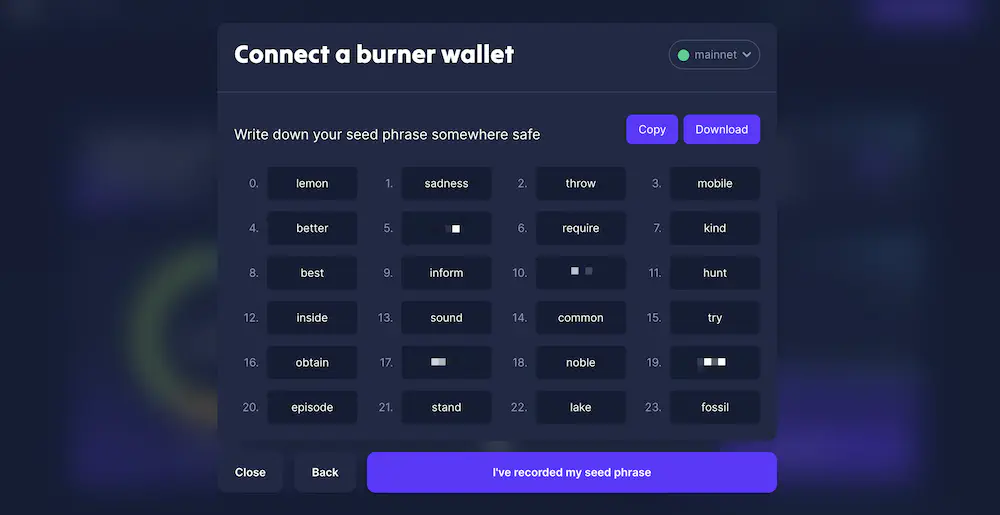
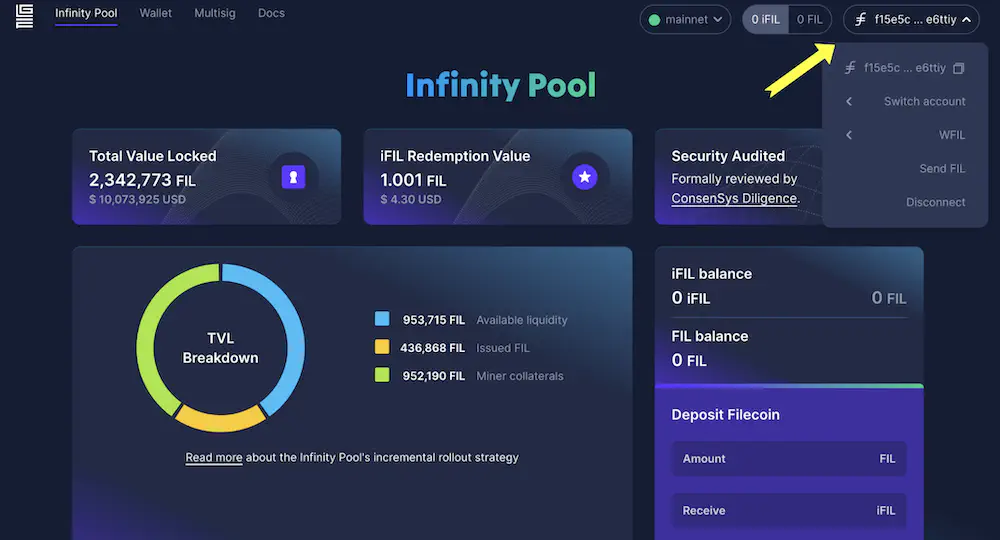

# Transfer FIL

After FVM launched, a new Ethereum-compatible address type (`f410` address) was introduced to the Filecoin network. This new `f410` address can be converted into Ethereum-style addresses starting with `0x` so that it can be used in any Ethereum-compatible toolings or dApps. Filecoin addresses start with `f`, so we will use the `f` address in this tutorial. And Ethereum-style addresses start with `0x`, so we will use the `0x` address in this tutorial.

There are four paths for transferring FIL tokens across the Filecoin network, depending on which address type you are transferring from and to.

|                        | From an `0x` address                                                                                                | From a `f` address                                                                                       |
| ---------------------- | ------------------------------------------------------------------------------------------------------------------- | -------------------------------------------------------------------------------------------------------- |
| **To an `0x` address** | [`0x` => `0x` address](https://docs.filecoin.io/basics/assets/transfer-fil/#eth-style-address-to-eth-style-address) | [`f` =>`0x` address](https://docs.filecoin.io/basics/assets/transfer-fil/#filecoin-to-eth-style-address) |
| **To a `f` address**   | [`0x` => `f` address](https://docs.filecoin.io/basics/assets/transfer-fil/#eth-style-address-to-filecoin)           | [`f` => `f` address](https://docs.filecoin.io/basics/assets/transfer-fil/#filecoin-to-filecoin)          |


**ASSETS ON THE FILECOIN NETWORK ARE NOT AVAILABLE ON ANY OTHER NETWORK**\
\
Remember that Filecoin is fully compatible with Ethereum tools, like wallets. But that doesn’t mean you’re using the Ethereum network. These instructions transfer assets only within the Filecoin network. [Learn how to configure your Ethereum wallet on the Filecoin network](https://docs.filecoin.io/basics/assets/metamask-setup/).


## 0x => 0x address

If you want to transfer FIL tokens from one `f4` address to another `f4` address using their corresponding `0x` addresses, you need to understand how to convert between `f4` and `0x` addresses.

* If you have `f4` address, you can convert it to `0x` address using [Beryx Address converter](https://beryx.zondax.ch/address\_converter).
* If you have a `0x` address, you can directly search it on [Filfox Explorer](https://filfox.info/en), which will show the `0x` address and corresponding `f4` address.

Apart from that, you just need to follow the standard process using your preferred Ethereum-compatible wallet, like MetaMask, MethWallet, etc. For instance, [MetaMask has a simple guide](https://support.metamask.io/hc/en-us/articles/360015488931-How-to-send-tokens-from-your-MetaMask-wallet) for how to send Ethereum from one account to another.

## 0x => f address

If you want to transfer FIL tokens from an Ethereum style `0x` address to another Filecoin address type, like an `f1` or `f3` address, follow the steps in [FilForwarder](../../smart-contracts/filecoin-evm-runtime/filforwarder.md) tutorial.

## f => 0x address

Most wallets and exchanges currently support Filecoin `f1` or `f3` addresses, and many of them already fully support `f4` and `0x` addresses, including [OKX](https://www.okx.com/markets/prices/filecoin-fil), [Kraken](https://www.kraken.com/), [Btcturk](https://www.btcturk.com/), etc. But there are some exchanges that are still implementing the support for `f4` addresses. If your preferred wallets and exchanges don’t let you directly transfer FIL to an `f4` or Ethereum-style `0x` address, We recommend filing a support issue with the exchange to help accelerate the support of `f4` addresses.

The process for sending FIL from a Filecoin `f` address to an Ethereum-style `0x` address depends on the wallet or exchange you use.

### Ledger device

Ledger Live supports sending to a Filecoin `f4` address, which has an automatic `0x` equivalent that you can look up on any [block explorer](../../networks/mainnet/explorers.md). This allows you to directly transfer your FIL to an Ethereum-style `0x` address using its `f4` equivalent.


Sending directly to a `0x` address does not work in Ledger Live. You must use the `f4` equivalent.


### Hot wallet

A hot wallet is a cryptocurrency wallet that is always connected to the internet. They allow you to store, send, and receive tokens. Because hot wallets are always connected to the internet, they tend to be somewhat more vulnerable to hacks and theft than cold storage methods. However, they are generally easier to use than cold wallets and do not require any specific hardware like a Ledger device.

If you want to transfer your FIL tokens from the `f1\f3` to the `0x` address, but the wallet or exchange you are using does not support the `f4` and `0x` style addresses. Then, you can create a _burner wallet_ using Glif, transfer FIL to the burner wallet, and then transfer FIL from the burner wallet to the `0x` address on MetaMask.

1. Navigate to [glif.io/](https://www.glif.io/en?txtype=send). Create a **Burner wallet**.

2. Click **Create Seed Phase**. Write down your seed phrase somewhere safe. You can also copy or download the seed phrase. You will need it later.

3. Click **I’ve recorded my seed phrase**. Using your seed phrase, enter the missing words in the blank text fields.
4. Click **Next**, and then **Connect**. The burner wallet is created
5. In the upper left corner of your wallet dashboard, click on the double squares icon next to your address to copy it. Record this address. You will need it later.

6. From your main wallet account or exchange, transfer your FIL token to this address.
7. Connect to MetaMask and copy your `0x` address.
8. Once the funds appear in the burner wallet, click on **Send FIL**.
9. Enter the necessary information into the text fields:

* In the **Recipient** field, enter your `0x` style address. GLIF automatically converts it to an `f4` address.
* In the **Amount** field, enter the amount of FIL to send. Make sure you have enough FIL to cover the GAS cost.

.webp>)

10. Click **Send**. The FIL will arrive in your MetaMask wallet shortly.

### Exchange

If you are transferring FIL from any exchange to your `0x` address on MetaMask, make sure the exchange supports withdrawing FIL to the `0x` or `f410` address. If not, you will need extra steps to withdraw FIL to your `0x` address. Let’s take Coinbase as an example; you can follow this [Guide: How to transfer FIL from Coinbase to a Metamask Wallet (0x)](https://filecointldr.io/article/guide-how-to-transfer-fil-from-coinbase-to-a-metamask-wallet-0x).

## f to f address 

There are no special steps or requirements for sending Filecoin from one Filecoin-style address to another on the Filecoin network.
