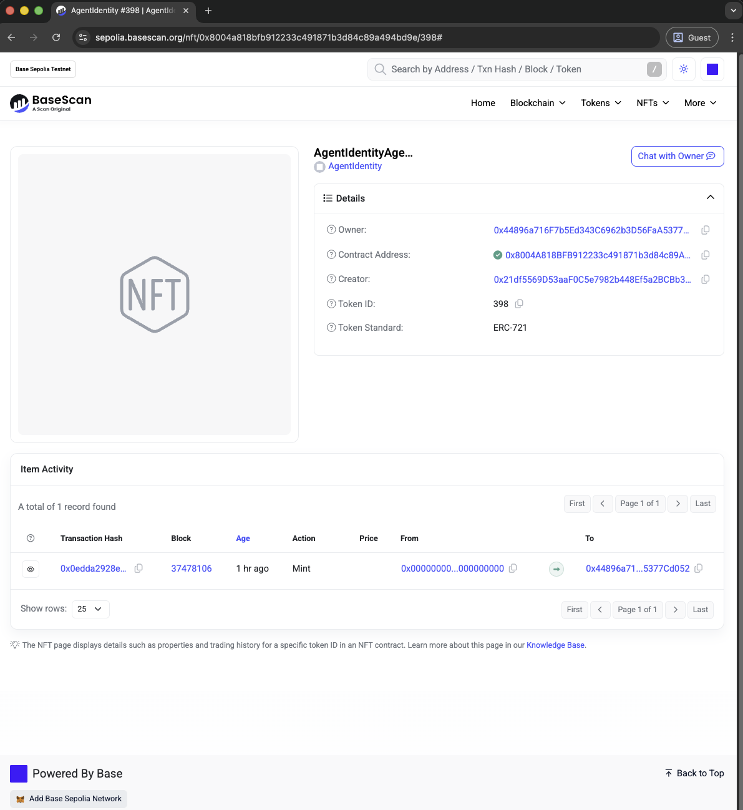

# Filecoin Pin for ERC-8004 Agents

Learn how to register a trustless autonomous agent on the ERC-8004 Identity Registry with verifiable persistent storage using Filecoin Pin for the agent registration file.

***

## Overview

This tutorial walks you through registering an [ERC-8004](https://eips.ethereum.org/EIPS/eip-8004) compliant agent with cryptographically-verified persistent storage on Filecoin. You'll create an agent card (metadata describing your agent's capabilities), store it on Filecoin & IPFS using Filecoin Pin, and register it on-chain as an NFT on Base Sepolia.

**What you'll learn:**
- How to create an ERC-8004 compliant agent card
- How to use Filecoin Pin for persistent, verifiable storage
- How to register an agent on the ERC-8004 Identity Registry
- How to verify Filecoin storage proofs and on-chain registration

**What you'll build:**
A GitHub Integration Agent that references GitHub's official MCP server, demonstrating how real-world services can be integrated with ERC-8004.

***

## Example Code and Scripts

For example code and helper scripts to help with using Filecoin Pin and agent registration, check out the quickstart repository:

**GitHub Repository**: [FilOzone/FilecoinPin-for-ERC8004](https://github.com/FilOzone/FilecoinPin-for-ERC8004)

***

## Why Filecoin Pin for Agent Storage?

Agent cards need persistent storage with provable guarantees. Unlike generic IPFS pinning services that may stop hosting your data without notice, Filecoin Pin provides:

- ✅ **Cryptographic proof** your data is stored (daily PDP proofs)
- ✅ **Ongoing verification** ensures storage persistence
- ✅ **Decentralized** storage across a global network
- ✅ **IPFS compatible** - works with existing tools and gateways
- ✅ **Crypto payments** - onchain payments
- ✅ **Limited time - sponsored storage coming soon** available for ERC-8004 builders

***

## Prerequisites

### Required Tools

Before starting, you'll need:

1. **Filecoin Pin CLI** - Follow the complete setup guide here:
   - [Filecoin Pin Getting Started](getting-started.md)
   - This covers wallet creation, funding your wallet with FIL and USDFC, and payment setup

2. **Foundry** - Ethereum development toolkit for contract interactions
   ```bash
   curl -L https://foundry.paradigm.xyz | bash
   foundryup
   ```

3. **jq** (optional but recommended) - JSON processor for viewing outputs
   ```bash
   # macOS
   brew install jq

   # Ubuntu/Debian
   sudo apt-get install jq
   ```

### Required Tokens

You'll need testnet tokens on **two networks**:

#### Filecoin Calibration Testnet
- **tFIL** (testnet Filecoin) - For gas fees
  - Request tFIL from [Filecoin Calibration Faucet](https://faucet.calibnet.chainsafe-fil.io/funds.html)
  - Amount requested: 100 tFIL
- **USDFC** (Filecoin stablecoin) - For storage payments
  - Request test USDFC from [Filecoin Calibnet USDFC Faucet](https://forest-explorer.chainsafe.dev/faucet/calibnet_usdfc)
  - Or Mint at [USDFC website](https://stg.usdfc.net) (requires tFIL as collateral)
  - Amount needed: ~5 USDFC

#### Base Sepolia Testnet
- **Sepolia ETH** - For NFT minting and registration
  - Request test ETH on Base Sepolia on [Faucet](https://www.alchemy.com/faucets/base-sepolia)
  - Amount needed: ~0.001 ETH

> **NOTE!** The same Ethereum wallet works on both Filecoin Calibration and Base Sepolia. You only need one private key.

### ERC-8004 Registry Address

We'll be using the reference ERC-8004 Identity Registry deployed on the Base Sepolia testnet:
```
0x8004A818BFB912233c491871b3d84c89A494BD9e
```

***

## Step 1: Create Your Agent Card

An agent card is a JSON file that describes your agent's capabilities, endpoints, and trust model according to the [ERC-8004 specification](https://eips.ethereum.org/EIPS/eip-8004).

### Create the Agent Card JSON

Create a file named `github-agent-card.json`:

```bash
cat > github-agent-card.json << 'EOF'
{
  "type": "https://eips.ethereum.org/EIPS/eip-8004#registration-v1",
  "name": "GitHub Integration Agent",
  "description": "AI agent providing GitHub repository, issue, and pull request management capabilities through GitHub's official MCP server. Enables automated code review, issue triage, PR management, and repository analysis.",
  "image": "https://github.githubassets.com/images/modules/logos_page/GitHub-Mark.png",
  "endpoints": [
    {
      "name": "MCP",
      "endpoint": "https://api.githubcopilot.com/mcp/",
      "version": "1.0.0",
      "capabilities": {
        "tools": [
          {
            "name": "repository_management",
            "description": "Browse code, search files, analyze commits across GitHub repositories"
          },
          {
            "name": "issue_management",
            "description": "Create, update, search, and manage GitHub issues with AI assistance"
          },
          {
            "name": "pull_request_management",
            "description": "Review PRs, manage approvals, merge conflicts, and code reviews"
          }
        ]
      }
    },
    {
      "name": "agentWallet",
      "endpoint": "eip155:84532:0x0000000000000000000000000000000000000000"
    }
  ],
  "registrations": [],
  "supportedTrust": [
    "reputation"
  ]
}
EOF
```

### Validate the JSON

Verify your agent card is valid JSON:

```bash
jq . github-agent-card.json
```

You should see the formatted JSON output with syntax highlighting.

### Understanding the Agent Card Structure

Key fields in the agent card:

- **`type`** - Links to the ERC-8004 specification version
- **`name`** - Human-readable name for your agent
- **`description`** - What the agent does
- **`image`** - Avatar or logo URL
- **`endpoints`** - Array of service endpoints:
  - **MCP endpoint** - Points to GitHub's official MCP server
  - **agentWallet** - The agent's wallet address (chain:chainId:address format)
- **`capabilities`** - Tools and functions the agent provides
- **`supportedTrust`** - Trust mechanisms (reputation, stake, etc.)

> **💡 Note**: This example uses GitHub's real public MCP server at `https://api.githubcopilot.com/mcp/`. You can replace this with your own MCP server endpoint.

***

## Step 2: Upload to Filecoin Pin

Now we'll store the agent card on Filecoin with PDP proofs.

### Setup Payment System

If this is your first time using Filecoin Pin, set up the payment system:

```bash
export PRIVATE_KEY="0x..."  # Your wallet private key
filecoin-pin payments setup --auto
```

This configures your wallet to pay for storage automatically.
This may take a few minutes to complete.

You'll see output similar to:

```bash
filecoin-pin payments setup --auto                                                     
┌  Filecoin Onchain Cloud Payment Setup
│
│  Running in auto mode...
│
◇  ✓ Connected to calibration
│
◇  ✓ Balance check complete
│
│  Account:
│    Wallet: 0x44896a716F7b5Ed343C6962b3D56FaA5377Cd052
│    Network: calibration
│  Balances:
│    FIL: 354.9996 tFIL
│    USDFC wallet: 199.6428 USDFC
│    USDFC deposited: 0.0000 USDFC
│
◇  ✓ Deposited 1.0000 USDFC
│
│  Transaction details:
│    Deposit: 0x3b9cb71e21c9df895c9a2f50df437e0dfa5cf00d20bff6cf6deea0c231b5b128
│
◇  ━━━ Configuration Summary ━━━
│
│  Network: calibration
│  Deposit: 1.0000 USDFC
│  Storage: ~372.4 GiB for 1 month
│  Status: Ready to upload
│
└  Payment setup completed successfully
```

> **NOTE!** You only need to run this once per wallet. Subsequent uploads will use the existing payment configuration.

### Upload Your Agent Card

Upload the agent card to Filecoin:

```bash
filecoin-pin add --auto-fund github-agent-card.json
```

The `--auto-fund` flag ensures your storage provider wallet has sufficient funds.

You'll see output similar to:

```bash
filecoin-pin add --auto-fund github-agent-card.json
┌  Filecoin Pin Add
│
◇  ✓ File validated (1.3 KiB)
│
◇  ✓ Connected to calibration
│
◇  ✓ Minimum payment setup verified (~0.066 USDFC required)
│
◇  ✓ File packed with root CID: bafybeihhal5hlbylkibniig6j72wdrm7lr4nf6z47natleh2jkyosrg7di
│
◇  ✓ IPFS content loaded (1.5 KiB)
│
◇  ✓ Funding requirements met
│
◑  Creating storage context..Provider 0xB709A785c765d7d3F7d94dbA367DA6a611D7972b failed ping test: fetch failed
◇  ✓ Storage context ready
│
│  Storage Context
│
│    Data Set ID: undefined
│    Provider: pspsps-calibnet
│
◇  ━━━ Add Complete ━━━
│
│  Network: calibration
│
│  Add Details
│    File: github-agent-card.json
│    Size: 1.5 KiB
│    Root CID: bafybeihhal5hlbylkibniig6j72wdrm7lr4nf6z47natleh2jkyosrg7di
│
│  Filecoin Storage
│    Piece CID: bafkzcibdricannieziik7jobrwqia4qfq6g7cwxfspsppv5aa76uev4u6ek7awz5
│    Piece ID: 0
│    Data Set ID: 11653
│
│  Storage Provider
│    Provider ID: 11
│    Name: pspsps-calibnet
│    Direct Download URL: https://calibnet.pspsps.io/piece/bafkzcibdricannieziik7jobrwqia4qfq6g7cwxfspsppv5aa76uev4u6ek7awz5
│
└  Add completed successfully

```

> **NOTE!** Data storage on the Calibration Testnet has a retention period of approximately 1 week. For production use and to ensure your data remains available, please switch to Filecoin mainnet.

### Save Important Values

Copy these values from the output - you'll need them later:

- **Root CID** - The IPFS content identifier (e.g., `bafybeihhal5hlbylkibniig6j72wdrm7lr4nf6z47natleh2jkyosrg7di`).
- **Dataset ID** - For checking PDP proof status (e.g., `11653`)

> **⚠️ IMPORTANT**: The Token URI for ERC-8004 registration must include the filename! Format it as:
> ```
> ipfs://<ROOT_CID>/github-agent-card.json
> ```

### Verify IPFS Retrieval

Test that your agent card is accessible via IPFS (it may take a few minutes to propagate!):

```bash
# Replace <ROOT_CID> with your actual CID
curl -s "https://ipfs.io/ipfs/<ROOT_CID>/github-agent-card.json" | jq .
```

You should see your agent card JSON returned:

```bash
curl -s "https://ipfs.io/ipfs/bafybeihhal5hlbylkibniig6j72wdrm7lr4nf6z47natleh2jkyosrg7di/github-agent-card.json" | jq .
{
  "type": "https://eips.ethereum.org/EIPS/eip-8004#registration-v1",
  "name": "GitHub Integration Agent",
  "description": "AI agent providing GitHub repository, issue, and pull request management capabilities through GitHub's official MCP server. Enables automated code review, issue triage, PR management, and repository analysis.",
  "image": "https://github.githubassets.com/images/modules/logos_page/GitHub-Mark.png",
  "endpoints": [
    {
      "name": "MCP",
      "endpoint": "https://api.githubcopilot.com/mcp/",
      "version": "1.0.0",
      "capabilities": {
        "tools": [
          {
            "name": "repository_management",
            "description": "Browse code, search files, analyze commits across GitHub repositories"
          },
          {
            "name": "issue_management",
            "description": "Create, update, search, and manage GitHub issues with AI assistance"
          },
          {
            "name": "pull_request_management",
            "description": "Review PRs, manage approvals, merge conflicts, and code reviews"
          }
        ]
      }
    },
    {
      "name": "agentWallet",
      "endpoint": "eip155:84532:0x0000000000000000000000000000000000000000"
    }
  ],
  "registrations": [],
  "supportedTrust": [
    "reputation"
  ]
}
```

***

## Step 3: Register on Base Sepolia

Now we'll register the agent on-chain as an ERC-8004 NFT on Base Sepolia.

### Set Environment Variables

```bash
export PRIVATE_KEY="0x..."  # Your wallet private key
export TOKEN_URI="ipfs://<ROOT_CID>/github-agent-card.json"  # From Step 2
export IDENTITY_REGISTRY="0x8004A818BFB912233c491871b3d84c89A494BD9e"
export BASE_SEPOLIA_RPC="https://sepolia.base.org"
```

> **⚠️ SECURITY WARNING**: Never commit your private key to version control or share it publicly.

### Check Your Balance

Ensure you have sufficient Base Sepolia ETH:

```bash
cast balance <YOUR_WALLET_ADDRESS> --rpc-url $BASE_SEPOLIA_RPC --ether
```

You should have at least 0.001 ETH for the registration transaction.

### Register the Agent

Send the registration transaction:

```bash
cast send $IDENTITY_REGISTRY \
  "register(string)" \
  "$TOKEN_URI" \
  --rpc-url $BASE_SEPOLIA_RPC \
  --private-key $PRIVATE_KEY
```

You'll see output similar to:

```bash
cast send $IDENTITY_REGISTRY \
  "register(string)" \
  "$TOKEN_URI" \
  --rpc-url $BASE_SEPOLIA_RPC \
  --private-key $PRIVATE_KEY

blockHash            0x8699f29397c8b6b921d5e3f754220fa84ba049a0cfed875dc5deffcfd5f5dcb9
blockNumber          37478106
contractAddress      
cumulativeGasUsed    6675540
effectiveGasPrice    1200000
from                 0x44896a716F7b5Ed343C6962b3D56FaA5377Cd052
gasUsed              200928
logs                 [{"address":"0x8004a818bfb912233c491871b3d84c89a494bd9e","topics":["0xddf252ad1be2c89b69c2b068fc378daa952ba7f163c4a11628f55a4df523b3ef","0x0000000000000000000000000000000000000000000000000000000000000000","0x00000000000000000000000044896a716f7b5ed343c6962b3d56faa5377cd052","0x000000000000000000000000000000000000000000000000000000000000018e"],"data":"0x","blockHash":"0x8699f29397c8b6b921d5e3f754220fa84ba049a0cfed875dc5deffcfd5f5dcb9","blockNumber":"0x23bdeda","blockTimestamp":"0x698b1c94","transactionHash":"0x0edda2928ec45aaa4091a2fa2cc863f249e78b86931aed31e2c5365d3b99175c","transactionIndex":"0x13","logIndex":"0xe0","removed":false},{"address":"0x8004a818bfb912233c491871b3d84c89a494bd9e","topics":["0xf8e1a15aba9398e019f0b49df1a4fde98ee17ae345cb5f6b5e2c27f5033e8ce7"],"data":"0x000000000000000000000000000000000000000000000000000000000000018e","blockHash":"0x8699f29397c8b6b921d5e3f754220fa84ba049a0cfed875dc5deffcfd5f5dcb9","blockNumber":"0x23bdeda","blockTimestamp":"0x698b1c94","transactionHash":"0x0edda2928ec45aaa4091a2fa2cc863f249e78b86931aed31e2c5365d3b99175c","transactionIndex":"0x13","logIndex":"0xe1","removed":false},{"address":"0x8004a818bfb912233c491871b3d84c89a494bd9e","topics":["0xca52e62c367d81bb2e328eb795f7c7ba24afb478408a26c0e201d155c449bc4a","0x000000000000000000000000000000000000000000000000000000000000018e","0x00000000000000000000000044896a716f7b5ed343c6962b3d56faa5377cd052"],"data":"0x00000000000000000000000000000000000000000000000000000000000000200000000000000000000000000000000000000000000000000000000000000059697066733a2f2f626166796265696868616c35686c62796c6b69626e696967366a37327764726d376c72346e66367a34376e61746c6568326a6b796f7372673764692f6769746875622d6167656e742d636172642e6a736f6e00000000000000","blockHash":"0x8699f29397c8b6b921d5e3f754220fa84ba049a0cfed875dc5deffcfd5f5dcb9","blockNumber":"0x23bdeda","blockTimestamp":"0x698b1c94","transactionHash":"0x0edda2928ec45aaa4091a2fa2cc863f249e78b86931aed31e2c5365d3b99175c","transactionIndex":"0x13","logIndex":"0xe2","removed":false},{"address":"0x8004a818bfb912233c491871b3d84c89a494bd9e","topics":["0x2c149ed548c6d2993cd73efe187df6eccabe4538091b33adbd25fafdb8a1468b","0x000000000000000000000000000000000000000000000000000000000000018e","0x2ac6109326e720d1435c0db66f7e35eda7839f52b6f1f5520a60788e132b4e39"],"data":"0x00000000000000000000000000000000000000000000000000000000000000400000000000000000000000000000000000000000000000000000000000000080000000000000000000000000000000000000000000000000000000000000000b6167656e7457616c6c6574000000000000000000000000000000000000000000000000000000000000000000000000000000000000000000000000000000001444896a716f7b5ed343c6962b3d56faa5377cd052000000000000000000000000","blockHash":"0x8699f29397c8b6b921d5e3f754220fa84ba049a0cfed875dc5deffcfd5f5dcb9","blockNumber":"0x23bdeda","blockTimestamp":"0x698b1c94","transactionHash":"0x0edda2928ec45aaa4091a2fa2cc863f249e78b86931aed31e2c5365d3b99175c","transactionIndex":"0x13","logIndex":"0xe3","removed":false}]
logsBloom            0x00000000000000000000000000000000000000000000000000000000000000000000000080000000001000000000010200000000000000000000000000000000000000000000000000000008000080000000000000000000000000000000000000000000a20000000000000008000800000000000000000000000010000000000000000000100000000000000000000080000000000000000000000000000000000000000000000040000000000000002000000000000000010000000000008000000002000000002000000000000000000000000000000000800000000020000000081000010000200000000000000000000000000000000000000004000000
root                 
status               1 (success)
transactionHash      0x0edda2928ec45aaa4091a2fa2cc863f249e78b86931aed31e2c5365d3b99175c
transactionIndex     19
type                 2
blobGasPrice         
blobGasUsed          46176
to                   0x8004A818BFB912233c491871b3d84c89A494BD9e
daFootprintGasScalar 312
l1BaseFeeScalar      1101
l1BlobBaseFee        63508363
l1BlobBaseFeeScalar  659851
l1Fee                8679909892
l1GasPrice           928642664
l1GasUsed            2383

```

A `status` of `1` means the transaction succeeded and your agent NFT was minted!

### Get Your Agent ID

Your agent ID is the **token ID** of the ERC-721 NFT that was minted when you registered. You can extract it from the transaction logs with `cast` and `jq` (install `jq` if needed, e.g. `brew install jq` on macOS):

1. Set `TX_HASH` to the `transactionHash` from your `cast send` output (e.g. `0x0edda2928ec45aaa4091a2fa2cc863f249e78b86931aed31e2c5365d3b99175c`).
2. Get the receipt and read the **Transfer** event's `tokenId` (fourth topic):

```bash
export TX_HASH="0x..."   # from your cast send output

# Extract agent ID (token ID) from the Transfer event in the receipt logs
AGENT_ID=$(cast receipt $TX_HASH --rpc-url $BASE_SEPOLIA_RPC --json \
  | jq -r '.logs[] | select(.topics[0] == "0xddf252ad1be2c89b69c2b068fc378daa952ba7f163c4a11628f55a4df523b3ef") | .topics[3]' \
  | head -1 \
  | xargs cast --to-dec)
echo "Agent ID: $AGENT_ID"
```

This filters logs for the ERC-721 **Transfer** event and converts the `tokenId` topic to decimal. Use `$AGENT_ID` in the [Verify Registration](#verify-registration) step below.

**Alternative:** You can also look up the transaction on [BaseScan (Base Sepolia)](https://sepolia.basescan.org/) → **Logs** tab → **Transfer** or **Registered** event, and read the `tokenId` / `agentId` from the event (e.g. [example transaction](https://sepolia.basescan.org/tx/0x0edda2928ec45aaa4091a2fa2cc863f249e78b86931aed31e2c5365d3b99175c) shows token ID 398).

### Verify Registration

Confirm your agent is registered correctly using the agent ID from the previous step (use `$AGENT_ID` if you extracted it with `cast`, or the value you read from BaseScan):

```bash
cast call $IDENTITY_REGISTRY \
  "tokenURI(uint256)" \
  $AGENT_ID \
  --rpc-url $BASE_SEPOLIA_RPC
```

You will get ABI-encoded output similar to:

```bash
0x00000000000000000000000000000000000000000000000000000000000000200000000000000000000000000000000000000000000000000000000000000059697066733a2f2f626166796265696868616c35686c62796c6b69626e696967366a37327764726d376c72346e66367a34376e61746c6568326a6b796f7372673764692f6769746875622d6167656e742d636172642e6a736f6e00000000000000
```

The output is ABI-encoded. Decode it:

```bash
cast --abi-decode "f()(string)" <OUTPUT_FROM_ABOVE>
```

You should see your Token URI returned: `ipfs://<ROOT_CID>/github-agent-card.json`:

```bash
cast --abi-decode "f()(string)" 0x00000000000000000000000000000000000000000000000000000000000000200000000000000000000000000000000000000000000000000000000000000059697066733a2f2f626166796265696868616c35686c62796c6b69626e696967366a37327764726d376c72346e66367a34376e61746c6568326a6b796f7372673764692f6769746875622d6167656e742d636172642e6a736f6e00000000000000
"ipfs://bafybeihhal5hlbylkibniig6j72wdrm7lr4nf6z47natleh2jkyosrg7di/github-agent-card.json"
```

### View on Block Explorer

Visit your agent on the Base Sepolia block explorer:

```
https://sepolia.basescan.org/nft/0x8004a818bfb912233c491871b3d84c89a494bd9e/<AGENT_ID_DECIMAL>
```

Replace `<AGENT_ID_DECIMAL>` with your agent's ID (e.g., `398`).

<figure><figcaption>Base Sepolia block explorer, showing NFT minted</figcaption></figure>

***

## Step 4: Check On-chain Storage Proofs

Finally, let's verify that your agent card is persistently stored with cryptographic proofs.

### Check PDP Proof Status

Use the Dataset ID from Step 2:

```bash
filecoin-pin data-set show 11653  # Replace with your Dataset ID
```

You'll see output like:

```bash
filecoin-pin data-set show 11653
┌  Filecoin Onchain Cloud Data Set Details for #11653
│
◇  ━━━ Data Set ━━━
│
│  Network: calibration
│  Client address: 0x44896a716F7b5Ed343C6962b3D56FaA5377Cd052
│  
│  #11653
│    Status: live
│    CDN add-on: disabled
│  
│    Provider
│      ID: 11
│      Address: 0x682467D59F5679cB0BF13115d4C94550b8218CF2
│      Name: pspsps-calibnet
│      Description: herding cats
│      Service URL: https://calibnet.pspsps.io
│      Active: yes
│      Location: C=DE;ST=Bavaria;L=Nuremberg
│  
│    Metadata
│      source: "filecoin-pin"
│      withIPFSIndexing: ""
│  
│    Payment
│      PDP rail ID: 12908
│      Payer: 0x44896a716F7b5Ed343C6962b3D56FaA5377Cd052
│      Payee: 0x682467D59F5679cB0BF13115d4C94550b8218CF2
│  
│    Pieces
│      Total pieces: 1
│      Total size: 1.5 KiB
│      Unique PieceCIDs: 1
│      Unique IPFS Root CIDs: 1
│  
│      #0 (active)
│        PieceCID: bafkzcibdricannieziik7jobrwqia4qfq6g7cwxfspsppv5aa76uev4u6ek7awz5
│        Size: 1.5 KiB
│        Metadata
│          ipfsRootCID: "bafybeihhal5hlbylkibniig6j72wdrm7lr4nf6z47natleh2jkyosrg7di"
│  
│
└  Data set inspection complete

```

> **💡 Note**: PDP proofs may take up to 24 hours to begin after initial upload. This is normal.

### Summary

✅ Your agent is now:
- 🔒 **Persistently stored** on Filecoin with cryptographic PDP proofs
- 🌐 **Registered on-chain** as an ERC-8004 NFT on Base Sepolia
- 🔍 **Discoverable** via the Identity Registry by any third party
- ✅ **Verifiable** - anyone can check storage proofs and on-chain data
- 🚀 **Ready to use** by other agents and applications

***

## Step 5: Deploy on Mainnet

Ready to move to production? This step covers deploying your agent on Filecoin mainnet and Base mainnet.

### Required Tokens (Mainnet)

You'll need real tokens on **two networks**:

#### Filecoin Mainnet
- **FIL** - For gas fees on Filecoin
- **USDFC** - For storage payments

Get FIL and USDFC via the [USDFC Bridge](https://app.usdfc.net/#/bridge) - bridge from any token on any network to FIL and USDFC on Filecoin mainnet. You can also use [Sushi](https://www.sushi.com/filecoin/swap?token0=NATIVE&token1=0x80b98d3aa09ffff255c3ba4a241111ff1262f045) to swap FIL for USDFC.

#### Base Mainnet
- **ETH** - For NFT minting and registration on Base

### ERC-8004 Registry Address (Base Mainnet)

```
0x8004A169FB4a3325136EB29fA0ceB6D2e539a432
```

View on explorer: [Base Mainnet Registry](https://basescan.org/address/0x8004A169FB4a3325136EB29fA0ceB6D2e539a432)

### Upload to Filecoin Mainnet

Filecoin Pin defaults to Mainnet, so no extra flags are needed for mainnet operations.

#### Setup Payment System (Mainnet)

```bash
export PRIVATE_KEY="0x..."  # Your wallet private key
filecoin-pin payments setup --auto
```

#### Upload Your Agent Card (Mainnet)

```bash
filecoin-pin add --auto-fund github-agent-card.json
```

Save the **Root CID** and **Dataset ID** from the output.

### Register on Base Mainnet

#### Set Environment Variables

```bash
export PRIVATE_KEY="0x..."  # Your wallet private key
export TOKEN_URI="ipfs://<ROOT_CID>/github-agent-card.json"  # From previous step
export IDENTITY_REGISTRY="0x8004A169FB4a3325136EB29fA0ceB6D2e539a432"
export BASE_MAINNET_RPC="https://mainnet.base.org"
```

#### Register the Agent

```bash
cast send $IDENTITY_REGISTRY \
  "register(string)" \
  "$TOKEN_URI" \
  --rpc-url $BASE_MAINNET_RPC \
  --private-key $PRIVATE_KEY
```

#### Verify Registration

```bash
export TX_HASH="0x..."   # from your cast send output

# Extract agent ID (token ID) from the Transfer event in the receipt logs
AGENT_ID=$(cast receipt $TX_HASH --rpc-url $BASE_MAINNET_RPC --json \
  | jq -r '.logs[] | select(.topics[0] == "0xddf252ad1be2c89b69c2b068fc378daa952ba7f163c4a11628f55a4df523b3ef") | .topics[3]' \
  | head -1 \
  | xargs cast --to-dec)
echo "Agent ID: $AGENT_ID"
```

### Check Mainnet Storage Proofs

```bash
filecoin-pin data-set show <YOUR_DATASET_ID>
```

***

## Troubleshooting

### Issue: `filecoin-pin: command not found`

**Solution**: Install the Filecoin Pin CLI:
```bash
npm install -g filecoin-pin@latest
```

### Issue: `Insufficient USDFC`

**Solution**: Request more test USDFC at [Filecoin Calibnet USDFC Faucet](https://forest-explorer.chainsafe.dev/faucet/calibnet_usdfc)

### Issue: `Transaction reverted` on Base Sepolia

**Solution**: Check your Base Sepolia ETH balance:
```bash
cast balance <YOUR_ADDRESS> --rpc-url https://sepolia.base.org --ether
```
Get more from the [faucet](https://www.alchemy.com/faucets/base-sepolia) if needed.

### Issue: IPFS retrieval is slow or fails

**Solution**: IPFS propagation can take a few minutes. Try different gateways:
```bash
curl -s "https://ipfs.io/ipfs/<CID>/github-agent-card.json" | jq .
curl -s "https://gateway.pinata.cloud/ipfs/<CID>/github-agent-card.json" | jq .
curl -s "https://dweb.link/ipfs/<CID>/github-agent-card.json" | jq .
```

### Issue: PDP proofs not showing

**Solution**: PDP proofs can take up to 24 hours to begin after upload. This is normal - your data is still stored, proofs just take time to generate. Check back later with:
```bash
filecoin-pin data-set show <YOUR_DATASET_ID>
```

### Issue: Token URI doesn't include filename

**Solution**: The Token URI must include the full path including filename. Correct format:
```
ipfs://<CID>/github-agent-card.json
```

If you registered with the wrong format, you'll need to register a new agent with the corrected Token URI.

***

## What's Next?

Now that your agent is registered with verifiable persistent storage, you can:

### Build Your Own Agent

1. **Create custom agent cards** for your services
2. **Deploy your own MCP server** and reference it in the agent card
3. **Register multiple agents** for different capabilities
4. **Update agent cards** by uploading new versions (CID changes) and updating on-chain

### Explore ERC-8004 Features

- **Reputation Registry** - Build reputation for your agents
- **Validation Registry** - Add validators to verify agent behavior
- **Multi-agent coordination** - Discover and compose multiple agents

### Join the Community

- **Filecoin Builders**: [on telegram](https://t.me/+Xj6_zTPfcUA4MGQ1); [on Slack](https://filecoinproject.slack.com/archives/CRK2LKYHW)
- **ERC-8004 Discussion**: [GitHub Discussions](https://github.com/ethereum/EIPs/issues/8004)
- **Filecoin Pin**: [Documentation](README.md)
- **Builder Channels**: Join ERC-8004 builder communities

### Sponsored Storage for ERC-8004 Builders

Coming soon, stay tuned!

***

## Additional Resources

- [**ERC-8004 Specification**](https://eips.ethereum.org/EIPS/eip-8004)
- [**Reference Implementation**](https://github.com/ChaosChain/trustless-agents-erc-ri)
- [**Filecoin Pin Getting Started**](getting-started.md)
- [**Base Sepolia Explorer**](https://sepolia.basescan.org)
- [**GitHub MCP Server**](https://github.com/github/github-mcp-server)

***

**Happy building!** 🚀
