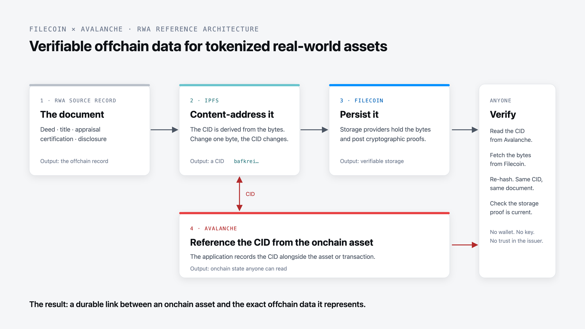

# Verifiable data infrastructure for tokenized assets

Connect onchain assets to the offchain records they depend on. Use IPFS + Filecoin to make deeds, appraisals, certifications and other source data durable, content-addressed and independently verifiable.

* [Explore the working demo →](https://sgtpooki.github.io/Avalanche-IPFS-Filecoin-RWA-reference-Architecture/) (runs live on Avalanche Fuji and Filecoin Calibration; no wallet needed)
* [View implementation →](https://github.com/SgtPooki/Avalanche-IPFS-Filecoin-RWA-reference-Architecture)

## Your asset is onchain. Its source of truth usually isn't.

Tokenized assets rely on offchain records to establish what they represent. If those records live only in an issuer's database or cloud account, applications depend on that infrastructure to preserve the data unchanged.

IPFS + Filecoin give RWA applications a verifiable data layer: **IPFS identifies the exact content, Filecoin persistently stores it with cryptographic proofs, and your onchain application references the CID.**

## A hybrid architecture for real-world assets



| Component | What it does | Output |
| --- | --- | --- |
| **RWA source record** | Deed, title, appraisal, certification, disclosure | The document |
| **IPFS** | Content-addresses the record | A CID (content identifier) derived from the bytes |
| **Filecoin** | Persists the underlying data | Verifiable storage, backed by cryptographic proofs |
| **Avalanche** | References the CID from the onchain asset or application | Onchain state and transactions |

The result is a durable link between an onchain asset and the exact offchain data it represents.

## How it works

1. **Store the source record.** An issuer adds an offchain asset record such as a deed, appraisal or certification.
2. **Create a content-addressed reference.** IPFS generates a CID derived from the content itself. If the record changes, its CID changes too.
3. **Persist it on Filecoin.** The referenced data is stored on Filecoin, giving durable storage backed by cryptographic proofs.
4. **Reference it from Avalanche.** The application records the CID alongside the relevant asset or transaction on Avalanche.
5. **Verify independently.** A third party retrieves the record and checks that it matches the CID the application referenced.

## See it in action: property record

The [working example](https://sgtpooki.github.io/Avalanche-IPFS-Filecoin-RWA-reference-Architecture/) publishes a synthetic property record set for 123 Main Street: a deed, a survey, a parcel file and two tax assessments, issued by a county recorder. Each file is content-addressed with IPFS, stored on Filecoin, and listed in a manifest whose CID is anchored on Avalanche.

| Field | Value |
| --- | --- |
| Property | 123 Main Street, Fairview |
| Record type | Property deed |
| Parcel | 07-14-226-0031 |
| Issuer | Fairview County Recorder |
| IPFS CID of the deed | `bafkreidh5qsi5z6uo2thzvynr27ioajoviafqiveunrielhugyj65l6rzu` |
| Filecoin status | Persisted, with a current storage proof |
| Avalanche reference | [Registry on Fuji](https://testnet.snowtrace.io/address/0x7fdfdb7F166A3dEE947A5533e20B8E5Ce8c80863) |
| Verification | Retrieved record matches the referenced CID |

Press **Verify now** in the demo, or run it from a terminal with no key:

```sh
git clone https://github.com/SgtPooki/Avalanche-IPFS-Filecoin-RWA-reference-Architecture.git
cd Avalanche-IPFS-Filecoin-RWA-reference-Architecture
npm ci
npm run verify
```

## What happens if the record changes?

Because the CID is derived from the content, changing the underlying record produces a different identifier. Applications can therefore verify that the retrieved document is the exact record originally referenced.

| Document | CID |
| --- | --- |
| `deed.pdf` (original) | `bafkreidh5qsi5z6uo2thzvynr27ioajoviafqiveunrielhugyj65l6rzu` |
| `deed-tampered.pdf` (one line edited) | `bafkreiausintabvl4n4hvgv2jdmazvy35bg26gku2ufu2bosxhrd7dzxqi` |

In the demo, open **Check a document** and drop in either file. The file is hashed in your browser and never uploaded; the edited copy is reported as not a document of record.

## What each layer provides

| Layer | Role |
| --- | --- |
| **Avalanche** | Asset state, transactions and the onchain reference |
| **IPFS** | Content addressing and integrity verification |
| **Filecoin** | Durable storage backed by cryptographic proofs |
| **Application** | Connects the onchain asset to its underlying records |

Verification here means that particular content was persisted and that the retrieved content matches its CID. None of these layers judges whether a deed is legitimate.

## Built for assets that depend on offchain truth

Real-world assets often depend on supporting data that cannot or should not be stored directly onchain. A content-addressed storage layer creates a durable connection between an onchain asset and those records without asking the blockchain itself to hold them.

* **Integrity.** Know whether the underlying record has changed.
* **Persistence.** Reduce dependence on a single application's database or cloud provider.
* **Portability.** Reference the same content-addressed data across applications and infrastructure.

### Example: tokenized real estate

A tokenized property can reference many offchain records throughout its lifecycle: deeds, parcel data, appraisals, inspections, certifications and disclosures. Rather than placing those documents directly onchain, an RWA platform can content-address them with IPFS, persist them on Filecoin, and reference their CIDs from its Avalanche application.

This reference implementation was developed to explore architectures for real-world asset platforms building on Avalanche.

## Build this pattern

Explore the implementation, run the demo, or adapt the architecture for your own RWA application.

* [View on GitHub](https://github.com/SgtPooki/Avalanche-IPFS-Filecoin-RWA-reference-Architecture)
* [Architecture: what is stored where](https://github.com/SgtPooki/Avalanche-IPFS-Filecoin-RWA-reference-Architecture#what-the-issuer-publishes)
* [Run the demo](https://github.com/SgtPooki/Avalanche-IPFS-Filecoin-RWA-reference-Architecture#verify-the-example)
* [Implementation guide](https://github.com/SgtPooki/Avalanche-IPFS-Filecoin-RWA-reference-Architecture#fork-map)

The implementation stores bytes with [Filecoin Onchain Cloud](https://docs.filecoin.cloud/) through the Synapse SDK, anchors a manifest pointer in a plain EVM registry contract on Avalanche, and verifies by re-hashing retrieved bytes and reading data set proof state. It builds on the [Avalanche and Filecoin data bridge](https://www.avalanche.com/about/blog/avalanche-and-filecoin-launch-cross-chain-data-bridge-for-scalable-web3) announced in May 2025.

## Building real-world assets on Avalanche?

We're looking for RWA teams interested in applying this architecture to production data and helping shape the next generation of Filecoin + IPFS tooling.

* [Talk to the Filecoin team](https://filecoin.cloud/contact)
* [View the implementation](https://github.com/SgtPooki/Avalanche-IPFS-Filecoin-RWA-reference-Architecture)

### About the demo

This open-source demo application was created to illustrate the reference architecture. The property in the example is synthetic.

[Was this page helpful?](https://airtable.com/apppq4inOe4gmSSlk/pagoZHC2i1iqgphgl/form?prefill_Page+URL=https://docs.filecoin.io/build/cookbook/rwa-reference-architecture)
