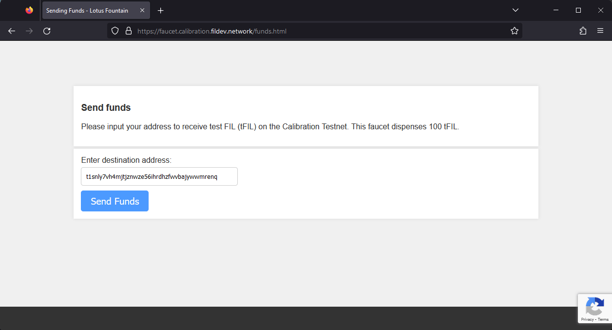
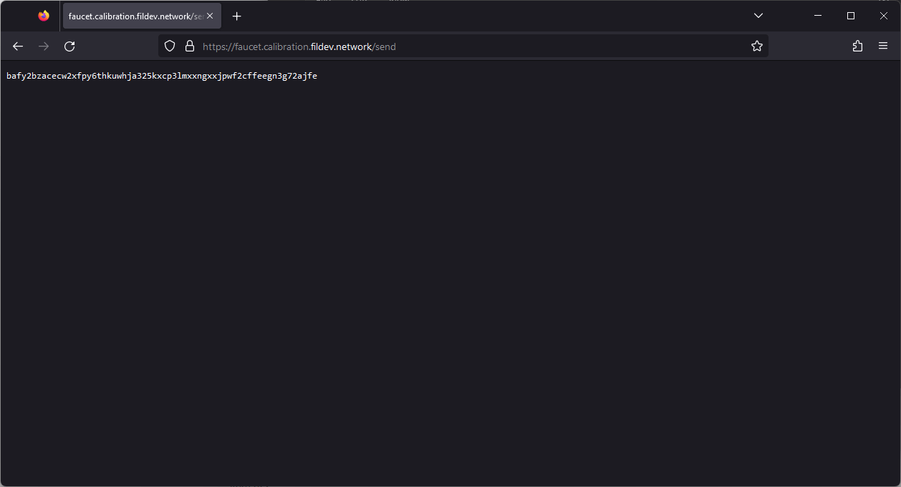
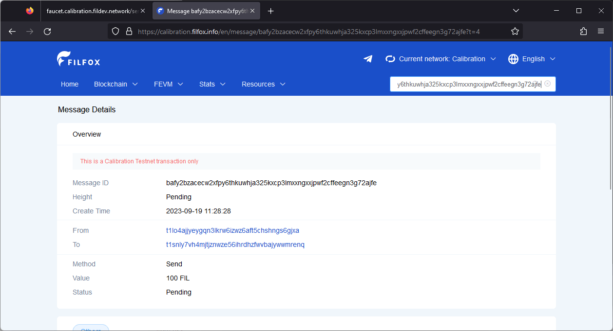

# Get test tokens

## Calibration testnet

MetaMask is one of the easier ways to manage addresses on the Calibration testnet. MetaMask displays Filecoin EVM accounts in Ethereum `0x` format; on Filecoin testnets those accounts map to delegated `t4` [addresses](../../core-concepts/filecoin-evm-runtime/address-types.md). Follow the [MetaMask setup guide](../../networks-and-tools/assets/metamask-setup.md) if you haven’t set up an address in your MetaMask wallet yet.

1. In your browser, open MetaMask and copy your address to your clipboard.
2. Go to [faucet.calibnet.chainsafe-fil.io](https://faucet.calibnet.chainsafe-fil.io/funds.html) and click **Send Funds**.
3.  Paste your address into the address field and click **Send funds**:

    
4.  The webpage will give you a transaction ID:

    
5.  You can copy this ID into a block explorer to track the progress of your transaction:

    

That’s all there is to it! Getting `tFIL` is easy!

## Local testnet

Before we begin, you must have a local testnet running. Follow the [Run a local network guide](../../networks-and-tools/networks/local-testnet/README.md) if you haven’t got a local testnet set up yet. Run the commands below from the directory that contains your local `lotus` binary, and replace the placeholder addresses with addresses from your local node.

1. Change directory to where you created the `lotus` and `lotus-miner` binaries. If you followed the [Run a local network guide](../../networks-and-tools/networks/local-testnet/README.md) these binaries will be in `~/lotus-devnet`:

```shell
cd ~/lotus-devnet
```

2. View the wallets available on this node with `lotus wallet list`:

```shell
./lotus wallet list
```

3. Create the send request with `lotus send`, supplying a funded local wallet as the `--from` address, the receiving address, and the amount of FIL you want to send:

```shell
./lotus wallet list
./lotus send --from <FUNDED_LOCAL_ADDRESS> <TO_ADDRESS> <VALUE>
```

To create a delegated address for local Filecoin EVM testing, run:

```shell
./lotus wallet new delegated
```

4. Check the balance of your receiving address with `lotus wallet balance`:

```shell
./lotus wallet balance <ADDRESS>
```

If you want to manage your local testnet tokens in MetaMask, use a delegated address and [connect MetaMask to your local testnet](../../networks-and-tools/assets/metamask-setup.md) to see the new balance within the MetaMask extension.


[Was this page helpful?](https://airtable.com/apppq4inOe4gmSSlk/pagoZHC2i1iqgphgl/form?prefill\_Page+URL=https://docs.filecoin.io/build/developing-contracts/get-test-tokens)
