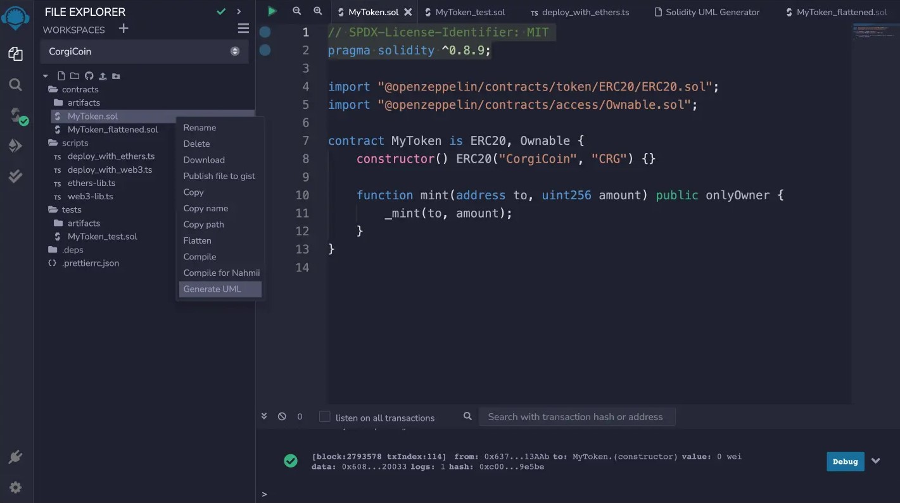
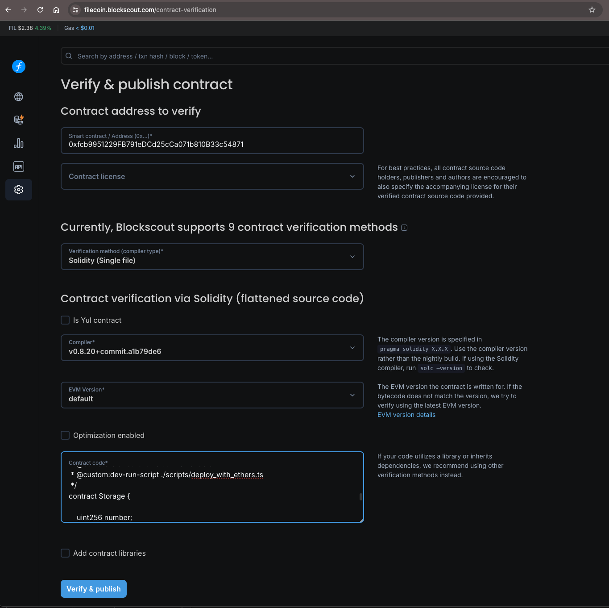
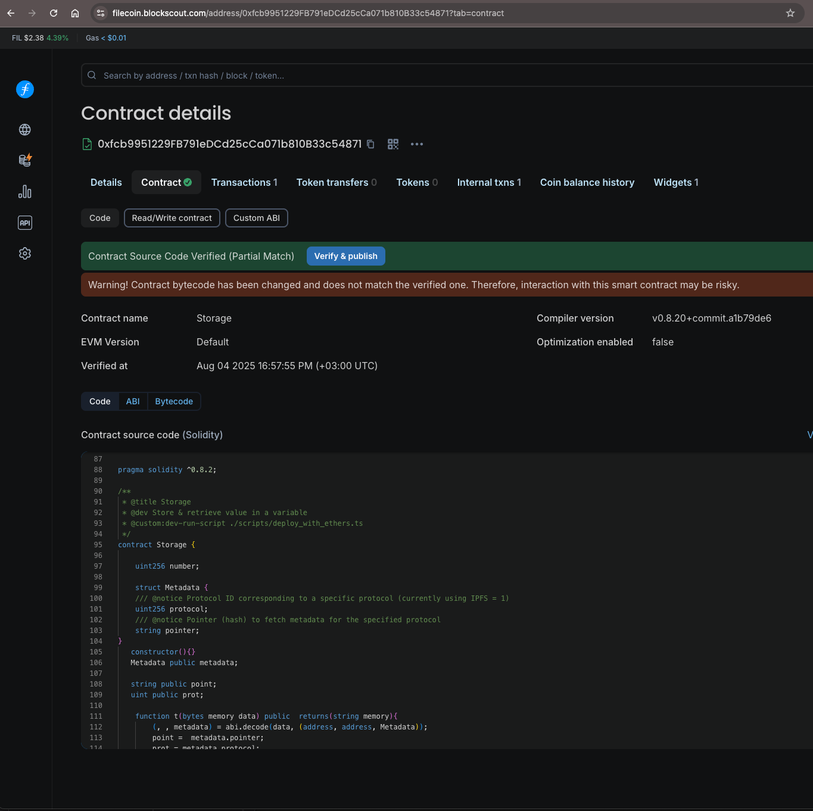

# Contract Verification with Blockscout

The following guide walks you through the process of contract verification using the [Blockscout](https://filecoin.blockscout.com/) explorer.

## Prerequisites

- A deployed smart contract on Filecoin mainnet or Calibration testnet
- Your contract source code, either as a flattened `.sol` file or the same source files and metadata used at compile time
- The deployed contract address
- The Solidity compiler version used for deployment
- The license, optimization settings, optimizer runs, EVM version, and `viaIR` setting used for deployment
- Constructor arguments, if the contract was deployed with any

## Step-by-Step Verification Process

### Step 1: Prepare Your Contract Source Code

1. **Open Remix IDE** if you are using Blockscout's single-file Solidity verification method:

2. **Flatten your contract:**
   - In the **File Explorer** sidebar, under **contracts**, right-click on your contract
   - Select **Flatten** from the menu
   - This creates a `<contract-name>_flattened.sol` file with all dependencies included

3. **Verify contract details:**
   - Ensure the license and Solidity version match your original contract
   - Click **Save** to save the flattened contract

4. **Download the flattened contract:**
   - Right-click on `<contract-name>_flattened.sol`
   - Select **Download** to save the file locally

5. **Gather required information:**
   - Contract deployment address
   - Contract license type (optional)
   - Solidity compiler version used for deployment
   - Optimization settings, including enabled/disabled and runs count
   - EVM version and `viaIR` setting, if your deployment used non-default values
   - ABI-encoded constructor arguments, if your contract constructor used arguments

### Step 2: Submit for Verification
6. **Access Blockscout verification page:**
   - For Filecoin mainnet, navigate to [Filecoin Blockscout Contract Verification](https://filecoin.blockscout.com/contract-verification). Mainnet uses chain ID `314`.
   - For Calibration testnet, navigate to [Calibration Blockscout Contract Verification](https://filecoin-testnet.blockscout.com/contract-verification). Calibration uses chain ID `314159`.

7. **Fill in contract information:**
   - Enter your contract's deployment address
   - Select the appropriate license type (optional)
   - Choose verification method: `Solidity (Single file)`
   - Select the compiler version used for deployment
   - Paste the source code from your `<contract-name>_flattened.sol` file
   - Configure the `Optimization enabled` checkbox to match your deployment settings
   - Enter optimizer runs, constructor arguments, and any advanced compiler settings if the form prompts for them

8. **Submit for verification:**
   - Click **Verify & Publish** to submit your contract

### Step 3: Verification Complete

Upon successful verification, Blockscout will display a success message and redirect you to your verified contract dashboard where you can view the source code and interact with your contract.

