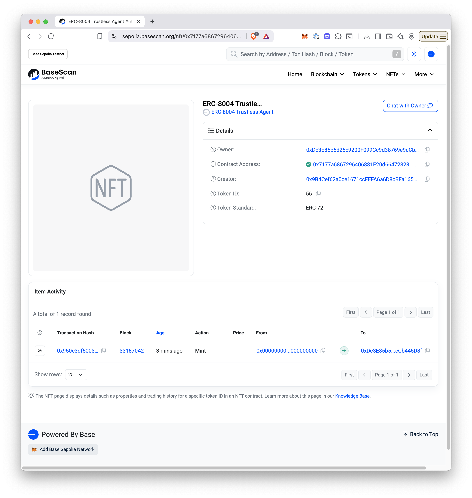

# Filecoin Pin for ERC-8004 Agents

Learn how to register a trustless autonomous agent on the ERC-8004 Identity Registry with verifiable persistent storage using Filecoin Pin for the agent registration file.

***

## Overview

This tutorial walks you through registering an [ERC-8004](https://eips.ethereum.org/EIPS/eip-8004) compliant agent with cryptographically-verified persistent storage on Filecoin. You'll create an agent card (metadata describing your agent's capabilities), store it on Filecoin with daily PDP (Proof of Data Possession) storage proofs, and register it on-chain as an NFT on Base Sepolia.

**What you'll learn:**
- How to create an ERC-8004 compliant agent card
- How to use Filecoin Pin for persistent, verifiable storage
- How to register an agent on the ERC-8004 Identity Registry
- How to verify PDP proofs and on-chain registration

**What you'll build:**
A GitHub Integration Agent that references GitHub's official MCP server, demonstrating how real-world services can be integrated with ERC-8004.

***

## Why Filecoin Pin for Agent Storage?

Agent cards need persistent storage with provable guarantees. Unlike generic IPFS pinning services that may stop hosting your data without notice, Filecoin Pin provides:

- ✅ **Cryptographic proof** your data is stored (daily PDP proofs)
- ✅ **Ongoing verification** ensures storage persistence
- ✅ **Decentralized** storage across a global network
- ✅ **IPFS compatible** - works with existing tools and gateways
- ✅ **Crypto payments** - onchain payments 
- ✅ **Limited time - sponsered storage coming soon** available for ERC-8004 builders

***

## Prerequisites

### Required Tools

Before starting, you'll need:

1. **Filecoin Pin CLI** - Follow the complete setup guide here:
   - [Filecoin Pin CLI Tutorial](https://docs.filecoin.io/builder-cookbook/filecoin-pin/filecoin-pin-cli)
   - This covers wallet creation, testnet tokens (tFIL and USDFC), and payment setup

2. **Foundry** - Ethereum development toolkit for contract interactions
   ```bash
   curl -L https://foundry.paradigm.xyz | bash
   foundryup
   ```

3. **jq** (optional but recommended) - JSON processor for viewing outputs
   ```bash
   # macOS
   brew install jq

   # Ubuntu/Debian
   sudo apt-get install jq
   ```

### Required Tokens

You'll need testnet tokens on **two networks**:

#### Filecoin Calibration Testnet
- **tFIL** (testnet Filecoin) - For gas fees
  - Faucet: https://faucet.calibnet.chainsafe-fil.io/funds.html
  - Amount needed: ~5 tFIL
- **USDFC** (Filecoin stablecoin) - For storage payments
  - Mint at: https://stg.usdfc.net (requires tFIL as collateral)
  - Amount needed: ~5 USDFC

#### Base Sepolia Testnet
- **Sepolia ETH** - For NFT minting and registration
  - Faucet: https://www.alchemy.com/faucets/base-sepolia
  - Amount needed: ~0.001 ETH

> **NOTE!** The same Ethereum wallet works on both Filecoin Calibration and Base Sepolia. You only need one private key.

### ERC-8004 Registry Address

We'll be using the reference ERC-8004 Identity Registry deployed on the Base Sepolia testnet:
```
0x7177a6867296406881E20d6647232314736Dd09A
```

***

## Step 1: Create Your Agent Card

An agent card is a JSON file that describes your agent's capabilities, endpoints, and trust model according to the [ERC-8004 specification](https://eips.ethereum.org/EIPS/eip-8004).

### Create the Agent Card JSON

Create a file named `github-agent-card.json`:

```bash
cat > github-agent-card.json << 'EOF'
{
  "type": "https://eips.ethereum.org/EIPS/eip-8004#registration-v1",
  "name": "GitHub Integration Agent",
  "description": "AI agent providing GitHub repository, issue, and pull request management capabilities through GitHub's official MCP server. Enables automated code review, issue triage, PR management, and repository analysis.",
  "image": "https://github.githubassets.com/images/modules/logos_page/GitHub-Mark.png",
  "endpoints": [
    {
      "name": "MCP",
      "endpoint": "https://api.githubcopilot.com/mcp/",
      "version": "1.0.0",
      "capabilities": {
        "tools": [
          {
            "name": "repository_management",
            "description": "Browse code, search files, analyze commits across GitHub repositories"
          },
          {
            "name": "issue_management",
            "description": "Create, update, search, and manage GitHub issues with AI assistance"
          },
          {
            "name": "pull_request_management",
            "description": "Review PRs, manage approvals, merge conflicts, and code reviews"
          }
        ]
      }
    },
    {
      "name": "agentWallet",
      "endpoint": "eip155:84532:0x0000000000000000000000000000000000000000"
    }
  ],
  "registrations": [],
  "supportedTrust": [
    "reputation"
  ]
}
EOF
```

### Validate the JSON

Verify your agent card is valid JSON:

```bash
jq . github-agent-card.json
```

You should see the formatted JSON output with syntax highlighting.

### Understanding the Agent Card Structure

Key fields in the agent card:

- **`type`** - Links to the ERC-8004 specification version
- **`name`** - Human-readable name for your agent
- **`description`** - What the agent does
- **`image`** - Avatar or logo URL
- **`endpoints`** - Array of service endpoints:
  - **MCP endpoint** - Points to GitHub's official MCP server
  - **agentWallet** - The agent's wallet address (chain:chainId:address format)
- **`capabilities`** - Tools and functions the agent provides
- **`supportedTrust`** - Trust mechanisms (reputation, stake, etc.)

> **💡 Note**: This example uses GitHub's real public MCP server at `https://api.githubcopilot.com/mcp/`. You can replace this with your own MCP server endpoint.

***

## Step 2: Upload to Filecoin Pin

Now we'll store the agent card on Filecoin with PDP proofs.

### Setup Payment System

If this is your first time using Filecoin Pin, set up the payment system:

```bash
export PRIVATE_KEY="0x..."  # Your wallet private key
filecoin-pin payments setup --auto
```

This configures your wallet to pay for storage automatically. 
This may take a few minutes to complete.

You'll see output similar to:

```
% filecoin-pin payments setup --auto                                                     
┌  Filecoin Onchain Cloud Payment Setup
│
│  Running in auto mode...
│
◇  ✓ Connected to calibration
│
◇  ✓ Balance check complete
│
│  Account:
│    Wallet: 0xDc3E85b5d25c9200F099Cc9d38769e9cCb445D8f
│    Network: calibration
│  Balances:
│    FIL: 100.0000 tFIL
│    USDFC wallet: 9.0000 USDFC
│    USDFC deposited: 0.9000 USDFC
│
◇  ✓ WarmStorage permissions configured
│
│  Transaction:
│    0x3cda50059a974ee5534e585306cfb8675165597f11a997637e26e25ba4a98c5f
│
◇  ✓ Deposited 0.1000 USDFC
│
│  Transaction details:
│    Deposit: 0xfd7b1d2a8071f1e0bf3f576510f5eab38b9573327740ceac094f7c8f1aee179d
│
◇  ━━━ Configuration Summary ━━━
│
│  Network: calibration
│  Deposit: 1.0000 USDFC
│  Storage: ~558.5 GiB for 1 month
│  Status: Ready to upload
│
└  Payment setup completed successfully
```

> **NOTE!** You only need to run this once per wallet. Subsequent uploads will use the existing payment configuration.

### Upload Your Agent Card

Upload the agent card to Filecoin:

```bash
filecoin-pin add --auto-fund github-agent-card.json
```

The `--auto-fund` flag ensures your storage provider wallet has sufficient funds.

You'll see output similar to:

```
% filecoin-pin add --auto-fund github-agent-card.json
┌  Filecoin Pin Add
│
◇  ✓ File validated (1.3 KB)
│
◇  ✓ Connected to calibration
│
◇  ✓ Payment capacity verified
│
◇  ✓ File packed with root CID: bafybeihhal5hlbylkibniig6j72wdrm7lr4nf6z47natleh2jkyosrg7di
│
◇  ✓ IPFS content loaded (1.5 KB)
│
◇  ✓ Funding requirements met
│
◇  ✓ Storage context ready
│
◇  ━━━ Add Complete ━━━
│
│  Network: calibration
│  
│  Add Details
│    File: github-agent-card.json
│    Size: 1.5 KB
│    Root CID: bafybeihhal5hlbylkibniig6j72wdrm7lr4nf6z47natleh2jkyosrg7di
│  
│  Filecoin Storage
│    Piece CID: bafkzcibdricannieziik7jobrwqia4qfq6g7cwxfspsppv5aa76uev4u6ek7awz5
│    Piece ID: 0
│    Data Set ID: 933
│  
│  Storage Provider
│    Provider ID: 23
│    Name: Axiaoming
│    Direct Download URL: https://pdp.oplian.com/piece/bafkzcibdricannieziik7jobrwqia4qfq6g7cwxfspsppv5aa76uev4u6ek7awz5
│  
│  Transaction
│    Hash: 0x9ae009d53165b2a01c9ae2e3fb0a2d11da4b90dc5f9acc31e6c4660e3d89606f
│
└  Add completed successfully

```

> **NOTE!** Data storage on the Calibration Testnet has a retention period of approximately 1 week. For production use and to ensure your data remains available, please switch to Filecoin mainnet.

### Save Important Values

Copy these values from the output - you'll need them later:

- **Root CID** - The IPFS content identifier (e.g., `bafybeihhal5hlbylkibniig6j72wdrm7lr4nf6z47natleh2jkyosrg7di`).
- **Dataset ID** - For checking PDP proof status (e.g., `933`)

> **⚠️ IMPORTANT**: The Token URI for ERC-8004 registration must include the filename! Format it as:
> ```
> ipfs://<ROOT_CID>/github-agent-card.json
> ```

### Verify IPFS Retrieval

Test that your agent card is accessible via IPFS (it may take a few minutes to propogate!):

```bash
# Replace <ROOT_CID> with your actual CID
curl -s "https://ipfs.io/ipfs/<ROOT_CID>/github-agent-card.json" | jq .
```

You should see your agent card JSON returned:

```
% curl -s "https://ipfs.io/ipfs/bafybeihhal5hlbylkibniig6j72wdrm7lr4nf6z47natleh2jkyosrg7di/github-agent-card.json" | jq .
{
  "type": "https://eips.ethereum.org/EIPS/eip-8004#registration-v1",
  "name": "GitHub Integration Agent",
  "description": "AI agent providing GitHub repository, issue, and pull request management capabilities through GitHub's official MCP server. Enables automated code review, issue triage, PR management, and repository analysis.",
  "image": "https://github.githubassets.com/images/modules/logos_page/GitHub-Mark.png",
  "endpoints": [
    {
      "name": "MCP",
      "endpoint": "https://api.githubcopilot.com/mcp/",
      "version": "1.0.0",
      "capabilities": {
        "tools": [
          {
            "name": "repository_management",
            "description": "Browse code, search files, analyze commits across GitHub repositories"
          },
          {
            "name": "issue_management",
            "description": "Create, update, search, and manage GitHub issues with AI assistance"
          },
          {
            "name": "pull_request_management",
            "description": "Review PRs, manage approvals, merge conflicts, and code reviews"
          }
        ]
      }
    },
    {
      "name": "agentWallet",
      "endpoint": "eip155:84532:0x0000000000000000000000000000000000000000"
    }
  ],
  "registrations": [],
  "supportedTrust": [
    "reputation"
  ]
}
```

***

## Step 3: Register on Base Sepolia

Now we'll register the agent on-chain as an ERC-8004 NFT on Base Sepolia.

### Set Environment Variables

```bash
export PRIVATE_KEY="0x..."  # Your wallet private key
export TOKEN_URI="ipfs://<ROOT_CID>/github-agent-card.json"  # From Step 2
export IDENTITY_REGISTRY="0x7177a6867296406881E20d6647232314736Dd09A"
export BASE_SEPOLIA_RPC="https://sepolia.base.org"
```

> **⚠️ SECURITY WARNING**: Never commit your private key to version control or share it publicly.

### Check Your Balance

Ensure you have sufficient Base Sepolia ETH:

```bash
cast balance <YOUR_WALLET_ADDRESS> --rpc-url $BASE_SEPOLIA_RPC --ether
```

You should have at least 0.001 ETH for the registration transaction.

### Register the Agent

Send the registration transaction:

```bash
cast send $IDENTITY_REGISTRY \
  "register(string)" \
  "$TOKEN_URI" \
  --rpc-url $BASE_SEPOLIA_RPC \
  --private-key $PRIVATE_KEY
```

You'll see output similar to:

```
% cast send $IDENTITY_REGISTRY \
  "register(string)" \
  "$TOKEN_URI" \
  --rpc-url $BASE_SEPOLIA_RPC \
  --private-key $PRIVATE_KEY

blockHash            0x54ee1b796e6062e6e78676dcb1cd59c200a80d710c42ebff09f720f3cdf8e4f4
blockNumber          33187042
contractAddress      
cumulativeGasUsed    3223263
effectiveGasPrice    1000100
from                 0xDc3E85b5d25c9200F099Cc9d38769e9cCb445D8f
gasUsed              176805
logs                 [{"address":"0x7177a6867296406881e20d6647232314736dd09a","topics":["0xddf252ad1be2c89b69c2b068fc378daa952ba7f163c4a11628f55a4df523b3ef","0x0000000000000000000000000000000000000000000000000000000000000000","0x000000000000000000000000dc3e85b5d25c9200f099cc9d38769e9ccb445d8f","0x0000000000000000000000000000000000000000000000000000000000000038"],"data":"0x","blockHash":"0x54ee1b796e6062e6e78676dcb1cd59c200a80d710c42ebff09f720f3cdf8e4f4","blockNumber":"0x1fa64e2","blockTimestamp":"0x690828a4","transactionHash":"0x950c3df5003a5ac827edc2e6f806e91d3f45fb05e82a9defc5afb486bf1bd8bb","transactionIndex":"0xf","logIndex":"0x50","removed":false},{"address":"0x7177a6867296406881e20d6647232314736dd09a","topics":["0xca52e62c367d81bb2e328eb795f7c7ba24afb478408a26c0e201d155c449bc4a","0x0000000000000000000000000000000000000000000000000000000000000038","0x000000000000000000000000dc3e85b5d25c9200f099cc9d38769e9ccb445d8f"],"data":"0x0000000000000000000000000000000000000000000000000000000000000020000000000000000000000000000000000000000000000000000000000000006768747470733a2f2f697066732e696f2f697066732f626166796265696868616c35686c62796c6b69626e696967366a37327764726d376c72346e66367a34376e61746c6568326a6b796f7372673764692f6769746875622d6167656e742d636172642e6a736f6e00000000000000000000000000000000000000000000000000","blockHash":"0x54ee1b796e6062e6e78676dcb1cd59c200a80d710c42ebff09f720f3cdf8e4f4","blockNumber":"0x1fa64e2","blockTimestamp":"0x690828a4","transactionHash":"0x950c3df5003a5ac827edc2e6f806e91d3f45fb05e82a9defc5afb486bf1bd8bb","transactionIndex":"0xf","logIndex":"0x51","removed":false}]
logsBloom            0x00000000000000400000000000000000000000000000000000000000000000000000000000000000000020200000000000000000000000000000004000200000000000000000000000000008000000000000000000000000000000000000000000000000020000000000000000000800000000002000000000000010000000000000000000000000000000000000000080000000000000000000000000000000000000000000000040000000000000000000000000000000000000000000000000000002000000000000000000000000000000001000000000000000000020000000000000010000000000000000000000010000000000000200000000000000
root                 
status               1 (success)
transactionHash      0x950c3df5003a5ac827edc2e6f806e91d3f45fb05e82a9defc5afb486bf1bd8bb
transactionIndex     15
type                 2
blobGasPrice         
blobGasUsed          
to                   0x7177a6867296406881E20d6647232314736Dd09A
l1BaseFeeScalar      1101
l1BlobBaseFee        1
l1BlobBaseFeeScalar  659851
l1Fee                86
l1GasPrice           9
l1GasUsed            2557

```

A `status` of `1` means the transaction succeeded and your agent NFT was minted!

### Get Your Agent ID

Query the registry to find your agent's ID:

```bash
cast call $IDENTITY_REGISTRY \
  "totalAgents()" \
  --rpc-url $BASE_SEPOLIA_RPC
```

This returns the total number of registered agents. Your agent ID is this number (the latest registration):

```bash
% cast call $IDENTITY_REGISTRY \
  "totalAgents()" \
  --rpc-url $BASE_SEPOLIA_RPC
0x0000000000000000000000000000000000000000000000000000000000000038
```

### Convert Agent ID to Decimal

The query returns a hex value (e.g., `0x38`). Convert to decimal:

```bash
printf "%d\n" 0x38  # Returns: 56
```

### Verify Registration

Confirm your agent is registered correctly:

```bash
cast call $IDENTITY_REGISTRY \
  "tokenURI(uint256)" \
  56 \
  --rpc-url $BASE_SEPOLIA_RPC
```

You will get output similar to:

```
% cast call $IDENTITY_REGISTRY \
  "totalAgents()" \
  --rpc-url $BASE_SEPOLIA_RPC
0x0000000000000000000000000000000000000000000000000000000000000038
matt@MacBook-Pro-2 demo1 % cast call $IDENTITY_REGISTRY \
  "tokenURI(uint256)" \
  56 \
  --rpc-url $BASE_SEPOLIA_RPC
0x0000000000000000000000000000000000000000000000000000000000000020000000000000000000000000000000000000000000000000000000000000006768747470733a2f2f697066732e696f2f697066732f626166796265696868616c35686c62796c6b69626e696967366a37327764726d376c72346e66367a34376e61746c6568326a6b796f7372673764692f6769746875622d6167656e742d636172642e6a736f6e00000000000000000000000000000000000000000000000000
```

The output is ABI-encoded. Decode it:

```bash
cast --abi-decode "f()(string)" <OUTPUT_FROM_ABOVE>
```

You should see your Token URI returned: `ipfs://<ROOT_CID>/github-agent-card.json`:

```bash
% cast --abi-decode "f()(string)" 0x0000000000000000000000000000000000000000000000000000000000000020000000000000000000000000000000000000000000000000000000000000006768747470733a2f2f697066732e696f2f697066732f626166796265696868616c35686c62796c6b69626e696967366a37327764726d376c72346e66367a34376e61746c6568326a6b796f7372673764692f6769746875622d6167656e742d636172642e6a736f6e00000000000000000000000000000000000000000000000000
"https://ipfs.io/ipfs/bafybeihhal5hlbylkibniig6j72wdrm7lr4nf6z47natleh2jkyosrg7di/github-agent-card.json"
```

### View on Block Explorer

Visit your agent on the Base Sepolia block explorer:

```
https://sepolia.basescan.org/token/0x7177a6867296406881E20d6647232314736Dd09A?a=<AGENT_ID_DECIMAL>
```

Replace `<AGENT_ID_DECIMAL>` with your agent's ID (e.g., `56`).

<figure><figcaption>Base Sepolia block explorer, showing NFT minted</figcaption></figure>

***

## Step 4: Verify Storage and PDP Proofs

Finally, let's verify that your agent card is persistently stored with cryptographic proofs.

### Check PDP Proof Status

Use the Dataset ID from Step 2:

```bash
filecoin-pin data-set 933  # Replace with your Dataset ID
```

**Screenshot**: [Terminal showing PDP proof status with storage provider, last proof timestamp, and next proof time]

You'll see output like:

```
% filecoin-pin data-set 933
┌  Filecoin Onchain Cloud Data Sets
│
◇  ━━━ Data Sets ━━━
│
│  Data Set #933 • live
│    Managed by Warm Storage: yes
│    CDN add-on: disabled
│    Pieces stored: 2
│    Leaf count: 96
│    Total size: 3.0 KB
│    Client data set ID: 0
│    PDP rail ID: 1529
│    CDN rail ID: none
│    Cache-miss rail ID: none
│    Payer: 0xDc3E85b5d25c9200F099Cc9d38769e9cCb445D8f
│    Payee: 0x6ABcF87adC44e27582a3e2bB5EDe97bcFe40043F
│    Service provider: 0x6ABcF87adC44e27582a3e2bB5EDe97bcFe40043F
│    Provider: Axiaoming (ID 23)
│    Commission: 0.00%
│  
│  Provider Service
│    Service URL: https://pdp.oplian.com
│    Min piece size: 1.0 MB
│    Max piece size: 1.0 GB
│    Storage price: < 0.0001 USDFC/TiB/month
│    Min proving period: 30 epochs
│    Location: C=CN;ST=Hong Kong SAR;L=Hong Kong
│    Payment token: USDFC (native)
│  
│  Metadata
│      source: filecoin-pin
│      withIPFSIndexing: (empty)
│  
│  
│  Pieces
│    Total pieces: 2
│    Unique CommPs: 1
│    Unique root CIDs: 1
│  
│    #0
│      CommP: bafkzcibdricannieziik7jobrwqia4qfq6g7cwxfspsppv5aa76uev4u6ek7awz5
│      Root CID: bafybeihhal5hlbylkibniig6j72wdrm7lr4nf6z47natleh2jkyosrg7di
│    #1
│      CommP: bafkzcibdricannieziik7jobrwqia4qfq6g7cwxfspsppv5aa76uev4u6ek7awz5
│      Root CID: bafybeihhal5hlbylkibniig6j72wdrm7lr4nf6z47natleh2jkyosrg7di
│
└  Data set inspection complete

```

> **💡 Note**: PDP proofs may take up to 24 hours to begin after initial upload. This is normal.

### Test Complete Workflow

Simulate how another agent would discover and use your agent:

```bash
# Step 1: Query total agents
TOTAL=$(cast call $IDENTITY_REGISTRY "totalAgents()" --rpc-url $BASE_SEPOLIA_RPC)
echo "Total agents: $(printf "%d" $TOTAL)"

# Step 2: Get your agent's Token URI
URI_RAW=$(cast call $IDENTITY_REGISTRY "tokenURI(uint256)" 55 --rpc-url $BASE_SEPOLIA_RPC)
URI=$(cast --abi-decode "f()(string)" $URI_RAW)
echo "Token URI: $URI"

# Step 3: Extract CID and fetch agent card
curl -s "https://ipfs.io/ipfs/<ROOT_CID>/github-agent-card.json" | jq '.endpoints[]'
```

**Screenshot**: [Terminal showing complete discovery workflow with agent card endpoints displayed]

### Summary

✅ Your agent is now:
- 🔒 **Persistently stored** on Filecoin with cryptographic PDP proofs
- 🌐 **Registered on-chain** as an ERC-8004 NFT on Base Sepolia
- 🔍 **Discoverable** via the Identity Registry by any third party
- ✅ **Verifiable** - anyone can check storage proofs and on-chain data
- 🚀 **Ready to use** by other agents and applications

***

## Troubleshooting

### Issue: `filecoin-pin: command not found`

**Solution**: Install the Filecoin Pin CLI:
```bash
npm install -g filecoin-pin
```

### Issue: `Insufficient USDFC`

**Solution**: Mint more USDFC at https://stg.usdfc.net using tFIL as collateral.

### Issue: `Transaction reverted` on Base Sepolia

**Solution**: Check your Base Sepolia ETH balance:
```bash
cast balance <YOUR_ADDRESS> --rpc-url https://sepolia.base.org --ether
```
Get more from the faucet if needed: https://www.alchemy.com/faucets/base-sepolia

### Issue: IPFS retrieval is slow or fails

**Solution**: IPFS propagation can take a few minutes. Try different gateways:
```bash
curl -s "https://ipfs.io/ipfs/<CID>/github-agent-card.json" | jq .
curl -s "https://gateway.pinata.cloud/ipfs/<CID>/github-agent-card.json" | jq .
curl -s "https://cloudflare-ipfs.com/ipfs/<CID>/github-agent-card.json" | jq .
```

### Issue: PDP proofs not showing

**Solution**: PDP proofs can take up to 24 hours to begin after upload. This is normal - your data is still stored, proofs just take time to generate. Check back later with:
```bash
filecoin-pin data-set <YOUR_DATASET_ID>
```

### Issue: Token URI doesn't include filename

**Solution**: The Token URI must include the full path including filename. Correct format:
```
ipfs://<CID>/github-agent-card.json
```

If you registered with the wrong format, you'll need to register a new agent with the corrected Token URI.

***

## What's Next?

Now that your agent is registered with verifiable persistent storage, you can:

### Build Your Own Agent

1. **Create custom agent cards** for your services
2. **Deploy your own MCP server** and reference it in the agent card
3. **Register multiple agents** for different capabilities
4. **Update agent cards** by uploading new versions (CID changes) and updating on-chain

### Explore ERC-8004 Features

- **Reputation Registry** - Build reputation for your agents
- **Validation Registry** - Add validators to verify agent behavior
- **Multi-agent coordination** - Discover and compose multiple agents

### Join the Community

- **Filecoin Builders**: [on telegram](https://t.me/+Xj6_zTPfcUA4MGQ1); [on Slack](https://filecoinproject.slack.com/archives/CRK2LKYHW)
- **ERC-8004 Discussion**: [GitHub Discussions](https://github.com/ethereum/EIPs/issues/8004)
- **Filecoin Pin**: [Documentation](https://docs.filecoin.io/builder-cookbook/filecoin-pin)
- **Builder Channels**: Join ERC-8004 builder communities

### Sponsered Storage for ERC-8004 Builders

Coming soon, stay tuned!

***

## Additional Resources

- **ERC-8004 Specification**: https://eips.ethereum.org/EIPS/eip-8004
- **Reference Implementation**: https://github.com/ChaosChain/trustless-agents-erc-ri
- **Filecoin Pin CLI Tutorial**: https://docs.filecoin.io/builder-cookbook/filecoin-pin/filecoin-pin-cli
- **Base Sepolia Explorer**: https://sepolia.basescan.org
- **GitHub MCP Server**: https://github.com/github/github-mcp-server

***

**Happy building!** 🚀

