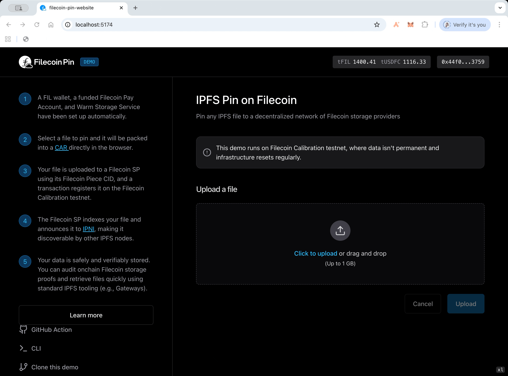
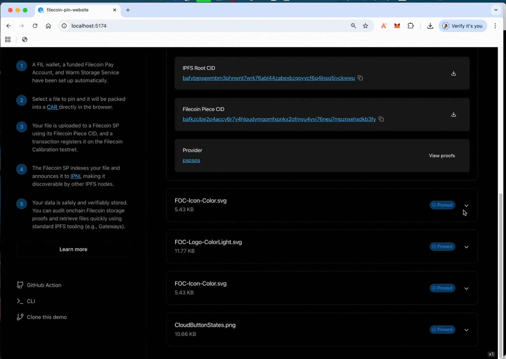

# Filecoin Pin dApp Demo

## What You'll Build

In this walkthrough, you’ll build a simple drag-and-drop file uploader that:

- Stores IPFS files directly on Filecoin with built-in payments, all in browser!
- Tracks real-time upload progress through each step
- Retrieves data easily from IPFS Mainnet and the underlying Filecoin Service Provider
- Verifies persistent storage with on-chain Filecoin proofs
- Multi-user support with session-based authentication
- Seamlessly integrates with React, TypeScript, and Vite

## Setup

We will start building by [forking the *filecoin-pin-website demo repo](https://github.com/filecoin-project/filecoin-pin-website/fork).* Make sure you have **Node.js 18+** and **npm 9+** installed.  The dapp works with Filecoin Calibration testnet. 

This will take ~10min. ⏲️

### Step 1: Fork, Clone, and Install Dependencies

```bash
# Fork the repo using the command below
# or visit [https://github.com/filecoin-project/filecoin-pin-website/fork](https://github.com/filecoin-project/filecoin-pin-website/fork)
gh repo fork filecoin-project/filecoin-pin-website

git clone https://github.com/YOUR-USERNAME/filecoin-pin-website.git
cd filecoin-pin-website
npm install
```

### **Step 2: Set Up Your Filecoin Wallet**

A Filecoin wallet is needed to send transactions on Filecoin and pay for the Filecoin storage service.

This demo dapp supports two authentication methods:

- **Private Key:** easiest for local development and learning.
- **Session Key:** recommended for production deployments - allows multiple users to share one wallet safely.

💡 The demo repo supports deployment with a shared session key, allowing multiple users to safely upload files using the same wallet. It has hardcoded DEFAULT_WALLET_ADDRESS and DEFAULT_SESSION_KEY that are ready to go, but please do NOT use it for production. You can override these defaults with env vars, see instructions [here](https://github.com/filecoin-project/filecoin-pin-website/blob/main/CONTRIBUTING.md#local-setup)!

**2.1 Get test FIL and test USDFC**

If you are using your own wallet, you need to get test FIL and test USDFC to pay for the Filecoin storage service and transactions.

1. Create or use an existing Filecoin wallet on the ****Calibration testnet**** ([such as MetaMask](https://docs.filecoin.io/basics/assets/metamask-setup#tab-calibration)).

2. Visit the [Filecoin Calibration Faucet](https://faucet.calibnet.chainsafe-fil.io/funds.html) to get free test FIL (to pay for transaction gas).

3. Visit the [Filecoin USDFC faucet]([https://forest-explorer.chainsafe.dev/faucet/calibnet_usdfc](https://forest-explorer.chainsafe.dev/faucet/calibnet_usdfc?__cf_chl_tk=qFwEfa7MNFkJlhKo32IUtR9rgP99qqf_XOmTs7qhusg-1758703656-1.0.1.1-gE8b6EQEmdp0lgg0gk5j2UZhF_69vRyYAAhtt..weyA))  to get test USDFC, which is a USD stable coin backed by FIL that can be used to pay for services.

### **Step 3: Run Your dApp**

Fire up your local development server:

```bash
 npm run dev
```

Visit `http://localhost:5173` and you should see your dApp running! That is all it takes to set up your app. Now, let’s upload a file to see the magic happen!

## Store IPFS Files on Filecoin

The magic happens in one key file [**`src/hooks/use-filecoin-upload.ts`**](https://github.com/filecoin-project/filecoin-pin-website/blob/main/src/hooks/use-filecoin-upload.ts). This is where your IPFS files get uploaded to Filecoin. 

### Step 1: Upload the data

- **Prepare Service** - Validates wallet balance and gets the Filecoin Warm Storage service initialized.
- **Create CAR** - Converts your file to an IPFS CAR (Content Addressed aRchive) file.
- **Upload** - Sends the CAR file to a Filecoin Storage Provider (SP).
    
    
    
### Step 2: Announce CIDs and confirm the transaction

The Filecoin SP:

- indexes the IPFS CAR file and publishes all the contained CIDs to the IPFS network via IPNI.
- commits to the Filecoin network via onchain transactions to store the data. Once the transaction is confirmed, your data is paid to be persisted on Filecoin.
    
    
    

### Step 3: Download the data

Your data is available from both the IPFS Mainnet network using standard traditional IPFS tooling and/or directly from Filecoin SPs.



### **Step 4: Verify your data storage**

Filecoin storage providers submit cryptographic proofs regularly onchain to prove that they are storing your data, and you can verify and see it for yourself [on the PDP Scan](https://pdp.vxb.ai/calibration).


That is it - you now have a dapp with a drag-and-drop interface to store IPFS Files on Filecoin!

# Next Steps

1. Check back on the [filecoin-pin-website repo](https://github.com/filecoin-project/filecoin-pin-website) - it will continue to be updated as new functionality is brought to filecoin-pin.
2. Feel free to report any issues with the dApp demo to https://github.com/filecoin-project/filecoin-pin-website/issues
3. Check out the the [other example uses of filecoin-pin](../).
4. Ask questions or get help with filecoin-pin in the [supported communcation channels](https://github.com/filecoin-project/filecoin-pin?tab=readme-ov-file#support-info).