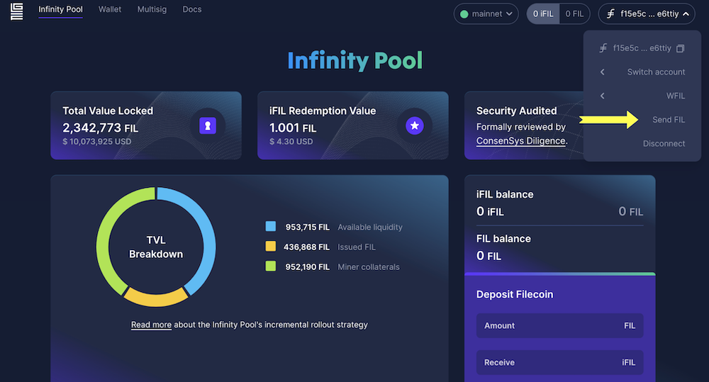


⚠️ **ASSETS ON THE FILECOIN NETWORK ARE NOT AVAILABLE ON ANY OTHER NETWORK**.
 While Filecoin is fully compatible with Ethereum tools, like wallets, that doesn’t mean you’re using the Ethereum network. These instructions only describe transfer of assets within the Filecoin network. [Learn how to configure your Ethereum wallet on the Filecoin network]().


There are four ways to transfer FIL tokens across the network. Methods vary between [address types](https://docs.filecoin.io/basics/the-blockchain/addresses/).

|   | From an `0x` address | From a `f` address |
| --- | --- | --- |
| **To an `0x` address** | [`0x` => `0x` address](#eth-style-address-to-eth-style-address) | [`f` =>`0x` address](#filecoin-to-eth-style-address) |
| **To a `f ` address** | [`0x` => `f` address](#eth-style-address-to-filecoin) | [`f` => `f` address](#filecoin-to-filecoin) |

## Address notation

Filecoin addresses are prefixed with `f`. Ethereum-style addresses start with `0x` so we will use `0x` address in this tutorial. 

## 0x to 0x

To transfer FIL tokens from one `f4` address to another `f4` address using their corresponding `0x` addresses, do the following:

1. Convert from your `f4` address to a `0x` address using [Beryx Address converter](https://beryx.zondax.ch/address_converter).
1. Complete the standard transfer process for your preferred Ethereum-compatible wallet.

## 0x to f 

To transfer FIL tokens from a `0x` address to a Filecoin address type like `f1` or `f3`, [use FilForwarder]().

## f to 0x address


Not all exchanges support `f` style addresses.
If your preferred wallets and exchanges don't support direct transfer FIL to an `f4` or Ethereum-style `0x` address, file a support ticket with the exchange to help accelerate support of `f4` addresses.


The process for sending FIL from a Filecoin `f` address to an Ethereum-style `0x`  address depends on the wallet or exchange you use. 

### Ledger device

Currently, Ledger Live has not supported `0x` or `f4` addresses yet, so you cannot directly use it to send FIL token to a `0x` or `f4`  address. However, you can connect your Ledger device to the [Glif.io](https://www.glif.io/s) wallet and transfer FIL from a Filecoin `f1/f3` address to an Ethereum-style `0x` address. This method is more secure than the [Hot wallet](#hot-wallet) method detailed below since your private keys never leave your Ledger device.

In this method, you will connect your Ledger device to the [Glif.io](https://www.glif.io/) website and send FIL from your `f` address on the Ledger to an Ethereum-style `0x` address.

1. Ensure your Ledger device is connected to your computer.
1. Log into the Ledger Live dashboard.
1. Update your Ledger device’s Filecoin app to version `0.22.9`.

   

1. Ensure your Filecoin app is open on your Ledger wallet. Your Ledger should display **Filecoin ready**.

1. Navigate to [Glif](https://glif.io).

   
1. Click **Connect Wallet**.
1. Select **Ledger (Filecoin)**.
1. Unlock your Ledger device
1. Select the Filecoin application.

   

   Once connected, the details of your Filecoin account display. 
1. Click **Send FIL**.

   

1. Enter the receiving `0x` address. Glif automatically converts the `0x` address into an `f4` address.

   

1. Enter the amount of FIL you want to send. 
1. Click **Send**.

1. Verify the information is correct and accept the transaction on your hardware device.

   After 60 to 90 seconds, the transaction is finalized on-chain and the transferred FIL displays at the Eth-style `0x` address. Check the transaction status by clicking the transaction ID link.

   

### Hot wallet

To transfer FIL tokens from `f1` or `f3` addresses to `0x` address when the wallet or exchange you are using does not support `f4` and `0x` style address, create a _burner wallet_. A burner wallet is a temporary   

You can create a burner wallet using Glif, transfer FIL to the burner wallet, and then transfer FIL from the burner wallet to a `0x` address on MetaMask.

1. Navigate to [https://wallet.glif.io/](https://wallet.glif.io/). 
1. Under **Burner wallets**, click **Create Seed Phase**.

   

1.  Copy, download, or write down the seed phrase. You will need it later.

   

1. Click **I've recorded my seed phrase**. 
1. Using your seed phrase, enter the missing words in the blank text fields. 
1. Click **Next**.
1. Click **Connect**. The burner wallet is created 
1. In the upper left corner of your wallet dashboard, click on the double squares icon next to your address to copy it. You will need it later.

   

1. From your main wallet account or exchange, transfer your FIL token to this address.
1. Connect to MetaMask.
1. Copy your `0x` address.
1. Once the funds appear in the burner wallet, click on **Send FIL**.

   

1. Enter the following information into the text fields:
   - In the **Recipient** field, enter your `0x` style address. GLIF automatically converts it to an `f4` address.
   - In the **Amount** field, enter the amount of FIL to send. Make sure you have enough FIL to cover the gas cost.

   

1. Click **Send**. The FIL arrives in your MetaMask wallet after a few moments.

### Exchange

If you are transferring FIL from any exchange to your `0x` address on MetaMask, make sure the exchange supports withdrawing FIL to `0x` or `f410` address. If not, you will need extra steps to withdraw FIL token to your `0x` address. Let's take Coinbase as an example, you can follow the this [Guide: How to transfer FIL from Coinbase to a Metamask Wallet (0x)](https://filecointldr.io/article/guide-how-to-transfer-fil-from-coinbase-to-a-metamask-wallet-0x).

## f to f address

There are no special steps or requirements for sending Filecoin from one Filecoin-style address to another on the Filecoin network.
