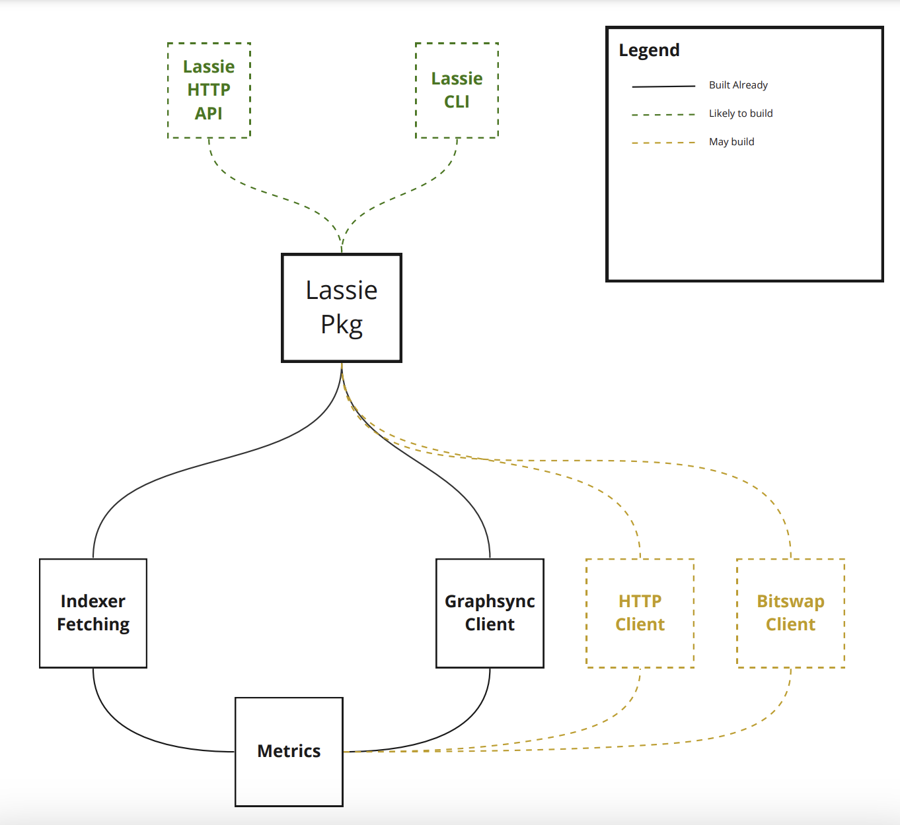

## Lassie

Lassie is a simple retrieval client for IPFS and Filecoin. It finds and fetches your data over the best retrieval protocols available. Lassie makes Filecoin retrieval easy. While Lassie is powerful, the core functionality is expressed in a single CLI command:

```shell
lassie fetch <CID>
```

Lassie can also be used as a library to fetch data from Filecoin from within your application. Due to the diversity of data transport protocols in the IPFS ecosystem Lassie is able to use the Graphsync or Bitswap protocols, depending on how to the requested data is available to be fetched.



### Lassie HTTP daemon

The Lassie HTTP daemon is an HTTP interface for retrieving IPLD data from IPFS and Filecoin peers. It fetches content from peers known to have it, and provides the resulting data in CAR format.

```shell
GET /ipfs/{cid}[/path][?params]
```

Retrieves from peers that have the content identified by the given root CID, streaming the DAG in the response in [CAR (v1)](https://ipld.io/specs/transport/car/carv1/) format.

#### Request

##### Headers

- `Accept` - _Optional_. Used to specify the response content type. Optional only if a `format` query parameter is provided, otherwise required.

  If provided, the value must explicitly or implicitly include `application/vnd.ipld.car`.

- `X-Request-Id` - _Optional_. Used to provide a unique request value that can be correlated with a unique retrieval ID in the logs.

##### Path Parameters

- `cid` - _Required_. A valid string representation of the root CID of the DAG being requested.

- `path` - _Optional_. A valid IPLD path to traverse within the DAG to the final content.

  The path must begin with a `/`, and must describe a valid path within the DAG. The path will be resolved as a [UnixFS](https://github.com/ipfs/specs/blob/main/UNIXFS.md) path where the encountered path segments are within valid UnixFS blocks and can be read as named links. Where the blocks do not describe valid UnixFS data, the path segment(s) will be interpreted as describing plain IPLD nodes to traverse.

  All blocks from the root `cid` to the final content via the provided path will be returned, allowing for a verifiable CAR. The entire DAG will also be returned from the point where the path terminates. This behavior can be modified with the `depthType` query parameter.

  Example: `/ipfs/bafy...foo/bar/baz` - where `bafy...foo` is the CID and `/bar/baz` is a path.

##### Query Parameters

- `filename` - _Optional_. Used to override the `filename` property of the `Content-Disposition` response header which dictates the default save filename for the response CAR data used by an HTTP client / browser.

  If provided, the filename extension cannot be missing and must be `.car`.

- `format` - _Optional_. `format=<format>` can be used to specify the response content type. This is a URL-friendly alternative to providing an `Accept` header. Optional only if an `Accept` header value is provided, otherwise required.

  If provided, the format value must be `car`. Example: `format=car`.

  `format=car` &rarr; `Accept: application/vnd.ipld.car`

- `depthType` - _Optional_. Used to specify the depth of the DAG to return in the response.

    - `depthType=full` - Returns the entire DAG from the termination of the `{cid}[/path]` specifier, as well as all blocks from the `cid` to the `path` terminus where a `path` is provided. This is the default behavior when no `depthType` is provided.

    - `depthType=shallow` - Returns only the content at the termination of the `{cid}[/path]` specifier, as well as all blocks from the `cid` to the `path` terminus where a `path` is provided. If the content is found to be UnixFS data, the entire UnixFS entity will be included. i.e. if `{cid}[/path]` terminates at a sharded UnixFS file, or a sharded UnixFS directory, the blocks required to reconsititute the entire file, or directory will be included. If the termination is a UnixFS sharded directory, only the full directory will be included, not the full DAG of the directory's contents.

#### Response

#### Status Codes

- `200` - OK

- `400` - Bad Request
    - No acceptable content type provided in the `Accept` header
    - Requested a non-supported format via the `format` query parameter
    - Neither providing a valid `Accept` header or `format` query parameter
    - No extension given in `filename` query parameter
    - Used a non-supported extension in the `filename` query parameter

- `404` - No candidates for the given CID were found

- `500` - Internal Server Error
    - The requested CID path parameter could not be parsed
    - An internal retrieval ID failed to generate
    - The internal blockstore file failed to write

- `504` - Timeout occured while retrieving the given CID

##### Headers

- `Accept-Ranges` - Returns with `none` if the block order in the CAR stream is not deterministic

- `Cache-Control` - Returns with `public, max-age=29030400, immutable`

- `Content-Disposition` - Returns as an attachment, using the given `filename` query parameter if provided, or if no `filename` query parameter is provided, uses the requested CID with a `.car` extension.

  Example: `bafy...foo.car`

- `Content-Type` - Returns with `application/vnd.ipld.car; version=1`

- `Etag` - Returns with the requested CID with the format as a suffix.

  Example: `bafy...foo.car`

- `X-Content-Type-Options` - Returns with `nosniff` to indicate that the `Content-Type` should be followed and not to be changed. This is a security feature, ensures that non-executable binary response types are not used in `<script>` and `<style>` HTML tags.

- `X-Ipfs-Path` - Returns the original, requested content path before any path resolution and traversal is performed.

  Example:  `/ipfs/bafy...foo`

- `X-Trace-ID` - Returns the given `X-Request-Id` header value if provided, otherwise returns an ID that uniquely identifies the retrieval request.

### Lassie's CAR format

Under normal operation, Lassie only returns IPLD data in CAR format. Specifically, the [CARv1](https://ipld.io/specs/transport/car/carv1/) format. Below sections describes the nature of the CAR data returned by Lassie and the various options available to the client for varying the data included.

#### Root CIDs

CARv1 allows for multiple roots to be included in a single CAR. Lassie will always return a CAR with a **single root CID**. This root CID will be the CID of the IPLD block that was requested by the client, even when an additional `path` is supplied.

#### Verifiability

Lassie will always return a CAR that is **verifiable**. This means that the CAR will contain all blocks required to verify the root CID and any additional path traversals to the requested content. It should always be possible to verify the root block content against the requested CID, and every block that is traversed to reach the content as specified by the final `path`.

#### Block ordering

Lassie will always return a CAR with a stable **block ordering** based on the traversal required to (a) navigate from the root CID to the final content where a `path` is provided, and (b) fetch the required DAG or partial DAG at the termination of that `path`, or from the root block where no `path` is provided. Blocks will be provided as they are encountered during a traversal, which works from "leftmost" link within a block/node to the "rightmost". The precise ordering will depend on how the data has been encoded, although this ordering is stable where standard (and properly implemented) codecs were used to generate the data. See https://ipld.io/specs/codecs/ for more information on IPLD codecs and block ordering, specifically see [DAG-PB Link Sorting](https://ipld.io/specs/codecs/dag-pb/spec/#link-sorting) which defines how UnixFS directory listings are ordered.

#### Block deduplication

Where blocks are referenced multiple times within a DAG, it will only be included once, when it is encountered first during the traversal.

#### Identity CIDs

Identity CIDs will not be present as separate blocks within a CAR returned by Lassie.

#### DAG depth

All traversals will include the content at the termination of the `path` specifier, as well as all blocks from the root CID to the `path` terminus where a `path` is provided. At the termination of a provided `path`, or from the root CID where no `path` is provided, the depth of the DAG returned may vary depending on the request or available data.

A "shallow" (e.g. when using `depthType=shallow` with the (HTTP)[HTTP_SPEC.md] server) traversal will include the entire UnixFS entity if the content is found to be UnixFS data. i.e. if the terminus is a sharded UnixFS file, or a sharded UnixFS directory, the blocks required to reconsititute the entire file, or directory will be included. If the termination is a UnixFS sharded directory, only the full directory will be included, not the full DAG of the directory's contents.

A "full" (e.g. when using `depthType=full` with the (HTTP)[HTTP_SPEC.md] server) traversal will include the entire DAG from the termination of a `path`, or from the root CID where no `path` is provided.

Under certain conditions, a complete DAG may not be returned.

* When a Filecoin storage provider chosen to retrieve from does not have the full DAG, only the portion that they do have will be included.
* When a Bitswap session is unable to exhaustively discover all blocks in a DAG, only the portion that was discovered will be included.

### Retrieve using Lassie

Make sure that you have [Go](https://go.dev/) installed and that your `GOPATH` is set up. By default, your `GOPATH` will be set to `~/go`.

#### Install Lassie

1. Download and install Lassie using the Go package manager:

    ```shell
    go install github.com/filecoin-project/lassie/cmd/lassie@latest
    ```

    ```plaintext
    go: downloading github.com/filecoin-project/lassie v0.3.1
    go: downloading github.com/libp2p/go-libp2p v0.23.2
    go: downloading github.com/filecoin-project/go-state-types v0.9.9

    ...
    ```

2. Install the [go-car](https://github.com/ipld/go-car) package using the Go package manager:

    ```shell
    go install github.com/ipld/go-car/cmd/car@latest
    ```

    ```plaintext
    go: downloading github.com/ipld/go-car v0.6.0
    go: downloading github.com/ipld/go-car/cmd v0.0.0-20230215023242-a2a8d2f9f60f
    go: downloading github.com/ipld/go-codec-dagpb v1.6.0 

    ...
    ```

   The go-car package makes it easier to work with content-addressed archive (CAR) files.

You now have everything you need to retrieve a file with Lassie and extract the contents with Go-car.

#### Retrieve

To retrieve data from Filecoin using Lassie, all you need is the CID of the content you want to download. You can use the following CIDs to test the process:

1. The format for retrieving data using Lassie is:

    ```shell
    lassie fetch -o <OUTFILE_FILE_NAME> -p <CID>
    ```

   For example:

    ```shell
    lassie fetch -o output.car -p bafykbzaceatihez66rzmzuvfx5nqqik73hlphem3dvagmixmay3arvqd66ng6
    ```

    ```plaintext
    Fetching bafykbzaceatihez66rzmzuvfx5nqqik73hlphem3dvagmixmay3arvqd66ng6
    Querying indexer for bafykbzaceatihez66rzmzuvfx5nqqik73hlphem3dvagmixmay3arvqd66ng6...
    Found 4 storage providers candidates from the indexer, querying all of them:
            12D3KooWPNbkEgjdBNeaCGpsgCrPRETe4uBZf1ShFXStobdN18ys
            12D3KooWNHwmwNRkMEP6VqDCpjSZkqripoJgN7eWruvXXqC2kG9f
            12D3KooWKGCcFVSAUXxe7YP62wiwsBvpCmMomnNauJCA67XbmHYj
            12D3KooWLDf6KCzeMv16qPRaJsTLKJ5fR523h65iaYSRNfrQy7eU
    Querying [12D3KooWLDf6KCzeMv16qPRaJsTLKJ5fR523h65iaYSRNfrQy7eU] (started)...
    Querying [12D3KooWKGCcFVSAUXxe7YP62wiwsBvpCmMomnNauJCA67XbmHYj] (started)...

    ...
    ```

2. This will create an `output.car` file within your current directory:

    ```shell
    ls -l
    ```

    ```shell
    total 143M
    -rw-rw-r-- 1 user user 143M Feb 16 11:21 output.car
    ```

#### Extract data

Now that we’ve downloaded a CAR file, we need to find out what’s inside it.

1. The format for extracting a `.car` file using Go-car is:

    ```shell
    car extract --file <INPUT_FILE>
    ```

2. Extract the `output.car` file we just downloaded using Lassie:

    ```shell
    car extract --file output.car
    ```

   This command does not output anything on success.

3. You can list the output of the `car` command with `ls`:

    ```shell
    ls -lh
    ```

    ```plaintext
    -rw-rw-r-- 1 user user 143M Feb 16 11:21 output.car
    -rw-rw-r-- 1 user user 143M Feb 16 11:36 moon-data.tar.gz
    ```

4. You can then manage the data as you need.

And there we have it! Downloading and managing data from Filecoin is super simple when you use Lassie and Go-car!

### Lassie CLI/API

Lassie’s API and CLI currently consist of a single command: `fetch`. Fetch takes a CID and outputs a CAR file. Eventually, we’d like the Lassie CLI and HTTP API to support the following features:

1. Direct Provider Fetch

    ```
    lassie fetch CID --providers ....
    ```

2. Bitswap only retrieval

    ```
    lassie fetch CID --disable-graphsync
    ```
   
3. Start HTTP daemon
    
   ```
    lassie daemon 
    ```


We expect to implement some but not all o

<!-- TODO: Complete Lotus node retrieval method. -->
<!-- ## Lotus node -->

<!-- It is possible to download data from the Filecoin network using a Lotus node. -->