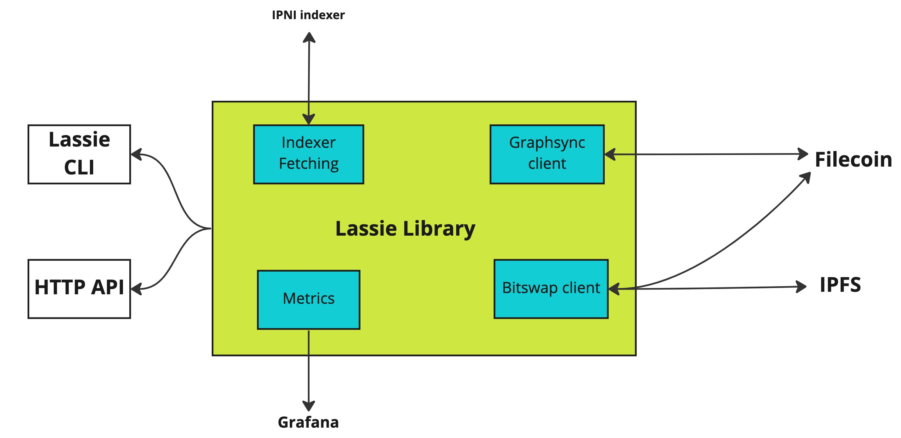

## Lassie

Lassie is a simple retrieval client for IPFS and Filecoin. It finds and fetches your data over the best retrieval protocols available. Lassie makes Filecoin retrieval easy. While Lassie is powerful, the core functionality is expressed in a single CLI command.

Lassie also provides an HTTP interface for retrieving IPLD data from IPFS and Filecoin peers. Developers can use this interface directly in their applications to retrieve the data. You can find more details about running a [Lassie HTTP daemon](#lassie-http-daemon) below.

Lassie fetches content in content-addressed archive (CAR) form, so in most cases, you will need additional tooling to deal with CAR files.
Lassie can also be used as a library to fetch data from Filecoin from within your application. Due to the diversity of data transport protocols in the IPFS ecosystem, Lassie is able to use the Graphsync or Bitswap protocols, depending on how the requested data is available to be fetched. One prominent use case of Lassie as a library is the **Saturn Network**. Saturn nodes fetch content from Filecoin and IPFS through Lassie in order to serve retrievals.



### Retrieve using Lassie

#### Install Lassie and go-car

1. Download the [Lassie Binary from the latest release](https://github.com/filecoin-project/lassie/releases/latest) based on your system architecture.

2. Download the [go-car binary from the latest release](https://github.com/ipld/go-car/releases/latest) based on your system architecture. The go-car package makes it easier to work with content-addressed archive (CAR) files.

You now have everything you need to retrieve a file with Lassie and extract the contents with `go-car`.

#### Retrieve

To retrieve data from Filecoin using Lassie, all you need is the CID of the content you want to download.

The video below demonstrates how Lassie can be used to render content directly from Filecoin and IPFS.



Lassie and `go-car` can work together to retrieve and extract data from Filecoin. All you need is the CID of the content to download.

```shell
lassie fetch -o - <CID> | car extract
```

This command uses a `|` to chain two commands together. This will work on Linux or macOS. Windows users may need to use PowerShell to use this form. Alternatively, you can use the commands separately. An example of fetching and extracting a single file, identified by its CID:

```shell
lassie fetch -o - bafykbzaceatihez66rzmzuvfx5nqqik73hlphem3dvagmixmay3arvqd66ng6 | car extract - > lidar-data.tar
```

```plaintext
Fetching bafykbzaceatihez66rzmzuvfx5nqqik73hlphem3dvagmixmay3arvqd66ng6...
Fetched [bafykbzaceatihez66rzmzuvfx5nqqik73hlphem3dvagmixmay3arvqd66ng6] from [12D3KooWPNbkEgjdBNeaCGpsgCrPRETe4uBZf1ShFXStobdN18ys]
        Duration: 42.259908785s
          Blocks: 144
           Bytes: 143 MiB
extracted 1 file(s)
```

The resulting file is a tar archive:

```shell
ls -l
```

```plaintext
total 143M
-rw-rw-r-- 1 user user 143M Feb 16 11:21 lidar-data.tar
```

##### Lassie CLI usage

To retrieve data using Lassie, run the following:

```shell
lassie fetch -p -o <OUTFILE_FILE_NAME> <CID>/path/to/content
```

The following variables and flags are available:

- `-p` is an optional flag that tells Lassie that you would like to see detailed progress information as it fetches your data.

  For example:

    ```plaintext
    Fetching bafykbzaceatihez66rzmzuvfx5nqqik73hlphem3dvagmixmay3arvqd66ng6
    Querying indexer for bafykbzaceatihez66rzmzuvfx5nqqik73hlphem3dvagmixmay3arvqd66ng6...
    Found 4 storage providers candidates from the indexer, querying all of them:
            12D3KooWPNbkEgjdBNeaCGpsgCrPRETe4uBZf1ShFXStobdN18ys
            12D3KooWNHwmwNRkMEP6VqDCpjSZkqripoJgN7eWruvXXqC2kG9f
            12D3KooWKGCcFVSAUXxe7YP62wiwsBvpCmMomnNauJCA67XbmHYj
            12D3KooWLDf6KCzeMv16qPRaJsTLKJ5fR523h65iaYSRNfrQy7eU
    Querying [12D3KooWLDf6KCzeMv16qPRaJsTLKJ5fR523h65iaYSRNfrQy7eU] (started)...
    Querying [12D3KooWKGCcFVSAUXxe7YP62wiwsBvpCmMomnNauJCA67XbmHYj] (started)...

    ...
    ```

- `-o' is an optional flag that tells Lassie where to write the output to. If you don't specify a file, it will append`.car` to your CID and use that as the output file name.

If you specify `-`, the output will be written to `stdout` and can be piped to another command. For example, you can pipe the output to `go-car` or redirect it to a file.

- `<CID>/path/to/content` is the CID of the content you want to retrieve and an optional path to a specific file within that content. For example:

    ```shell
    lassie fetch -o - bafybeiaysi4s6lnjev27ln5icwm6tueaw2vdykrtjkwiphwekaywqhcjze/wiki/Cryptographic_hash_function | car extract - | less
    ```

A CID is always necessary. If you don't specify a path, Lassie will attempt to download the entire content. If you specify a path, Lassie will only download that specific file. If the CID refers to a directory, Lassie will download the entire directory and its contents.

##### Using the go-car CLI

The `car extract` command can be used to extract files and directories from a CAR:

```shell
car extract -f <INPUT_FILE>[/path/to/file/or/directory] [<OUTPUT_DIR>]
```

The following variables and flags are available:

- `-f` is an optional flag that tells `go-car` where to read the input from. If omitted, it will read from `stdin`, as in our example above where we piped `lassie fetch -o -` output to `car extract`.

- `/path/to/file/or/directory` is an optional path to a specific file or directory within the CAR. If omitted, it will attempt to extract the entire CAR.

- `<OUTPUT_DIR>` is an optional argument that tells `go-car` where to write the output to. If omitted, it will write to the current directory.

If you supply `-`, Lassie will attempt to extract the content directly to `stdout`. This will only work if we are extracting a single file.

In the above example, the `>` operator was used to redirect the output of `car extract` to a file. This is because the content we fetched was raw file data that did not have a name encoded. In this case, if we didn't use `-` and `> filename`, `go-car` would write to a file named `unknown`. In this instance, `go-car` was used to reconstitute the file from the raw blocks contained within Lassie's CAR output.

`go-car` has other useful commands. The first is `car ls`, which can be used to list the contents of a CAR. The second is `car inspect`, which can be used to inspect the contents of the CAR, and optionally verify the integrity of a CAR.

And there we have it! Downloading and managing data from Filecoin is super simple when you use Lassie and Go-car!

### Lassie HTTP daemon

The Lassie HTTP daemon is an HTTP interface for retrieving IPLD data from IPFS and Filecoin peers. It fetches content from peers known to have it and provides the resulting data in CAR format.

```shell
GET /ipfs/{cid}[/path][?params]
```

A `GET` query against a Lassie HTTP daemon allows retrieval from peers that have the content identified by the given root CID, streaming the DAG in the response in [CAR (v1)](https://ipld.io/specs/transport/car/carv1/) format.
You can read more about the HTTP request and response to the daemon in [Lassie's HTTP spec](https://github.com/filecoin-project/lassie/blob/main/docs/HTTP_SPEC.md).
Lassie's HTTP interface can be a very powerful tool for web applications that require fetching data from Filecoin and IPFS.

### Lassie's CAR format

Lassie only returns data in CAR format, specifically, [CARv1](https://ipld.io/specs/transport/car/carv1/) format. [Lassie's car spec](https://github.com/filecoin-project/lassie/blob/main/docs/CAR.md) describes the nature of the CAR data returned by Lassie and the various options available to the client for manipulating the output.
