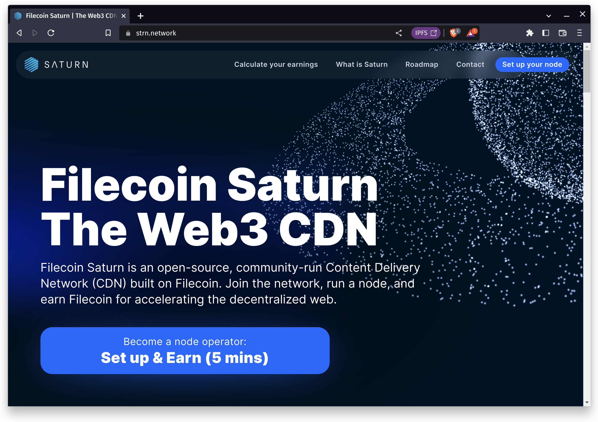

Saturn is a Web3 CDN in Filecoin’s retrieval market. On one side of the network, websites buy fast, low-cost content delivery. On the other side, Saturn node operators earn Filecoin by fulfilling requests.

Saturn is trustless, permissionless, and inclusive. Anyone can run Saturn software, contribute to the network, and earn Filecoin.

Content on Saturn is IPFS content-addressed. Every piece of content is immutable and every response verifiable.

Crypto-incentives unite, align, and grow the network. Node operators earn Filecoin for accelerating web content and websites get faster content delivery for less.

Find out more over at [saturn.tech](https://saturn.tech)
