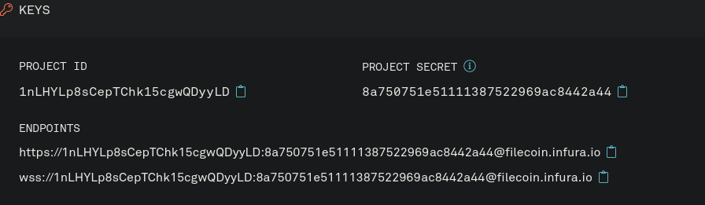

The Infura API makes it easier to interact with the Filecoin Network by abstracting away some of the complex workflows and requirements. There's no need to spin up a node or directly call a Lotus daemon!


Want to speed up your development process and easily upload your data to Filecoin? Use one of the community built tools and services to get started. [Take a look now →]()


In this tutorial, you will:

1. Sign in to the Infura API.
1. Create a Node.js script to:
   a. Check if a given string is a valid Filecoin address.
   a. Return the balance of that address if it is valid.
1. Discover more ways to interact with the Filecoin network using the Infura API.

## Prerequisites

Make sure you have both [Node.js](https://nodejs.org/en/) and [NPM](https://www.npmjs.com/) installed.

## Infura API

To interact with the Infura API, you need to register on the Infura website. It's a free API, and all you need to do is sign up with your email:

1. Go to [infura.io/](https://infura.io/) and log in.
1. Select **Filecoin** from the sidebar and click **Create new project**.
1. Enter _Filecoin - Get started_ as the project name and click **Create**.
1. You should now see your `Project ID` and `Project Secret`. Take a note of these two fields; we'll use them later.



That's everything set up on the Infura side. Next, let's create our project.

## Create your project

To make things a bit easier to manage, let's create a new directory for our project, and create a file with some boilerplate code:

1. To kick things off, create a new project directory and move into it:

   ```shell
   mkdir ~/Code/filecoin-wallet-checker -p
   cd ~/Code/filecoin-wallet-checker
   ```

1. Create a file called `index.js` and add this boilerplate code:

   ```javascript
   let request = require('request')

   // Call the Infura API and check that the address is valid.

   request(options, (error, response, body) => {
     if (error) {
       console.error('Error: ', error)
     } else {
       console.log('Response: ', body)
     }
   })
   ```

1. Add the `request` package to this project:

```shell with-output
npm install request
```
```
...
+ request@2.88.2
added 47 packages from 58 contributors and audited 47 packages in 1.594s
...
```

Now that we've got a project set up, we can start to build our script!

## Design the basic script

We've got our project directory set up and have our `index.js` file ready to go. Let's start fleshing out our script by creating a basic API call.

1. As a refresher, this is what our boilerplate code looks like:

   ```javascript
   let request = require('request')

   // Call the Infura API and check that the address is valid.

   request(options, (error, response, body) => {
     if (error) {
       console.error('Error: ', error)
     } else {
       console.log('Response: ', body)
     }
   })
   ```

1. Create an object called `options` just underneath the comment. This object is where we're going to build our request from:

   ```javascript
   // Call the Infura API and check that the address is valid.
   let options = {}
   ```

1. Enter the `url`, `method`, and `headers` values into the object:

   ```javascript
   // Call the Infura API and check that the address is valid.
   let options = {
     url: 'https://filecoin.infura.io',
     method: 'post',
     headers: {
       'content-type': 'application/json'
     }
   }
   ```

   These are pretty self-explanatory, so we won't delve into what they mean here. The two object values we're more interested in are `body` and `auth`:

1. Create a new value called `auth`, and within it create a new object:

   ```javascript
   // Call the Infura API and check that the address is valid.
   let options = {
     url: 'https://filecoin.infura.io',
     method: 'post',
     headers: {
       'content-type': 'application/json'
     },
     auth: {}
   }
   ```

   This object is what the Infura API uses to authenticate your request.

1. Add your Infura project ID and project secret into to `user` and `pass` fields:

   ```javascript
   // Call the Infura API and check that the address is valid.
   let options = {
     url: 'https://filecoin.infura.io',
     method: 'post',
     headers: {
       'content-type': 'application/json'
     },
     auth: {
       user: '1nO7B...',
       pass: 'bda4a...'
     }
   }
   ```

   Enter your project ID into the `user` field, and enter your project secret into the `pass` field. You can find your Infura details by going to `infura.io/dashboard/filecoin`, selecting your project, and going to the **Settings** tab.

1. The final value we need to add to our `options` object is the `body` of our request. The `body` object defines an ID used by the API endpoint, the version of JSON to use, and the method you want to call. Set `id` as `0` and `jsonrpc` as `2.0`:

   ```javascript
   // Call the Infura API and check that the address is valid.
   let options = {
     url: 'https://filecoin.infura.io',
     method: 'post',
     headers: {
       'content-type': 'application/json'
     },
     auth: {
       user: '1nO7B...',
       pass: 'bda4a...'
     },
     body: `{
         "jsonrpc": "2.0",
         "id": 0
    }`
   }
   ```

   Make sure to use backticks `` ` `` since they let us span the `body` object over a few lines. This doesn't do anything _functionally_, but it keeps our code fairly tidy.

1. Set the `method` to `Filecoin.ChainHead`:

   ```javascript
   // Call the Infura API and check that the address is valid.
   let options = {
     url: 'https://filecoin.infura.io',
     method: 'post',
     headers: {
       'content-type': 'application/json'
     },
     auth: {
       user: '1nO7B...',
       pass: 'bda4a...'
     },
     body: `{
         "jsonrpc": "2.0",
         "id": 0,
         "method": "Filecoin.ChainHead"
     }`
   }
   ```

   The method `Filecoin.ChainHead` returns the current head of the chain. While it's not the final method that we're going to use, it's a good way to test that our script is working.

## Test run

We've got some basic functionality in our script, so we should run everything to make sure it's all working!

1. In your project directory, call the script using `node`:

```shell with-output
node index.js
```
```
Post successful: response:  {"jsonrpc":"2.0","result":{"Cids":[{"/":"bafy2bzaceamdit67mnlyozufeaptmhmti6dv ...
```

Excellent! The Infura API received our request, and it sent us back the latest chain head information. But we're not interested in the chain head. We want to get information about addresses!

## Validate an address

Instead of asking for the chain head information, let's see if a given string is a valid Filecoin address:

1. Within the `body` section of the `options` object, change the `method` from `Filecoin.ChainHead` to `Filecoin.WalletValidateAddress`:

   ```javascript
   // Call the Infura API and check that the address is valid.
   let options = {
     url: 'https://filecoin.infura.io',
     method: 'post',
     headers: {
       'content-type': 'application/json'
     },
     auth: {
       user: '1nO7B...',
       pass: 'bda4a...'
     },
     body: `{
         "jsonrpc": "2.0",
         "id": 0,
         "method": "Filecoin.WalletValidateAddress"
     }`
   }
   ```

   If we ran the script now, we'd get an error back from the Infura API because the `WalletValidateAddress` method requires at least one string as a parameter. You can find out more about what methods are available and what their requirements are over on the [Infura Filecoin API documentation](https://infura.io/docs/filecoin)

1. Add an array called `params` into the `body` object:

   ```javascript
   // Call the Infura API and check that the address is valid.
   let options = {
     url: 'https://filecoin.infura.io',
     method: 'post',
     headers: {
       'content-type': 'application/json'
     },
     auth: {
       user: '1nO7B...',
       pass: 'bda4a...'
     },
     body: `{
         "jsonrpc": "2.0",
         "id": 0,
         "method": "Filecoin.WalletValidateAddress",
         "params": [""],
     }`
   }
   ```

1. Inside the `params` array, add an address that you want to check:

   ```javascript
   // Call the Infura API and check that the address is valid.
   let options = {
     url: 'https://filecoin.infura.io',
     method: 'post',
     headers: {
       'content-type': 'application/json'
     },
     auth: {
       user: '1nO7B...',
       pass: 'bda4a...'
     },
     body: `{
         "jsonrpc": "2.0",
         "id": 0,
         "method": "Filecoin.WalletValidateAddress",
         "params": ["f1ydrwynitbbfs5ckb7c3qna5cu25la2agmapkchi"],
     }`
   }
   ```

   This example uses `f1ydrwynitbbfs5ckb7c3qna5cu25la2agmapkchi` as the address in the `params` field.

1. Let's rerun the script to see what response we get:

   ```shell with-output
   node index.js
   ```
   ```
   Response:  {"jsonrpc":"2.0","result":"f1ydrwynitbbfs5ckb7c3qna5cu25la2agmapkchi","id":0}
   ```

   Great! The fact that we got our address back in the `result` field means that our address is valid. If we had sent over an invalid address, we'd get something like this:

   ```text output
   Response:  {"jsonrpc":"2.0","id":0,"error":{"code":1,"message":"invalid address payload"}}
   ```

## Check balance

Our script checks that a given string is a valid Filecoin address but doesn't do much else. Let's have the script tell us what the balance of a given Filecoin address is.

1. The only change we have to make is to request the `WalletBalance` method from the Infura API:

   ```javascript
   // Call the Infura API and check that the address is valid.
   let options = {
     url: 'https://filecoin.infura.io',
     method: 'post',
     headers: {
       'content-type': 'application/json'
     },
     auth: {
       user: '1nO7B...',
       pass: 'bda4a...'
     },
     body: `{
         "jsonrpc": "2.0",
         "id": 0,
         "method": "Filecoin.WalletBalance",
         "params": ["f1ydrwynitbbfs5ckb7c3qna5cu25la2agmapkchi"]}`
   }
   ```

1. The Infura API will let us know the balance:

   ```shell with-output
   node index.js
   ```
   ```
   ADDRESS:  {"jsonrpc":"2.0","result":"7182015146934547358774","id":0}
   ```

   The Infura API returns the value of the address in `attoFIL`. If the address you are requesting doesn't have a balance, the response from Infura will be blank:

## Script so far

Here's what your script should look like so far:

```javascript
let request = require('request')

// Call the Infura API and check that the address is valid.
let options = {
  url: 'https://filecoin.infura.io',
  method: 'post',
  headers: {
    'content-type': 'application/json'
  },
  auth: {
    user: '1nO7B...',
    pass: 'bda4a...'
  },
  body: `{
      "jsonrpc": "2.0",
      "id": 0,
      "method": "Filecoin.WalletBalance",
      "params": ["f3tfhgkbq6h55fqhumadd7wvogx3bbhgm3ifg6mk6hq35ob3fex2uei7hfbo2nwqkzudjzjidmshxpvo3ja4iq"]
  }`
}

request(options, (error, response, body) => {
  if (error) {
    console.error('Error: ', error)
  } else {
    console.log('Response: ', body)
  }
})
```

## Next steps

We've only really dipped our toes into what you can do with this API. The [Infura documentation](https://infura.io/docs/filecoin) is a great resource to determine what you can build. Why not try generating a transaction and sending FIL between two accounts using the API? Or get information about a particular storage provider?
