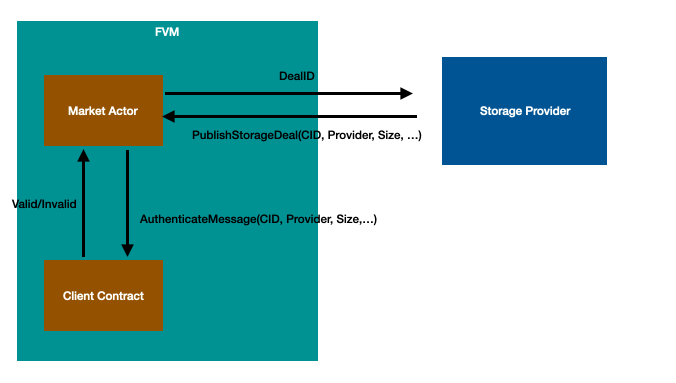

## DataDAO solution

There are many ways to create a DataDAO, so this document will only focus on one of the possibilities for the purpose of example.

As the [RFS](https://rfs.fvm.dev/) describes, DataDAOs enable groups of people to put together resources to preserve and utilize the data that are useful for their stakeholders. Imaging a DataDAO can mint a token $DATA, and incentivize Storage Providers to replicate the data it wants to store. The DataDAO can specify the data it wants to replicate and the number of replications it desires. For every replication, the DataDAO will mint some $DATA and send them to the SP as rewards. How datasets are chosen is left up to the governance process of the DataDAO.

### Solution Architecture

I highly recommend that you read through the [“Core Idea” section in this README](https://github.com/lotus-web3/client-contract) before continue reading this document.

#### Role management

The contract has to specify the admin of the DataDAO either during the creation of the contract or through a permission change contract call

#### ERC20 token

The DataDAO should be the minter of a standard ERC20 token $DATA and have the ability to mint $DATA. For example, a [ERC20PresetMinterPauser contract](https://github.com/OpenZeppelin/openzeppelin-contracts/blob/master/contracts/token/ERC20/presets/ERC20PresetMinterPauser.sol) from OpenZeppelin can be used.

#### Publish a deal to the DataDAO

Storage provider should seal the data and publish the deal information to the market actor by calling `publish_deal` on the market actor. The DataDAO will act as the client of the deal. (The command to seal the data and generate deal information are under development and will be updated here when more information is available) (p.s. [`publish_deal` is called `publish_storage_deals` in the mock solidity API](https://github.com/Zondax/fevm-solidity-mock-api/blob/master/contracts/v0.8/MarketAPI.sol#L170)).

The market actor will call the [AuthenticateMessage](https://github.com/filecoin-project/FIPs/blob/master/FIPS/fip-0044.md) native method on the DataDAO contract to know if this deal should be created. This method will be called using the FRC42 method number as specified in the linked FRC.

You can handle this callback by exposing a `handle_filecoin_method(uint64, uint64, bytes)` Solidity method, which is how the FEVM runtime routes inbound FRC42 calls. See [this example](https://github.com/lotus-web3/client-contract/blob/8b53caadd9f7b028f897dfcd28ec2ca9ae98b9e3/src/DealClient.sol#LL49).

The DataDAO contract should check if the deal should be published according to its business logic. For our example:

- If the SP has `admin` role, all the deals created by the SP should be accepted, and the DataDAO contract should start tracking the proposal and the number of replications of this CID
- If the CID of the deal does not have enough number of replications, the DataDAO contract should allow the creation of this deal
- The DataDAO should reject other deals not in the above cases

The DataDAO contract should mint some $DATA and send it to the SP who have successfully published the deal

[Reference](https://github.com/lotus-web3/client-contract)

#### Retrieve the information and data from the DataDAO

- The DataDAO contract should have a method that provides all the deals managed by it.
- The DataDAO contract should have a method that provides all the CIDs it wants to replicate and the current number of replications and the desired number of replications.
    - It should have a mechanism to refresh the number of replications based on the `stard_epoch` and `end_epoch` attributes of each deal it manages.
- Users can retrieve the data of the CID by using `lotus client retrieve` command.

### Possible future directions

Instead of letting contract admins decide which CIDs to preserve, the DataDAO contract can implement different mechanisms to decide what to store. For example, the contract can let users vote on what to store, or they can let $DATA holders vote

The DataDAO contract can decide how to incentivize SPs by implementing their business logic about how to distribute $DATA, or introduce tokenomics such as staking

## Perpetual Storage

There are many use cases in the world that need perpetual storage. For example, NFT owners would love the binary data of their NFT being safely stored and can be retrieved indefinitely. 

Filecoin deals have an expiration date, usually a year, attached to it, and after the expiration date, deals will expire and data will be lost. With FVM, uploaders can specify the number of replications they want and the desired expiration date. The expiration date can be a long time into the future, or even indefinitely. As long as the uploader still has funds (FIL) in the contract account, the contract will keep incentivizing Storage Providers to create deals to meet the goal of replication.

### Solution architecture

I highly recommend that you [read through the “Core Idea” section in this README](https://github.com/lotus-web3/client-contract) before continuing to reading this document. 

[Reference](https://github.com/lotus-web3/client-contract)

#### Deposit

- Uploaders can deposit funds into the PerpStorage contract

#### PerpDeal creation

- The uploader should upload the file to a place where Storage Providers can download the data from, such as IPFS or AWS S3, and get the URL of the data
- The uploader should send URL of the data, the desired number of replication, and the desired expiration date to the PerpStorage contract to create a PerpDeal
    - The Dapp frontend can provide an estimation of how long the data can be stored based on the amount of FIL the uploader has in the contract
    - The contract should reject the creation of the PerpDeal if the uploader does not have enough funds deposited in the contract
- The PerpStorage contract should create and update PerpDealAd based on the storage situation of each PerpDeal
    - The PerpStorage contract should determine the FIL it wants to give out for each PerpDealAd based on its business logic. For example, it can provide more bonuses if the PerpDeal does not have many replications or if its storage deals are about to expire. 

#### PerpDeal information

- The PerpStorage contract should provide an interface for storage providers to query the information about PerpDeals, including the URL of the data, the desired expiration date, the current number of replication, and the storage deals created by other storage providers
- The PerpStorage contract should provide an interface for storage providers to query PerpDealAd
- The PerpStorage contract should provide an interface for storage providers to query the funds that the uploader has put into the PerpStorage contract

#### Storage deals creation

- Storage Providers can look at the list of PerpDealAd and determine which PerpDealAd they want to store
- Storage Providers should download the content of the PerpDealAd. They should try to download from the URL of the content or use the CID to download the content from other storage providers
- Storage Providers should seal the data of the PerpDealAd and publish the deal information to the market actor by calling `publish_deal` on the market actor. The PerpStorage contract will act as the client of the deal. (The command to seal the data and generate deal information is under development and will be updated here when more information is available) (p.s. [`publish_deal` is called `publish_storage_deals` in the mock solidity API](https://github.com/Zondax/fevm-solidity-mock-api/blob/master/contracts/v0.8/MarketAPI.sol#L170)) 
    - The storage provider should put the PerpDealAd’s id into the label (this is the field used to store arbitrary data) of the deal, so the PerpStorage contract can identify which PerpDealAd the storage provider is targeting
    - The market actor will call the [AuthenticateMessage](https://github.com/filecoin-project/FIPs/blob/master/FIPS/fip-0044.md) native method on the PerpStorage contract to know if this deal should be created. This method will be called using the FRC42 method number as specified in the linked FRC.
    - You can handle this callback by exposing a `handle_filecoin_method(uint64, uint64, bytes)` Solidity method, which is how the FEVM runtime routes inbound FRC42 calls. [See this example](https://github.com/lotus-web3/client-contract/blob/8b53caadd9f7b028f897dfcd28ec2ca9ae98b9e3/src/DealClient.sol#LL49).
    - The PerpStorage contract should check if this replication is valid and send FIL to the storage provider if it successfully creates the deal.
