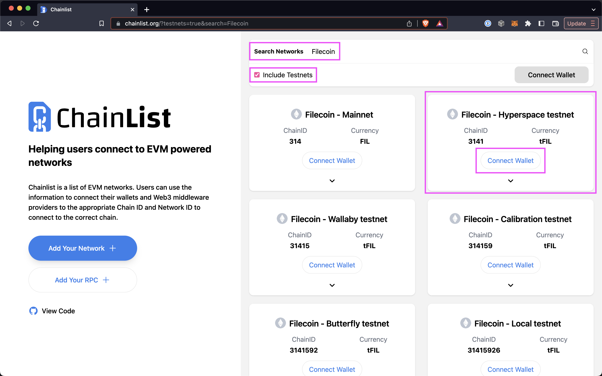
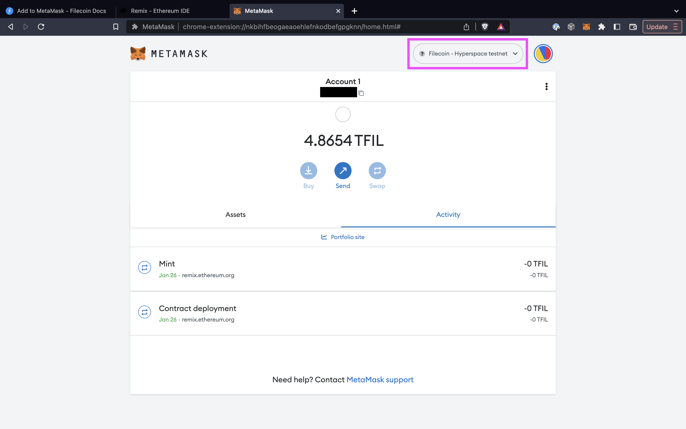
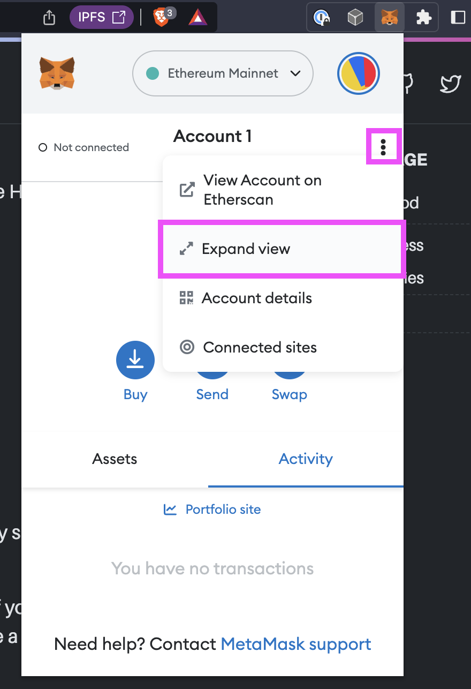
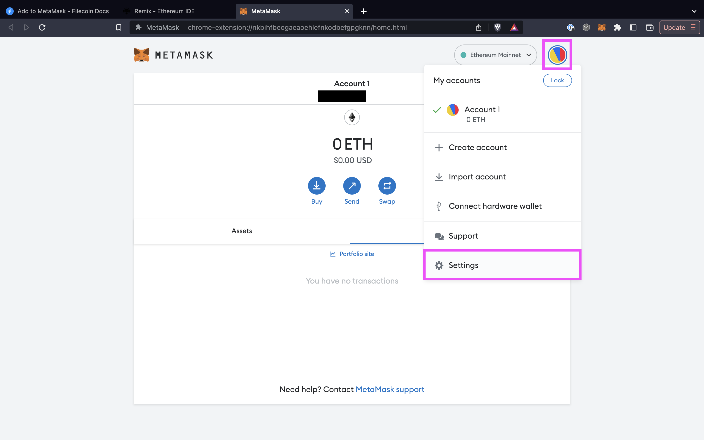
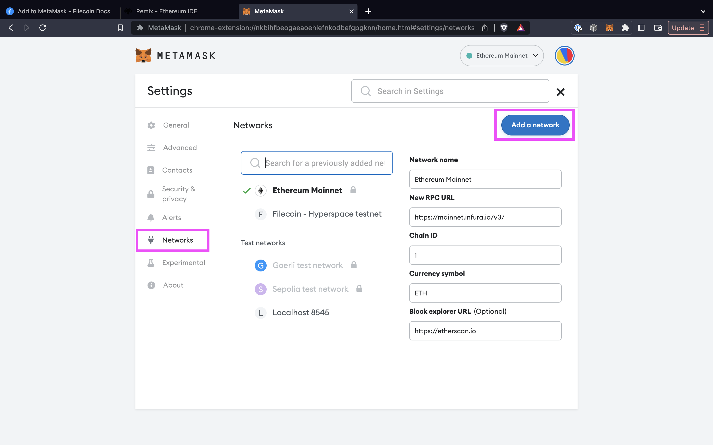
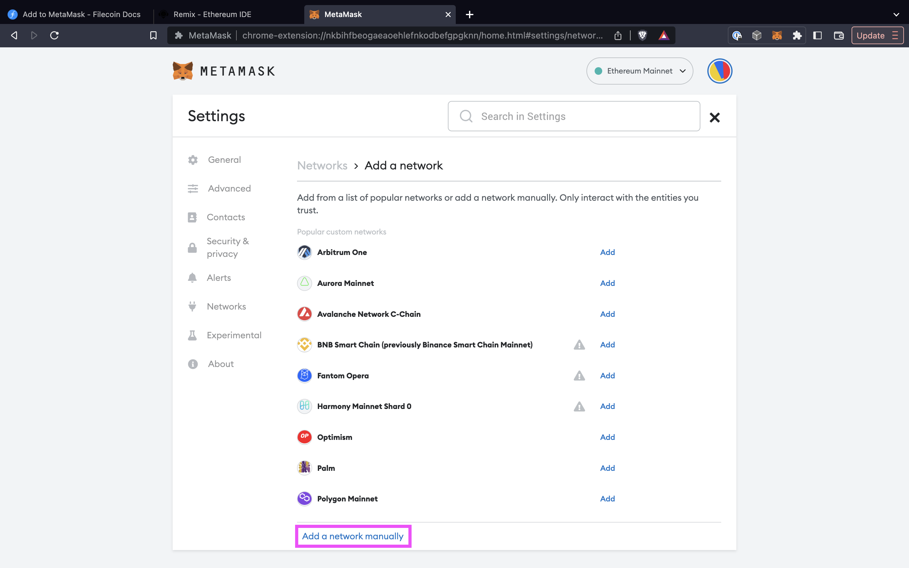
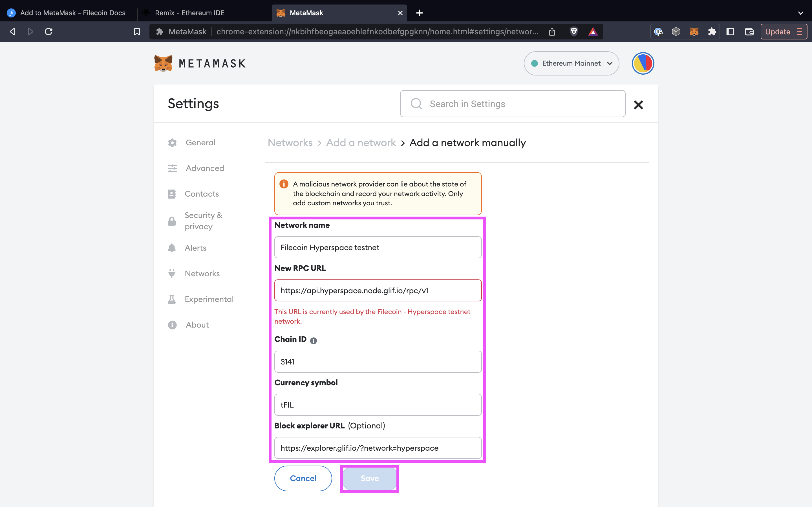



This page assumes that you already have [MetaMask installed](https://metamask.io/) in your browser.

## Simple method

The easiest way to add a Filecoin testnet to your MetaMask is by using the pre-configured options at chainlist.org.

1. Go to [chainlist.org](https://chainlist.org/).
1. Enable the **Testnets** toggle and enter `Filecoin` into the search bar.
1. Scroll down to find the **Filecoin - Hyperspace testnet**, then click **Connect Wallet**:

    

1. In MetaMask click **Next**, then **Connect**, then **Approve** when prompted to connect Chainlist.org to MetaMask:

    

2. You should now see that MetaMask is connected to the **Filecoin - Hyperspace testnet**:

    

## Manual process

If you can't or don't want to use Chainlist, you can add the Hyperspace network to your MetaMask manually.

### Prerequisities

Before we get started, you'll need the following:

- A [Chromium-based browser](https://en.wikipedia.org/wiki/Chromium_web_browser#Browsers_based_on_Chromium), or [Firefox](https://www.mozilla.org/en-CA/firefox/products/).
- A browser with [MetaMask](https://metamask.io/) installed.

### Steps

The process for integrating Filecoin into MetaMask is fairly simple but has some very specific variables that you must copy exactly.

1. Open your browser and open the MetaMask plugin. If you haven't opened the MetaMask plugin before, you'll be prompted to create a new wallet. Follow the prompts to create a wallet.
1. If you haven't already, change your view to **Expanded view**.

    

2. Click the user circle and select **Settings**:

    

3. Select **Networks**.
4. Click **Add a network**.

    

5. Scroll down and click **Add a network manually**.

    

6. Enter the following information into the fields:

    | Field | Value |
    | --- | --- |
    | Network name | `Filecoin Hyperspace testnet` |
    | New RPC URL | `https://api.hyperspace.node.glif.io/rpc/v1` |
    | Chain ID | `3141` |
    | Currency symbol | `tFIL` |

7. Pick one of the following block explorers, and enter the URL into the **Block explorer (optional)** field:

    - Glif Explorer: `https://explorer.glif.io/?network=hyperspace`
    - Filscan: `https://hyperspace.filscan.io/`

8. Review the values in the fields and click **Save**.

    

9.  The Hyperspace testnet should now be shown in your MetaMask window.

    

10. Done!

## Next steps

You can now add funds to this wallet by using the [Hyperspace testnet faucet]().
