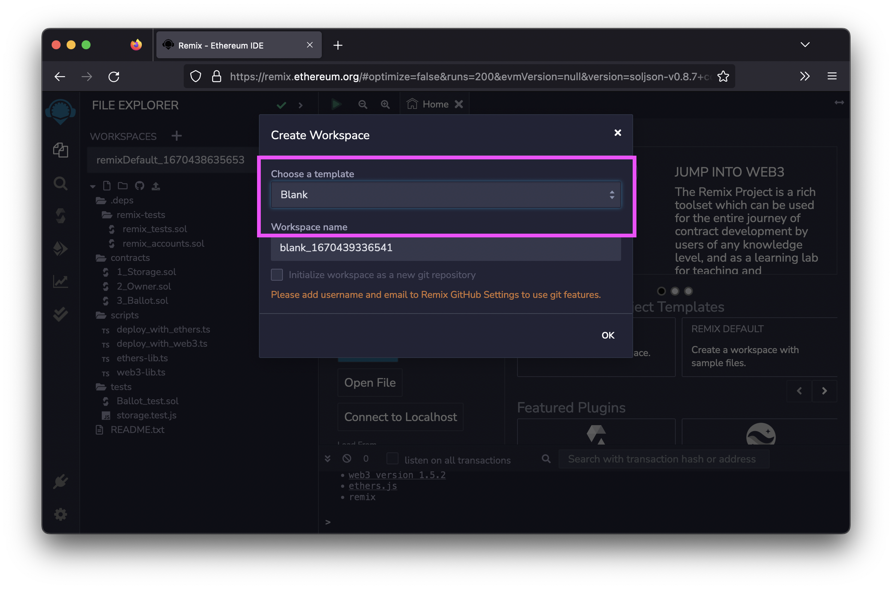
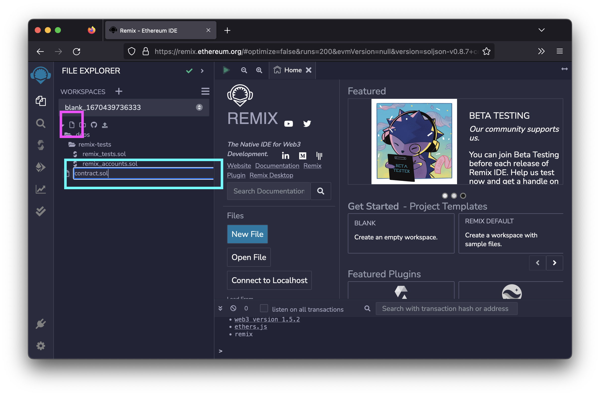
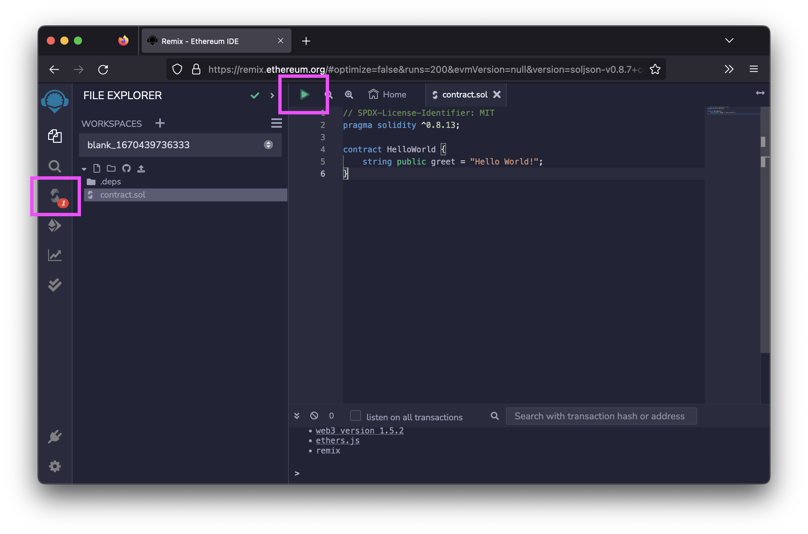
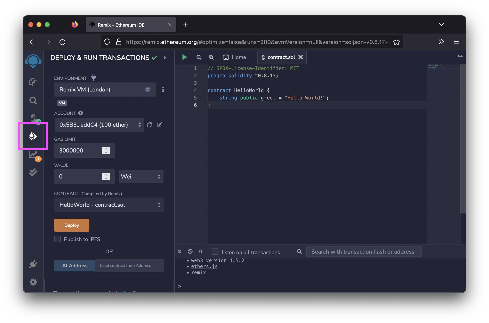
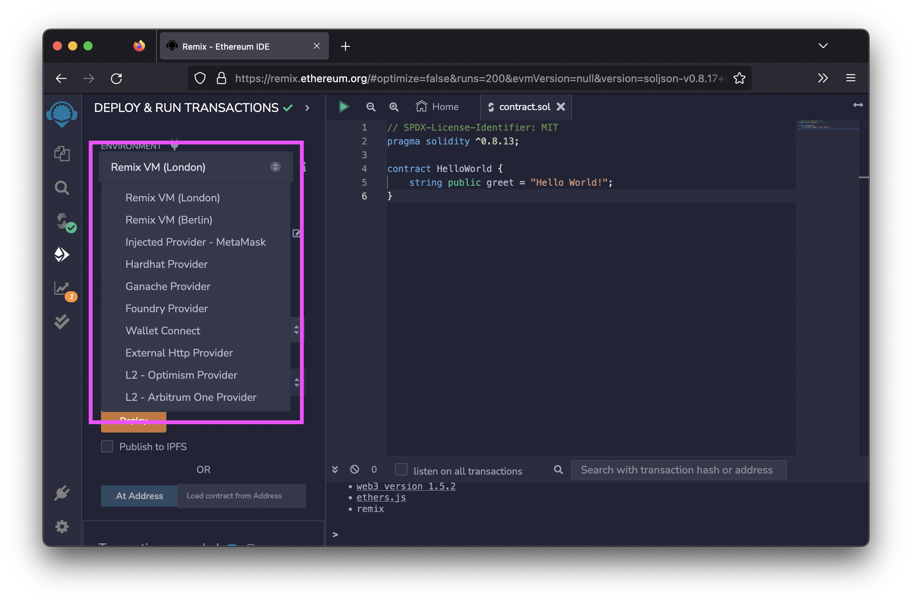
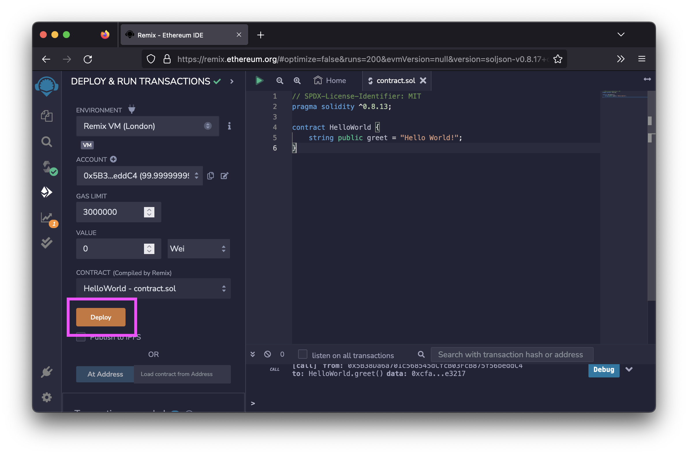
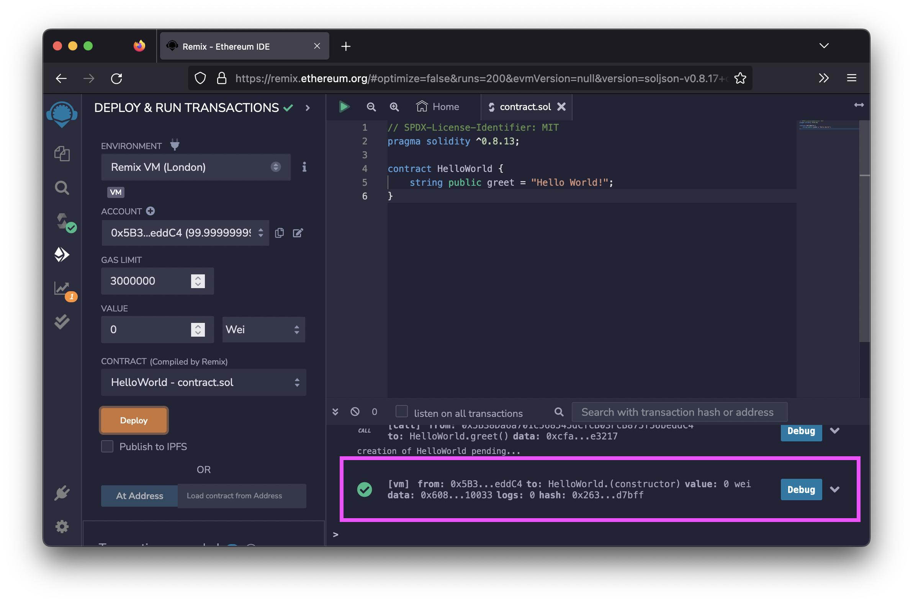



## Remix

You can quickly deploy a contract with [Remix](https://remix.ethereum.org/), the browser-based IDE maintained by the [Ethereum Foundation](https://ethereum.org/en/foundation/).

1. Go to [remix.ethereum.org](https://remix.ethereum.org/).
1. Create a new **Blank** workspace:

    

1. Create a new file called `contract.sol`.

    

1. Write or paste your contract into the new file. When pasting, you may receive a warning about crypto scams.
1. Compile your contract by either pressing `CTRL` + `s`, clicking on the **Save** button, or by selecting the **Compile** tab and clicking **Compile contract.sol**.

    

1. Select the **Deploy** tab:

    

1. Select your network from the **Environment tab**. If you want to deploy your contract to the Hyperspace testnet, follow the [Add to MetaMask guide]():

    

1. Click **Deploy**:

    

1. If everything was successful, you will see a success message at the bottom of the IDE window:

    

1. Done!

## Hardhat

You can deploy a contract using Hardhat. We're going to use the [FEVM Hardhat Kit repository](https://github.com/filecoin-project/FEVM-Hardhat-Kit) in the Filecoin Project GitHub organization to get started quickly.

### Prerequisites

You must have the following installed:

- [Git](https://git-scm.com/)
- [Yarn](https://yarnpkg.com/)

You should also have an address on the Filecoin Hyperspace testnet. See the [Add to MetaMask page]() for information on how to get an address. You also need test-FIL `tFIL` in your wallet. See the [Use a Faucet]() page for information on how to get test funds.

### Steps

1. Clone the `filecoin-project/FEVM-Hardhat-Kit` repository and move into the `FEVM-Hardhat-Kit` directory:

    ```shell
    git clone https://github.com/filecoin-project/FEVM-Hardhat-Kit.git
    cd FEVM-Hardhat-Kit
    ```

1. Install the project dependencies with Yarn:

    ```shell
    yarn install
    ```

1. Export your private key from MetaMask. See the [MetaMask documentation](https://metamask.zendesk.com/hc/en-us/articles/360015289632-How-to-export-an-account-s-private-key) to find out how to export your private key.
1. In your terminal, create an environment variable called `PRIVATE_KEY` and paste in the private key from MetaMask:

    ```shell
    export PRIVATE_KEY='eed8e9d727a647f7302bab440d405ea87d36726e7d9f233ab3ff88036cfbce9c'
    ```

1. Inside the `contracts` folder in a contract called `SimpleCoin.sol`. Deploy this contract using Hardhat:

    ```shell
    yarn hardhat deploy
    ```

    ```plaintext
    ...

    Compiled 1 Solidity file successfully
    Wallet Ethereum Address: 0x119bB8b0e3C3E5A1f2b608265342E3ef52c29594
    Wallet f4Address:  f410fcgn3rmhdyps2d4vwbatfgqxd55jmffmunzmqczq
    deploying "SimpleCoin" (tx: 0x2a2c50f8e34b582845e1f1991bc16cc6202caddc726af4737e2f5a9f47739ff4)...: deployed at 0x73867E39f7492a2ee2EBECBDF9c9FbcCabe4b760 with 17522415 gas
    ✨  Done in 79.61s. 
    ```

    The deployment process should take a couple of minutes. Once the contract has been successfully deployed, Hardhat will give you a contract address you can use to interact with the contract.

1. You can now interact with your contract using the contract address given by Hardhat.
1. Done!
