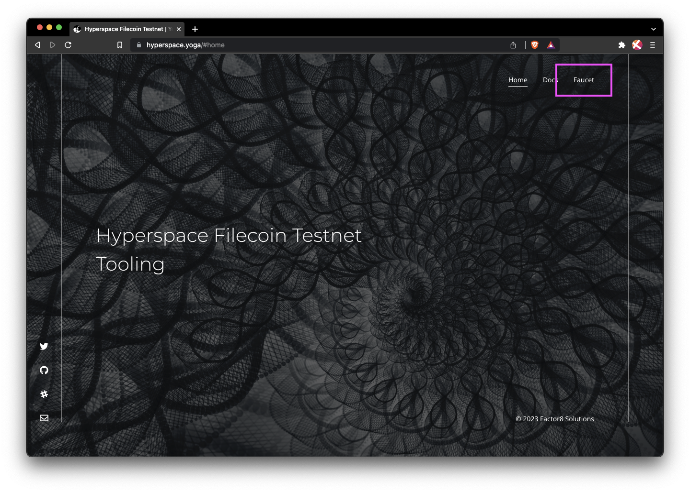
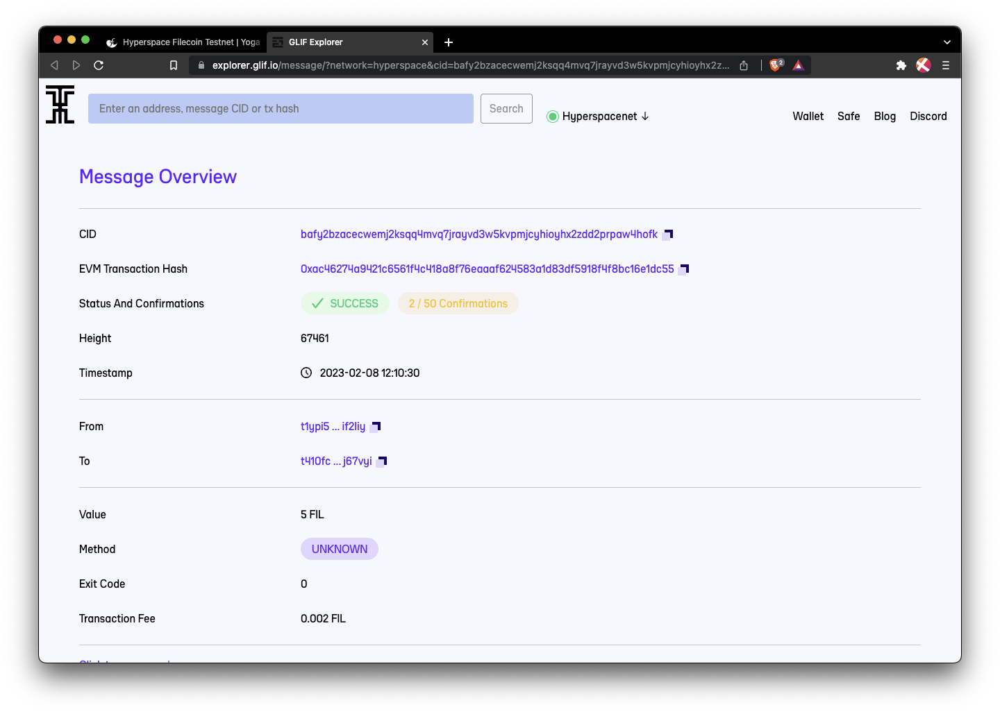



## Prerequisites

Before we begin, you must have an address on the Hyperspace testnet. Follow the [Add to MetaMask guide]() if you don't have one yet.

## Hyperspace testnet

1. In your browser, open MetaMask and copy your address to your clipboard:

    

1. Go to [hyperspace.yoga](https://hyperspace.yoga) and click **Faucet** from the menu.

    

1. Paste your address into the address field, complete the **I am human** captcha, and then click **Send**:

    

1. The faucet should give you a link to the transaction:

    

1. The block explorer will show you the transaction history for your address. After a couple of minutes, you should see 5 `tFIL` transferred to your address.

    

1. Open MetaMask to confirm that you received the `tFIL`:

    

That's all there is to it! Getting `tFil` is easy!
