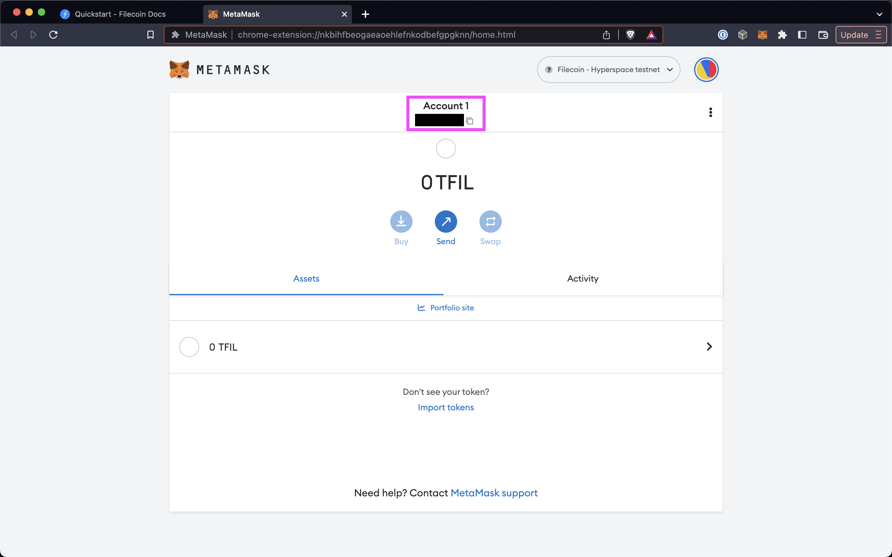
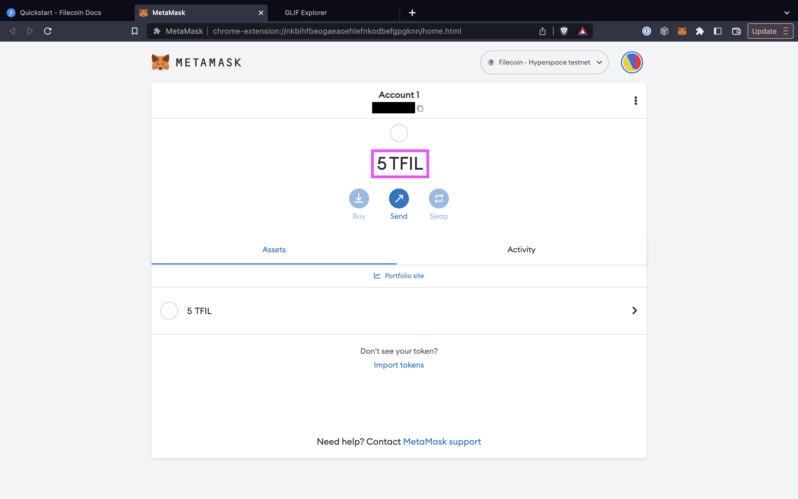



## Prerequisites

Before we begin, you must have an address on the Hyperspace testnet. Follow the [Add to MetaMask guide]() if you don't have one yet.

## Hyperspace testnet

1. Open your browser and open MetaMask.
1. Click your account to copy the address to your clipboard:

    

2. Go to [hyperspace.yoga](https://hyperspace.yoga/#faucet) and scrolldown to the **Faucet** section.
3. Paste your address into the address field, complete the **I am human** captcha, and then click **Send**:

    

4. The faucet should give you a link to the transaction. Click it to view your transaction: (Note that after clicking send, the link will appear and slowly fade away.)

    

5. The block explorer will show you the transaction history for your address. After a couple of minutes, you should see 5 `tFIL` transferred to your address.
6. Open MetaMask to confirm that you received the `tFIL`:

    

7. Done!
