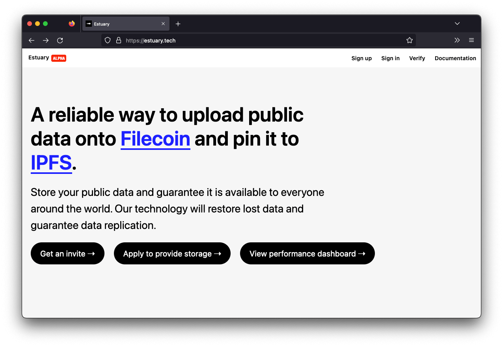



Estuary is still in the early stages, and as such, isn’t quite ready for a public release. However, you can [request an invitation](https://docs.estuary.tech/get-invite-key) to test the project and start making Filecoin storage deals.
