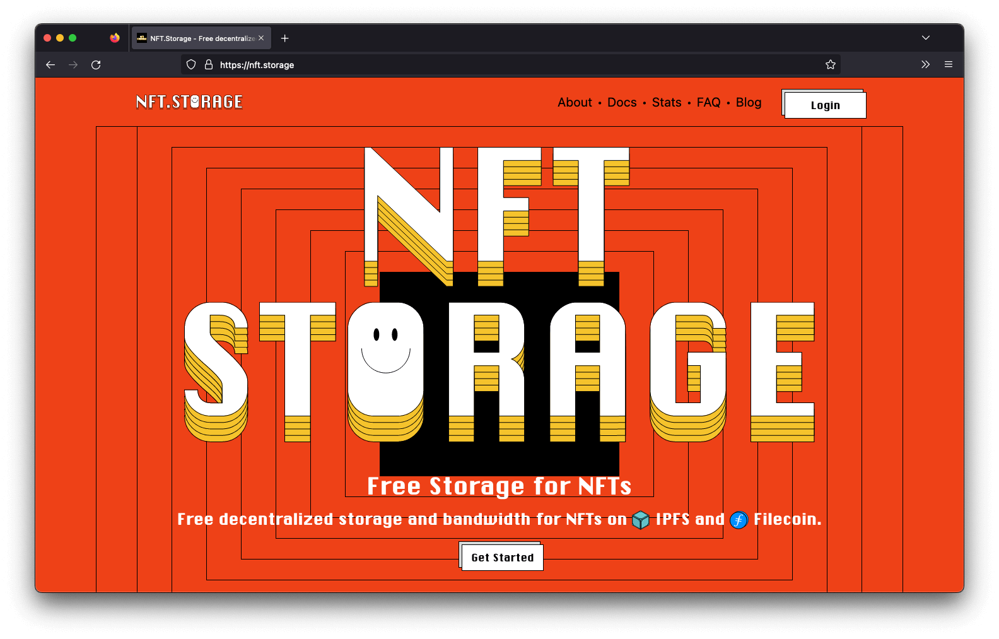



NFT.Storage stores many copies of uploaded data on the public IPFS network in two primary ways: in dedicated IPFS servers managed by NFT.Storage, and decentralized on Filecoin. Since IPFS is a standard used by many different storage services, it's easy to redundantly store data uploaded to NFT.Storage on any other IPFS-compatible storage solution from pinning services, to your local IPFS node, to other storage networks like Arweave or Storj. And as time goes on, NFT.Storage will increasingly decentralize itself as a public good!

Check out the NFT.Storage documentation for [how to get started](https://nft.storage/docs/)
