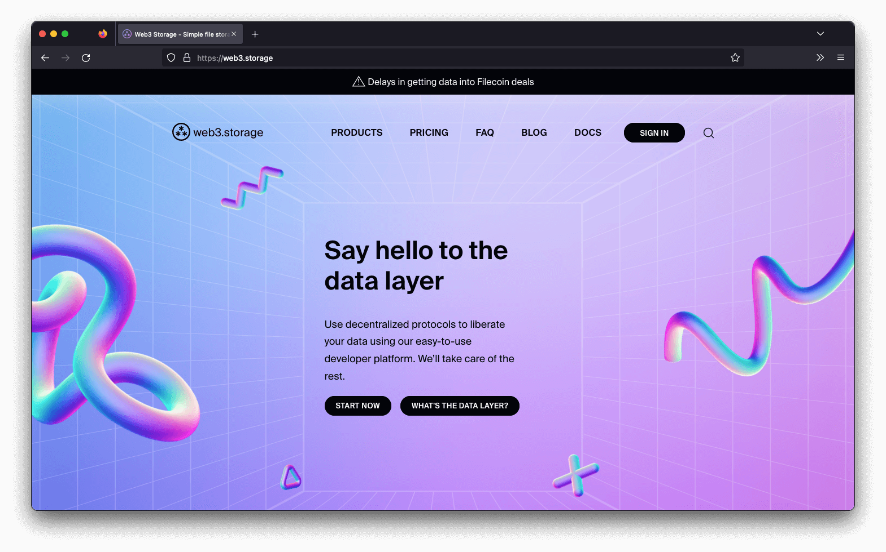



Web3.Storage also allows users to specify the level of security and privacy they want for their data. For example, users can choose to store their data on computers that are only located in certain countries, or they can specify that their data should only be accessible by certain individuals or groups. This gives users greater control over their data and how it is used.

For more information about Web3.Storage, check out the [Web3.Storage documentation](https://web3.storage/docs/).
