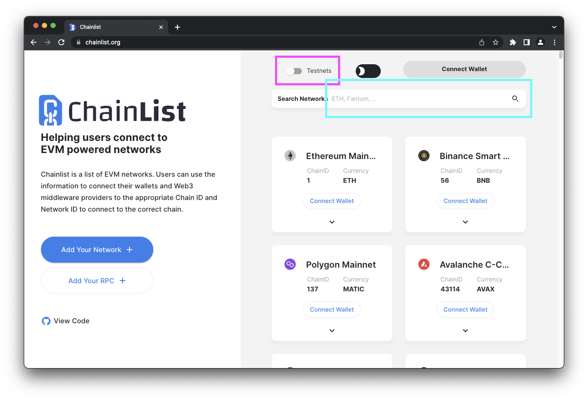
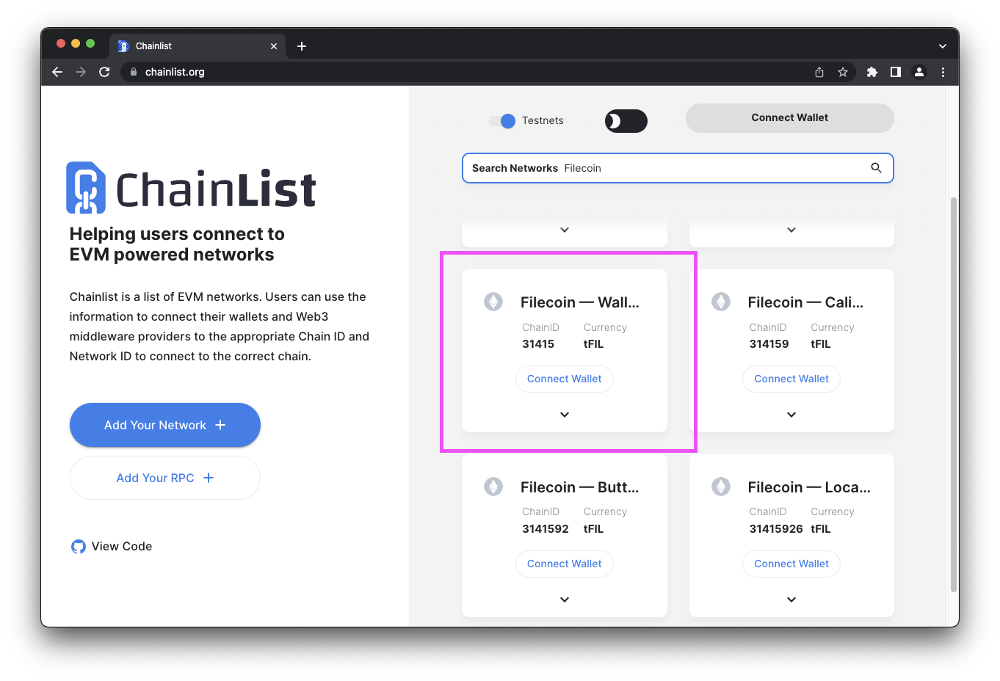
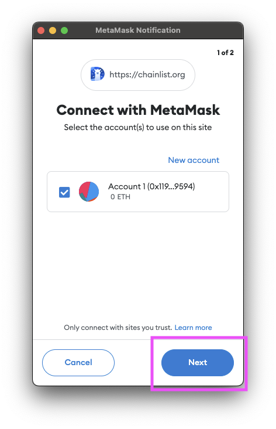
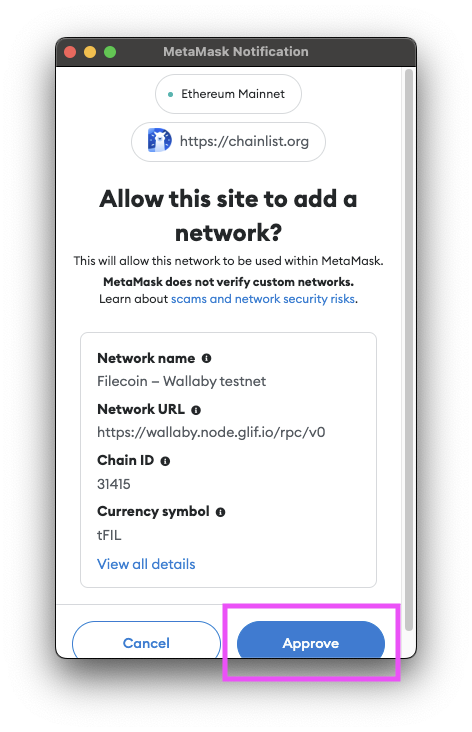
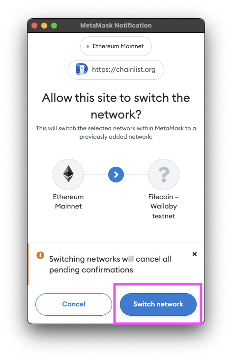
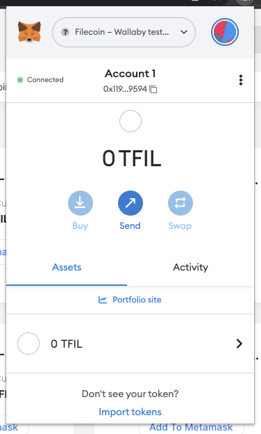
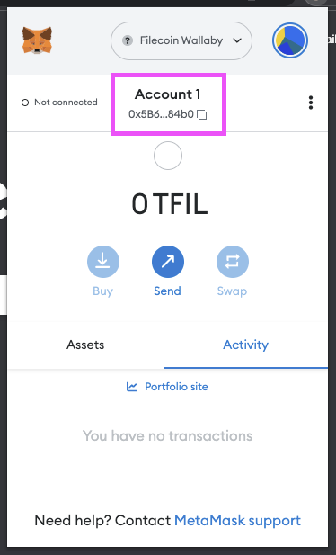
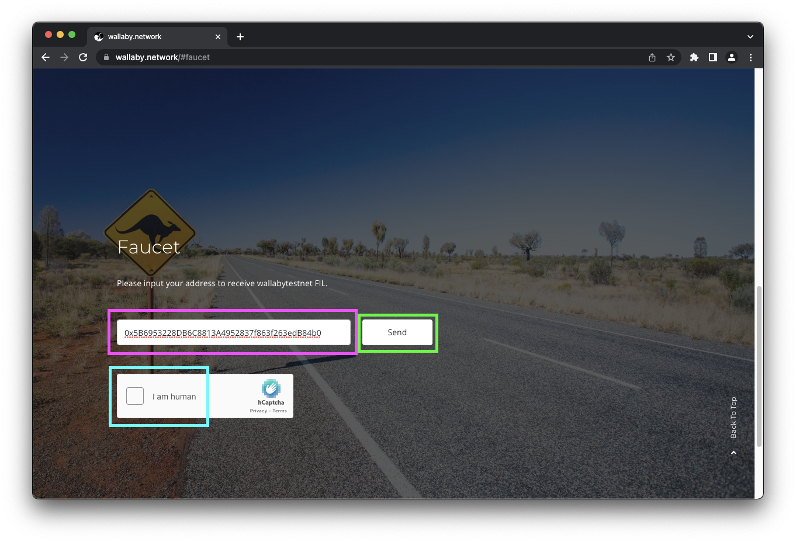
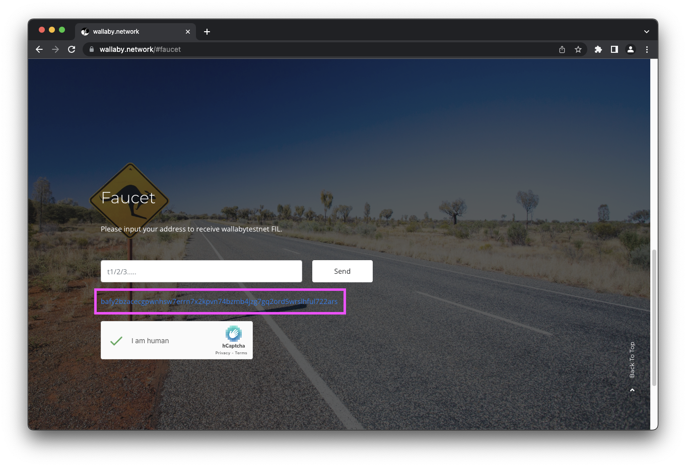
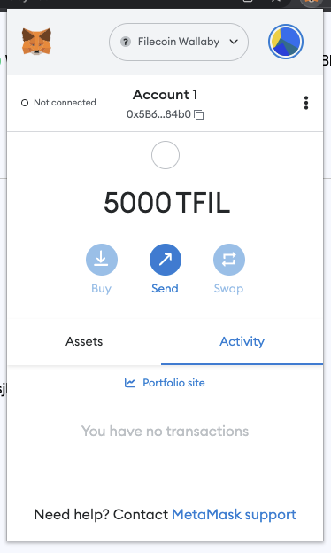



This tutorial assumes that you have some familiarity with web3, but you haven't hear of, or haven't yet used, the Filecoin network. However, you don't need to have developed smart-contracts in the past, as we're going to step through things from start to finish.

## Introducing the Filecoin virtual machine

The Filecoin virtual machine is (FVM) technology that allows developers to run code on the Filecoin network. The FVM has a number of different virtual machines that can run on-top of it. The baselayer is called WebAssemby (WASM), and then ontop of that is the Ethereum virtual machine (EVM) compatible layer. This tutorial is going to focus on deploying a smart contract to the Filecoin network using this EVM compatible layer.

## Create a wallet

Before we can interact with the Filecoin network, we need funds. But before we can get any funds, we need to where to put them! So we're going to be using MetaMask. MetaMask is a crypocurrency wallet that lives in your browser, which makes it really easy for users to interact with web3-based sites.

1. Open your browser and visit the [MetaMask website](https://metamask.io/).
1. Install the wallet by clicking the **Download for** button. MetaMask is available for Brave, Chrome, Edge, Firefox, and Opera.
1. Once MetaMask is installed, it will open a **Get started** window. 
1. Follow the promts until you are asked if you are **New to MetaMask**.
1. Because you don't yet have an account on the Filecoin network select **Create a wallet**.
1. Enter a secure password. You will use this password every time you want to open this wallet in this browser.
1. Click **Next** until you get to the **Secret Recovery Phrase** window. Read the information about what this _recovery phrase_ is on this page.
1. Once you've followed the instructions and saved your recovery phrase, click **Next**.
1. Confirm that you saved the recovery phrase correctly by clicking on the words in order.
1. Once you've done that, you should have your account set up!

## Switch networks

You may notice that MetaMask is currently connected to the **Ethereum Mainnet**. We need to point MetaMask to the Filecoin network, specifically the _Wallaby testnet_. We'll use a website called [chainlist.org](https://chainlist.org/) to quickly give MetaMask the information it needs.

1. Go to [chainlist.org](https://chainlist.org/).
1. Enable the **Testnets** toggle and enter `Filecoin` into the search bar.
    
    

1. Scroll down to find the **Filecoin -- Wallaby** testnet:

    

1. In MetaMask click **Next** and then **Continue** when prompted to connect Chainlist.org to MetaMask:

    

1. Back on the Chainlist.org page, click the **Filecoin -- Wallaby** testnet connect button again.
1. In MetaMask click **Approve** when prompted to _Allow this site to add a network_:

    

1. Click **Switch network** when prompted by MetaMask:

    

1. Open MetaMask, and you should see that you're now on the Filecoin Wallaby testnet:

    

Nice! Now we've got the Filecoin Wallaby testnet set up within MetaMask. You'll notice that our MetaMask window shows `0 TFIL`. Test-filecoin (`TFIL`) is `FIL` that has no value in the _real world_, and is purely used by developers for testing. We'll grab some `TFIL` next.

## Get some funds

1. Open your browser and open MetaMask.
1. Click your account to copy the address to your clipboard:

    

1. Go to [`wallaby.network#faucet`](https://wallaby.network/#faucet).
1. Paste your address into the address field, complete the **I am human** captcha, and then click **Send**:

    

1. The faucet should give you a link to the transaction. Click it to view your transaction:

    

1. The block explorer will show you the transaction history for your address. After a couple of minutes, you should see 5000 `tFIL` transferred to your address.
1. Open MetaMask to confirm that you received the `tFIL`:

    

1. Done!

## Connect to Remix

The development environment we're going to be using is called Remix. You can view the environment by going to [remix.ethereum.org](https://remix.ethereum.org/). Remix is an incredibly sophisitcated tool, and there's a lot you can play around with! However, in this tutorial we're going to just go through a fair simple development path.

### Create a workspace

In Remix, workspaces are siloed environments where you can create a contract, or group of contracts, for each of your projects. Let's make a new workspace where we can create our new ERC-20 token.

1. Click the `+` icon next to **Workspaces** to create a new workspace.
1. In the **Choose a template** dropdown, select **ERC 20**.
1. Select the **Mintable** checkbox.
1. In the **Workspace name** field, enter a fun name for your token. Something like `CorgiCoin` works fine.
1. Click **OK** to create your new workspace.

### Customize the contract

The contract template we're using is pretty simple; we just need to modify a couple of variables.

1. Under the **contract** directory, click **MyToken.sol**.
1. In the editor panel, replace `MyToken` with whatever you'd like to name your token. In this example we'll use `CorgiCoin`.
1. On the same line, replace the second string with whatever you want the symbol of your token to be. In this example we'll use `CRG`.

That's all we need to change within this contract. You can see on line 4 that this contract is importing another contract from `@openzeppelin` for us, meaning that we can keep our custom token contract nice and simple.

## Compile

1. Click the green play symbol at the top of the workspace to compile your contract. You can also press `CMD` + `s` on MacOS, or `CTRL` + `s` on Linux and Windows.
1. Remix automatically fetches the two `import` contracts from the top of our `.sol` contract. You can see these imported contract under the `.deps` directory.a You can browse the contracts in there, but any changes you make will not be saved.

## Deploy

Now that we've successfully compiled our contract, we need to deploy it somewhere! This is where our previous MetaMask set up comes into play.

1. Click the **Deploy** tab from the left.
1. Under the **Environment** dropdown, select **Injected Provider - MetaMask**.
1. MetaMask will open a new window confirming that you want to connect your account to Remix.
1. Click **Next** and the **Connect** to connect your `tFIL` account to Remix.
1. Back in Remix, under the **Account** field, you'll see that it says something like `0x5A5... (5000 ether)`. This value is actually 5000 `tFIL`, but Remix doesn't natively support the Filecoin network, and thus doesn't understand what `tFIL` is. This isn't a problem though, it's just a little quirk of using Remix.
1. Under the **Contract** dropdown make sure the contract you created.
