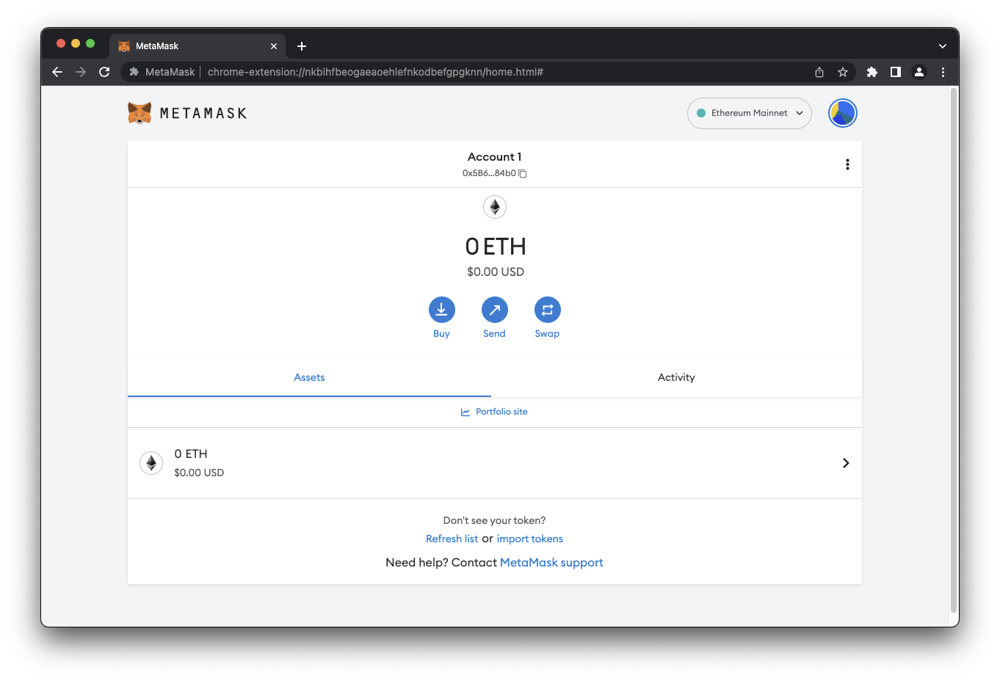
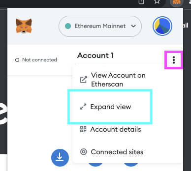
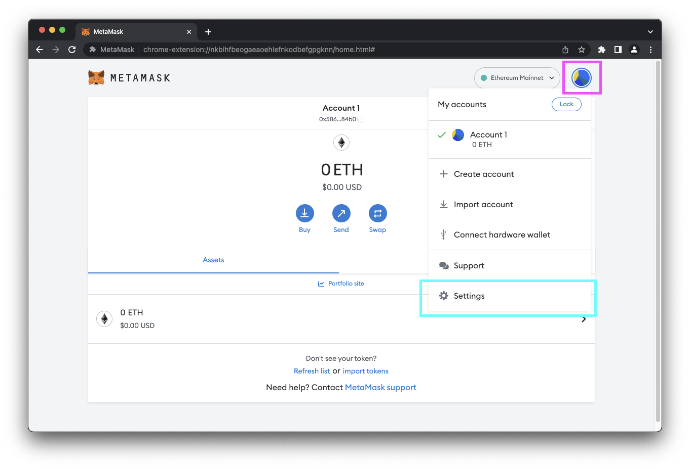
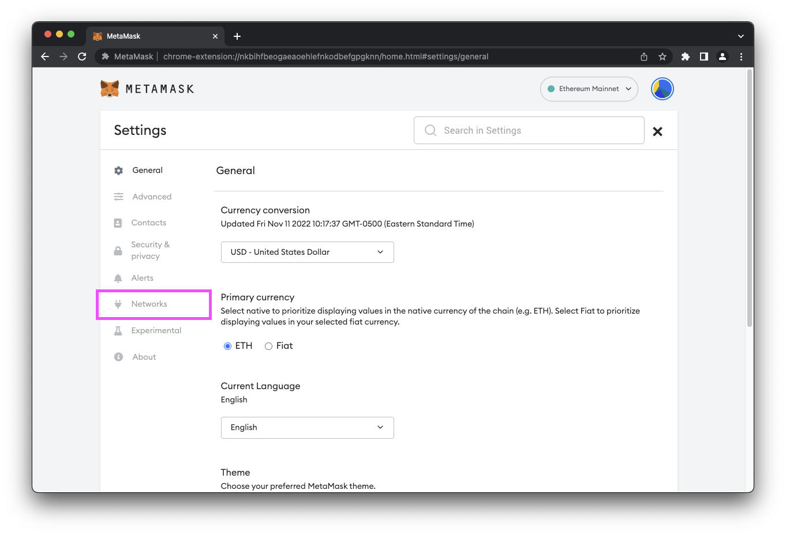
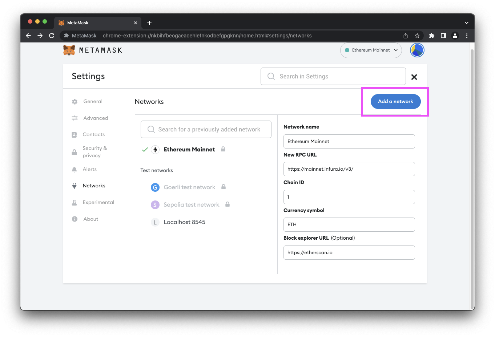
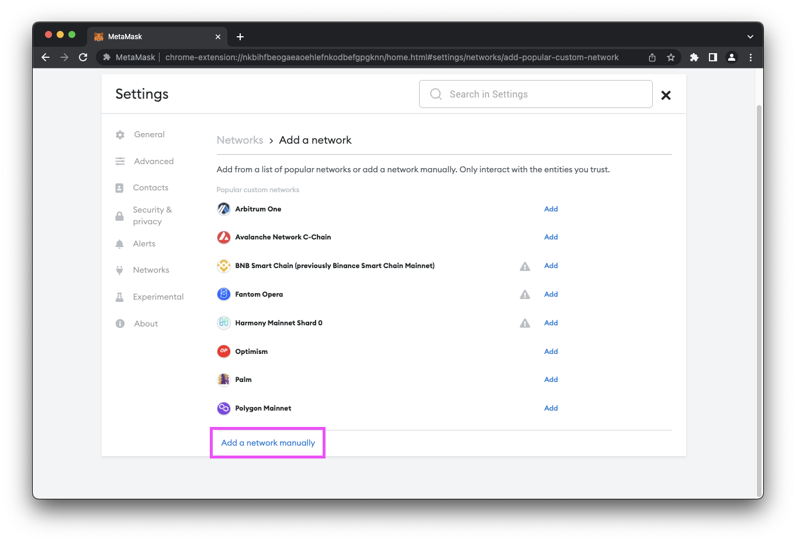
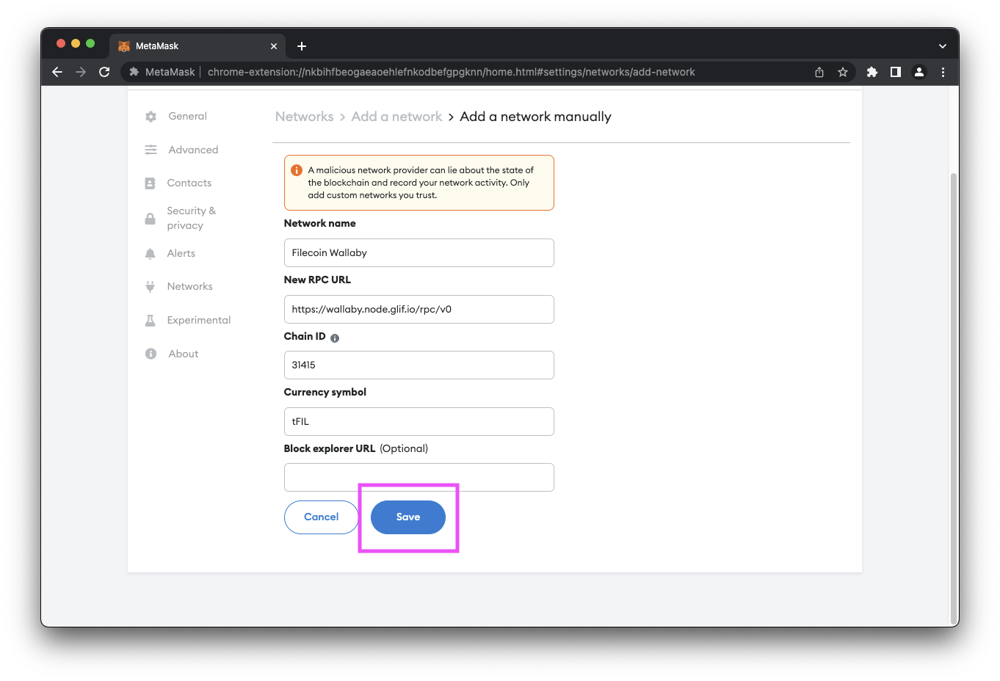
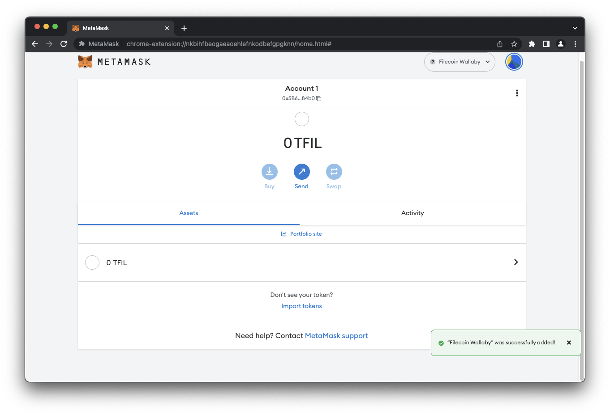



## Prerequisities

Before we get started, you'll need:

- A [Chromium-based browser](https://en.wikipedia.org/wiki/Chromium_web_browser#Browsers_based_on_Chromium), or [Firefox](https://www.mozilla.org/en-CA/firefox/products/).
- A browser with [MetaMask](https://metamask.io/) installed.

## Steps

The process for integrating Filecoin into MetaMask is fairly simple, but has some very specific variables that you must copy exactly.

1. Open your browser and open the MetaMask plugin:

    

    If you haven't opened the MetaMask plugin before, you'll be prompted to create a new wallet. Follow the prompts to create a wallet.
1. If you haven't already, change your view to **Expanded view**:

    

1. Click the user circle and select **Settings**:

    

1. Select **Networks**.

    

1. Click **Add a network**:

    

1. Scroll down and click **Add a network manually**:

    

1. Enter the following information into the fields:

    | Field | Value |
    | --- | --- |
    | Network name | `Filecoin Wallaby` |
    | New RPC URL | `https://wallaby.node.glif.io/rpc/v0` |
    | Chain ID | `31415` |
    | Currency symbol | `tFIL` |

1. Pick one of the following block explorers, and enter the URL into the **Block explorer (optional)** field:

    - Glif Explorer: `https://explorer.glif.io/?network=wallaby`
    - Filscan: `https://explorer.glif.io/?network=wallaby`

1. Review the values in the fields and click **Save**:

    

1. The Wallaby testnet should now be shown in your MetaMask window:

    

1. Done!

## Next steps

You can now add funds into this wallet by using the [Wallaby testnet faucet]().
