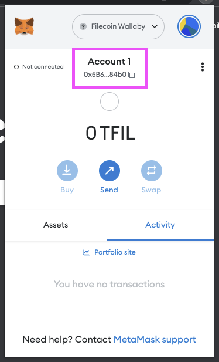
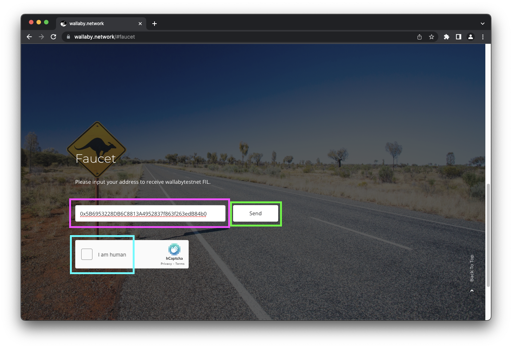
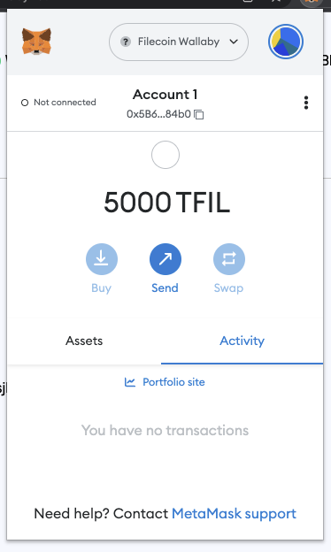



## Prerequisites

Before we begin, you must have an address on the Wallaby testnet. Follow the [Add to MetaMask guide]() if you don't have one yet.

<!-- ## Builder testnet (buildernet) -->
<!-- 1. Lorem. -->
<!-- 1. Ipsum. -->

## Wallaby testnet

1. Open your browser and open MetaMask.
1. Click your account to copy the address to your clipboard:

    

1. Go to [`wallaby.network#faucet`](https://wallaby.network/#faucet).
1. Paste your address into the address field, complete the **I am human** captcha, and then click **Send**:

    

1. The faucet should give you a link to the transaction. Click it to view your transaction:

    

1. The block explorer will show you the transaction history for your address. After a couple of minutes, you should see 5000 `tFIL` transferred to your address.
1. Open MetaMask to confirm that you received the `tFIL`:

    

1. Done!
