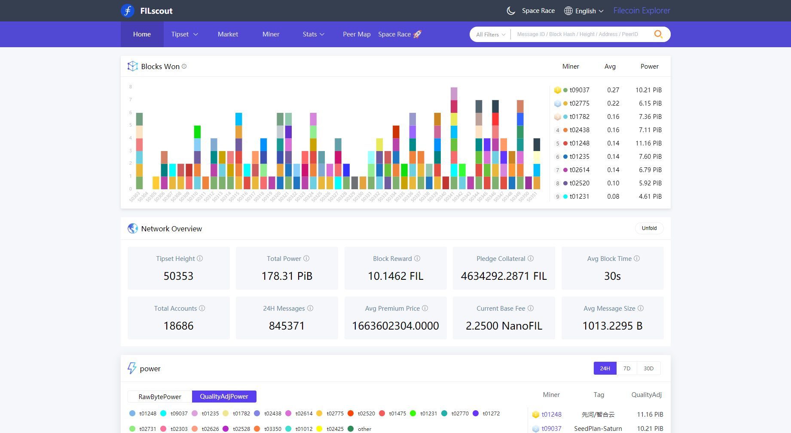

## Block explorers

Block explorers allow you to view the details of the Filecoin network on a single website. Individual block explorers contain different features that may be useful. None of these sites are created or maintained by Protocol Labs or the Filecoin Foundation. This list is in alphabetical order:

### Filfox

Website: [filfox.io](https://filfox.io)


### Filscan

Website: [filscan.io](https://filscan.io)


### Filscout

Website: [filscout](https://filscout.io)



## Lotus

Once you are [set up with Lotus](https://lotus.filecoin.io), you can use the command line to query information about the network.

Get the head tipset:

```shell
lotus chain head
```

Print a block:

```shell
lotus chain getblock <block_cid>
```

Print message information:

```shell
lotus chain getmessage <message_cid>
```

For additional chain-related commands:

```shell
lotus chain --help
```

