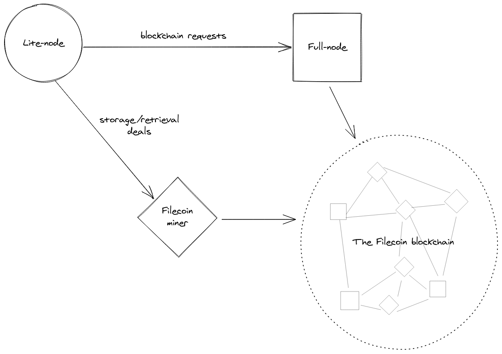

Before you begin storing any data on the Filecoin network, you need to run through a few steps to get everything set up. This section covers getting access to a Lotus full-node, creating a Lotus lite-node on your computer, getting a FIL address, and signing up to Filecoin+.


**What is Lotus?**
Programs that interact with the Filecoin network are called _implementations_, and [Lotus](https://lotus.filecoin.io) is a command-line interface (CLI) implementation. There are other implementation being created alongside Lotus, however Lotus is the only Filecoin implementation created and maintained by Protocol Labs.


## Things to note

As you're going through this section, make a note of the following variables:

| Variable | Description | Example |
| --- | --- | --- |
| Your Filecoin address | The public part of your Filecoin address. This address is what other users can use to send your FIL. | `f1fwavjcfb32nxbczmh3kgdxhbffqjfsfby2otloi` |

## Access a full-node

A Lotus full-node is a computer running the `lotus daemon`. Full-nodes are unique because they have complete access to the Filecoin blockchain. The computer specifications required to run a Lotus full-node are relatively high and might be out of reach for most end-user laptops and PCs.

Usually, we'd have to _spin up_ a full-node, but we're going to use a Lotus full-node provided by Protocol Labs for this tutorial. This node, called `api.chain.love`, is only for practice sessions like this tutorial and should not be relied upon for any production or development purposes.

## Install a lite-node

A lite-node lets your computer interact with the Filecoin network without having to run a resource-intensive full-node! Lite-nodes can do things like sign messages and talk to storage providers, but any processes that need data from the blockchain must come from a full-node. Luckily, lite-nodes automatically route any blockchain-based requests to a full-node. For this tutorial, you're going to run a Lotus lite-node on your local computer and have it connect to a full-node managed by Protocol Labs.




### macOS

**Requirements**
You can install Lotus on MacOS 10.11 El Capitan or higher. You must have [Homebrew](https://brew.sh/) installed.


1. Add the `filecoin-project/lotus` Homebrew tap:

    ```shell
    brew tap filecoin-project/lotus
    ```

1. Install Lotus:

    ```shell
    brew install lotus
    ```

1. Lotus is now installed on your computer.

[Head onto the next section to run your Lotus lite-node ↓](#run-a-lotus-lite-node)

### MacOS Build from source

If Homebrew doesn't work for you, or if you prefer to build from source, try these steps. 

1. Check that the XCode command line tools are installed.

    ```shell
    xcode-select -p (if missing, run xcode-select --install )
    ```

1. Install the pre-requisites via Homebrew
   
    ```shell
    brew install go bzr jq pkg-config rustup hwloc
    ```

1. Clone the latest sources
   
    ```shell
    git clone https://github.com/filecoin-project/lotus.git
    ```

1. Switch into the lotus folder
   
    ```shell
    cd lotus/
    ```

1. Checkout the latest release
   
    ```shell
    git checkout tags/v1.16.1
    ```

1. Setup some environment variables correctly
   
    ```shell
    export LIBRARY_PATH=/opt/homebrew/lib; export FFI_BUILD_FROM_SOURCE=1
    ```

1. Install Rust (when prompted, choose the default 'install' option) 
   
    ```shell
    rustup-init
    ```

1. Build the clients
   
    ```shell
    make all
    ```

If you get a warning: 'kIOMasterPortDefault' is deprecated: first deprecated in macOS 12.0' , don't worry - the build still worked. 


1. Finally, install the client into your system
    
    ```shell
    sudo make install
    ```

Now, you're ready to [run a Lotus lite node](/get-started/store-and-retrieve/set-up/#run-a-lotus-lite-node)

### Linux

<!-- There are two simple ways to install Lotus on Linux (this is tested on Ubuntu): -->

The easiest way to install the lotus client is to use Snap.
<!-- Commenting out AppImage until it builds again
- [AppImage](#appimage) -->
- [Snap](#snap)


<!-- #### AppImage

AppImage is not currently available, please use another option.

1. Update and upgrade your system:

    ```shell
    sudo apt update -y && sudo apt upgrade -y
    ```

1. Download the latest `AppImage` file from the [Lotus GitHub releases page](https://github.com/filecoin-project/lotus/releases/):

    ```shell
    wget https://github.com/filecoin-project/lotus/releases/download/v1.16.1/Lotus-v1.16.1-x86_64.AppImage
    ```

1. Make the `AppImage` executable:

    ```shell
    chmod +x Lotus-v1.16.1-x86_64.AppImage
    ```

1. Move the `AppImage` to `/usr/local/bin` and rename it `lotus`:

    ```shell
    sudo mv Lotus-v1.16.1-x86_64.AppImage /usr/local/bin/lotus
    ```

[Head onto the next section to run your Lotus lite-node ↓](#run-a-lotus-lite-node)
-->
#### Snap

**Requirements**
You must have [Snapd](https://snapcraft.io/docs/installing-snapd) installed.


1. To install Lotus using Snap, run:

    ```shell
    sudo snap install lotus-filecoin
    ```

2. The snap installer automatically starts a full lotus node in the background. For the purposes of this tutorial, we don't want that, so stop it, and then we can run a lotus lite node instead.

    ```shell
    sudo snap stop lotus-filecoin
    ```

[Head onto the next section to run your Lotus lite-node ↓](#run-a-lotus-lite-node)

## Run a Lotus lite-node

Now that you have Lotus ready to run, you can start a Lotus lite-node on your computer and connect to the `api.chain.love` Lotus full-node!


`api.chain.love` is a Lotus full-node managed by Protocol Labs. It's ideal for use in this tutorial, but should not be used in a development or in a production environment.



if you installed via Snap, the binary name is 'lotus-filecoin.lotus' instead of just 'lotus'


1. Open a terminal windows and run the `lotus daemon --lite` command, using `api.chain.love` as the full-node address:

    ```shell with-output
    FULLNODE_API_INFO=wss://api.chain.love lotus daemon --lite
    ```
    
    ```
    ...
    2021-06-16T02:00:08.390Z        INFO    markets loggers/loggers.go:56   module ready   {"module": "storage client"}
    2021-06-16T02:00:08.392Z        INFO    markets loggers/loggers.go:56   module ready   {"module": "retrieval client"}
    2021-06-16T02:00:18.190Z        INFO    basichost       basic/natmgr.go:91      DiscoverNAT error:no NAT found
    ...
    ```

1. MacOS users may see a warning regarding Lotus. Select **Accept incoming connections** if you see a warning.
1. The Lotus daemon will continue to run. You must run further commands from a separate terminal window.

Next up is [getting a FIL address ↓](#get-a-fil-address)

## Get a FIL address

Filecoin addresses are similar to regular bank account numbers. Other users can use your address to send you FIL, and you can use your address to pay storage providers for storing and retrieving your data.

There are two parts to a Filecoin address: the public address and the private key. You can freely share your public address with anyone, but you should never share your private key. We're not going to view any private keys in this tutorial, but it's essential to understand the difference between your public address and your private key.

1. Open a new terminal window and create an address using the `lotus wallet new` command:

    ```shell with-output
    sudo lotus wallet new
    ```

    ```
    f1fwavjcfb32nxbczmh3kgdxhbffqjfsfby2otloi
    ```

    Lotus outputs your public address. Public addresses always start with `f1`.

1. Make a note of this address. We'll use it in an upcoming section.

## Backup your address

Your address is made up of two parts: your _public address_ and your _private key_. The public address is what you see when you run `lotus wallet new`, and you're safe to share that address with whoever you want. Your private key, however, must be kept secret and secure. If you lose your private key, you lose access to any FIL stored in that address.

It is incredibly important that you backup your addreses. Storing a copy of your addresses on another device is a great way to ensure you don't lose access to your funds.

1. If your public address `f1...` is still in the terminal window, copy it to your clipboard. If not, list the addresses associated with your Lotus node and copy your public address:

    ```shell with-output
   sudo lotus wallet list
    ```

    ```
    Address                                    Balance  Nonce  Default
    f1nau67e6k6ggdwluatfz4waexetjfrqmx6fil3nq  0 FIL    0      X
    ```

1. Use `lotus wallet export` to export your private key, replacing `f1...` with your public key:

    ```shell
    sudo lotus wallet export f1... > my_address.key
    ```

    This will create a new file called `my_address.key` in the current directory.

Once you have your address in a file, you can copy it to another drive, securely send it to another computer, or even print it out. It's important to keep this file safe. If anything happens to your Lotus node, you can still access your funds using this file.

## Adding FIL to your wallet or using Filecoin Plus?

Before you can transact on the network, you usually have to add some Filecoin to your wallet. You can do this via an exchange such as [Coinbase](https://www.coinbase.com), but you can bypass this stage by applying for Filecoin Plus Datacap below. If you have Datacap on your wallet, then transaction fees are covered, and you can start doing deals faster.  

[Read more about managing wallets](/about-filecoin/managing-assets)


## Filecoin Plus

Storage providers get paid either by receiving FIL directly from users for storing their data, winning block rewards from the network, or both!

Getting paid from users is straightforward. If Laika wants to store some data, and Albert is a storage provider, the two of them can create a deal to store Laika's data for `X` amount of time for `Y` FIL.

Block rewards are randomly given to a storage provider every 30 seconds. The more data that a storage provider is _storing_, the higher their chances of winning the block reward. So if a storage provider accepts a deal from a user to store 5 GB of data, they have 5 chances to win the block reward for each 30 second round.

DataCap acts as a kind of _multiplier_ for block rewards. If a storage provider accepts a deal from a user with DataCap attached, also known as a _verified deal_ , then the Filecoin network treats that deal as though it's 10x bigger. So a 5 GB deal gives the storage provider 50 chances to win the block reward instead of the usual 5 chances. Some storage providers find DataCap so valuable that they're willing to make verified deals without charging any FIL! You can find a list of these storage providers using the [Filecoin Plus storage provider registry](https://plus.fil.org/miners/).

### Sign up

Signing up to Filecoin Plus is easy and free!


You need a GitHub account that is at least 180 days old. If you don't have a GitHub account that's old enough, [get in touch with #fil-lotus-help on Filecoin Slack](https://filecoinproject.slack.com/archives/CPFTWMY7N).


1. Go to [plus.fil.org](https://plus.fil.org).
1. Under **For Clients**, click **Proceed**.
1. Under **Get Verified**, click **Get Datacap**.
1. Click **Automatic Verification**.
1. Click **Github** to connect to your Github account
1. In the `Request` field, enter the public address you got from running `lotus wallet list`. This step may take a few minutes to complete.

You can check your Filecoin Plus balance with

```shell
lotus filplus check-client-datacap f1...
```


You can only request automatic datacap once every 30 days for a single GitHub account.


## Next steps

Now that we've got all the set up out of the way, we can move onto [storing data with the Filecoin network →]()
