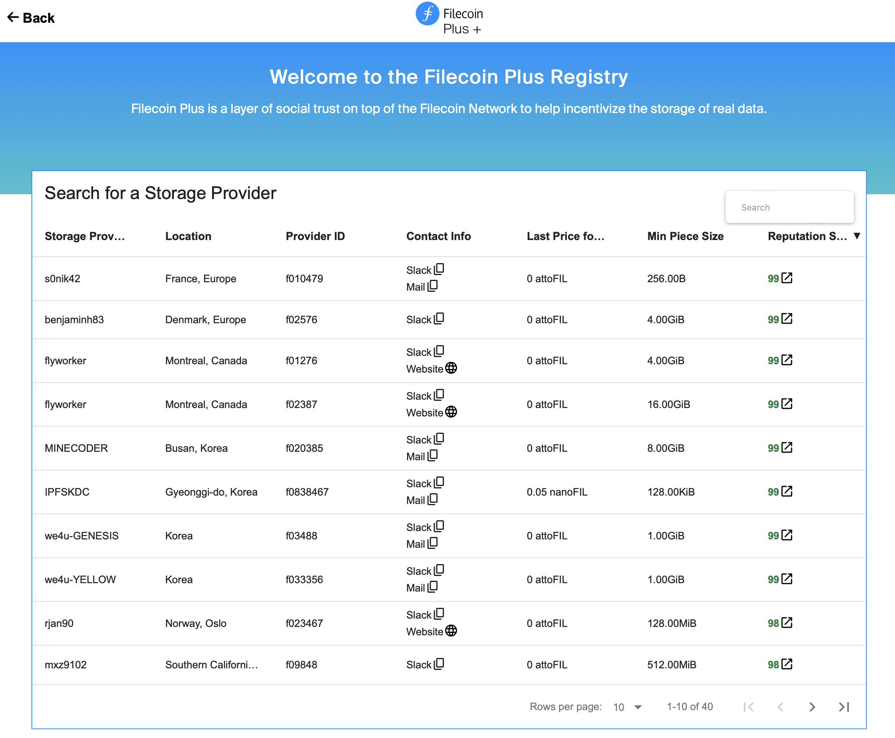
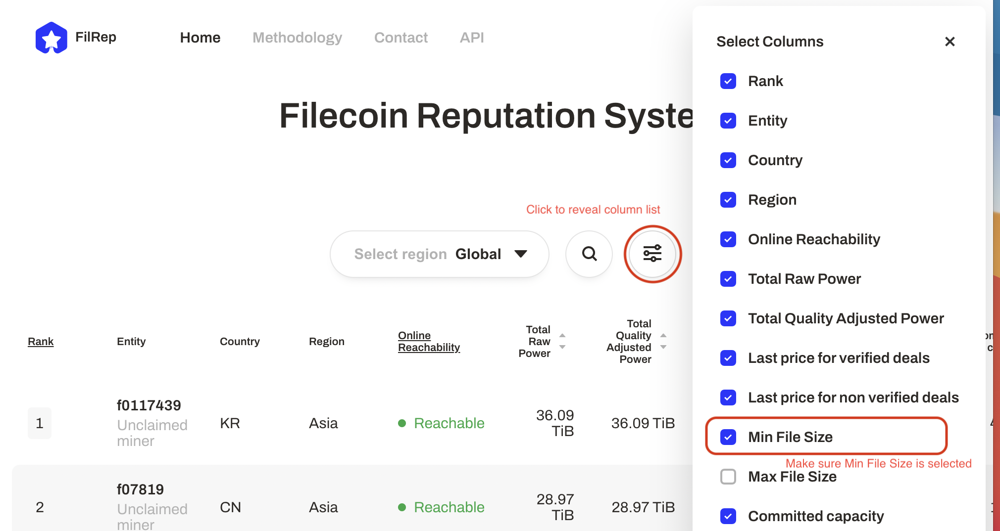
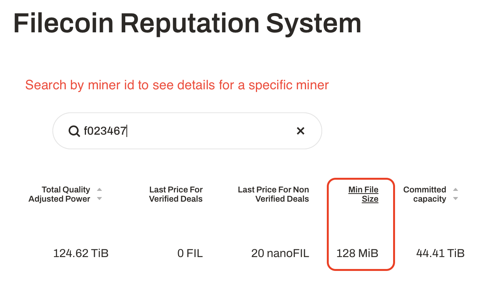

Start storing your data on the Filecoin network. This section covers packaging your data, importing it into your local Lotus lite-node, finding a storage provider through the Filecoin Plus storage provider registry, creating a storage deal, and then waiting for the deal to complete. There's a lot to do, so let's dive in!


Filecoin is optimized for public data and doesn't yet support access controls. If storing private data, ensure you encrypt it before storage to ensure it remains unreadable by anyone without the ability to decrypt it. Keep in mind that if a vulnerability is found in your encryption process at any point in the future, then your data may be compromised.


## Things to note

As you're going through this section, make a note of the following variables:

| Variable | Description | Example |
| --- | --- | --- |
| Data CID | The content identifier (CID) of the data that you want to store using Filecoin. | `bafk2bzaceajz56zudni2hli7id6jvvpo5n4wj5eoxm5xwj2ipthwc2pkgowwu` |
| Miner ID #1 | The unique identifier for each storage provider. You need to have two storage provider IDs for this tutorial. | `f01000`
| Miner ID #2 | The unique identifier for each storage provider. You need to have two storage provider IDs for this tutorial. | `f01000`
| Deal CID | The content identifier (CID) for a deal made with a storage provider. | `bafyreict2zhkbwy2arri3jgthk2jyznck47umvpqis3hc5oclvskwpteau` |

## Prepare your data

For this tutorial, we're going to create a dummy 5GB file full of random data and store it on the Filecoin network.

1. Move into your home folder:

    ```shell
    cd ~
    ```

1. Create a 5GB block of random data to serve as our payload:


    ```shell
    dd if=/dev/urandom of=5gb-filecoin-payload.bin bs=1M count=5200
    ```

    This process will take up to 60 seconds to create a dummy file.

We now have our payload file ready to be stored using the Filecoin network.

## Add data to Lotus

We need to tell our Lotus lite-node which file we want to store using Filecoin.

1. Import the payload into the `lotus daemon` using the `import` command:

    ```shell
    lotus client import 5gb-filecoin-payload.bin
    ```

    Lotus creates a directed acyclic graph (DAG) based off the payload. This process takes a few minutes. Once it's complete, Lotus will output the payload CID.

    ```plaintext output
    Import 3, Root bafykb...
    ```

    This process takes up to 60 seconds.

1. Make a note of the CID `bafykb...`. This is your **Data CID**. We'll use it in an upcoming section.


'lotus client local' will list all the currently imported CIDs


Now that Lotus has imported your file, we can create a deal with a Filecoin storage provider to store our data!


## Find a storage provider

We need to find suitable storage providers before we can store our data. The Filecoin network allows storage providers to compete by offering different terms for pricing, acceptable data sizes, and other important deal parameters. It's also important to consider the storage provider's location; the closer the storage provider is to you, the faster the storage and retrieval process will be.

We're going to use the Filecoin Plus storage provider registry to find a couple of storage providers and then cross-check their information with a third-party storage provider reputation system.


Increasing the number of storage providers you use increases your data redundancy, and decreases the chances of your data being lost.


### Filecoin Plus provider registry

The Filecoin Plus storage provider registry is a collection of geographically diverse storage providers that are willing to accept low-cost or free storage deals from users. The more storage providers that offer storage in different parts of the world, the faster we can work toward Filecoin’s underlying mission to store humanity’s most important information. Checkout the [Filecoin Plus page]() to find out more about the program.

Let's find a couple of storage providers to store our data.

1. Go to [plus.fil.org/miners](https://plus.fil.org/miners/).
1. Using the table, find a couple of storage providers that suit your needs. Try to find storage providers that are geographically close to you.
1. Once you have found a couple of suitable storage providers, make a note of their _miner IDs_ from the **Miner ID** column:

    


1. Make sure to write down the IDs of the storage providers you want to use. We'll be referring to these IDs in the next section.


### Miner reputation systems

The Filecoin Plus storage provider registry is a great resource, but it represents a small portion of the entire Filecoin mining community. Filecoin reputation systems like [FilRep](https://filrep.io) can help you compare storage providers based on their past performance and provide useful information about the deal parameters that a storage provider will accept. Using FilRep, you can compare storage provider metrics like location, storage power in the network, pricing, and overall success rate.

We're going to use FilRep to check that the minimum deal size of the storage providers we selected fits the size of our file.

1. Go to [filrep.io](https://filrep.io).
1. Click the **Settings** toggle to display a list of all available storage provider details.
1. Make sure that the **Min File Size** column is selected:

    

1. Now you can search for the storage providers you found before, using the miner ID.

    

1. Check that the minimum file size is lower than 5 GiB, and that they charge 0 FIL for verified deals.
1. If the minimum file size shown for any of your storage providers is larger than 5 GiB, or they charge more thann 0 FIL for verified deals, go back to [the previous section](#filecoin-plus-provider-registry) and select a new storage provider.

Now that you've found your storage providers, you can move onto creating a storage deal!

## Create a deal

To complete this section, you need the **Data CID** you received after running `lotus client import` and the IDs of the storage providers you want to use.

1. Start the interactive deal process:

    ```shell
    lotus client deal
    ```

    The interactive deal assistant will now ask you some questions.


If you get an error 'actor not found', it likely means this address has never had FIL or Datacap added to it. You'll need to add some of either before you can do a deal.
[Add Datacap](/get-started/store-and-retrieve/set-up/#filecoin-plus)
[Add FIL](/get-started/store-and-retrieve/set-up/#adding-fil-to-your-wallet-or-using-filecoin-plus)


1. Specify the CID of the payload you want to backup on Filecoin. This is the CID that you got from running `lotus client import ~/5gb-filecoin-payload.bin`:

    ```plaintext output
    Data CID (from lotus client import): bafykbz...
    ```

1. Wait for Lotus to finish calculating the size of your payload. Lotus calculates this size by counting the individual bits in your payload to ensure that the size is accurate.

    ```plaintext output
    .. calculating data size
    ```

    The duration of this process depends on the size of your file and the specification of your Lotus node. In tests, Lotus took around 20 minutes file of a ~7.5GB file with a 4-core CPU and 8GB RAM. These specifications are common for most end-user laptops.

1. Enter the number of days you want to keep this file on Filecoin. The minimum is 180 days:

    ```plaintext output
    Deal duration (days): 180
    ```

1. Tell Lotus whether or not this is a Filecoin Plus deal. Since you signed up to Filecoin Plus in an earlier step, select `yes` here:

    ```plaintext output
    Make this a verified deal? (yes/no): yes
    ```

1. Enter the miner IDs from the previous section with an empty space separating the two IDs:

    ```plaintext output
    Miner Addresses (f0.. f0..), none to find: f01000 f01001
    ```

1. Confirm your transaction by entering `yes`:

    ```plaintext output
    -----
    Proposing from f136b5uqa73jni2rr745d3nek4uw6qiy6b6zmmvcq
            Balance: 2 FIL

    Piece size: 8GiB (Payload size: 7.445GiB)
    Duration: 7200h0m0s
    Total price: ~0 FIL (0 FIL per epoch)
    Verified: true

    Accept (yes/no): yes
    ```

1. Lotus will returns two **Deal CIDs**:

    ```plaintext output
    .. executing
    Deal (f01000) CID: bafyreict2zhkbwy2arri3jgthk2jyznck47umvpqis3hc5oclvskwpteau
    Deal (f01001) CID: bafeauyreict2zhkbwy2arri3jgthk2jyznck47umvpqis3hc5oclvskwpt
    ```

1. Take a note of the **deal CIDs** `baf...`.

## Check the deal status

Once the data has been sent to the storage clients, the storage deals can take several hours to complete - this depends on a number of factors, including the storage provider you're working with, how quickly they trigger the sealing process, and how quickly they can seal data. You can check the progress of your deals.

1. List successful and pending deals by using the `lotus client list-deals` command:

    ```shell
    lotus client list-deals --show-failed
    ```

    **DO NOT TURN OFF YOUR LOTUS NODE**
    Your Lotus lite-node needs to remain online until the deal state has reached `StorageDealActive`. See the [Processing states](#processing-states) table below to find out which states happen and when.
    

1. You can check the progress of any data transfers by running `lotus client list-transfers`:

    ```shell
    lotus client list-transfers
    ```

    This command will output something like:

    ```plaintext output
    Sending Channels
    ID                   Status   Sending To   Root Cid     Initiated?  Transferred  Voucher
    1620782601911586915  Ongoing  ...KPFTTwY7  ...zyd3kapm  Y           224.1MiB     ...bqhcidjmajbelhlxfqry3d7qlu3tvar45a"}}

    Receiving Channels
    ...
    ```

    If the output of `lotus client list-transfers` is empty, then your transfer has finished:

    ```shell with-output
    lotus client list-transfers
    ```
    ```
    Sending Channels


    Receiving Channels


    ```

### Deal states

Because of the complex nature of Lotus and the Filecoin network, deals can be in one of many different states.

#### Processing states

The following table is the list of states that a deal should enter, assuming there are no errors. This list is in chronological order, from when the deal is first created to when it has completed successfully:

| State | Description |
| --- | --- |
| StorageDealUnknown | The current status of a deal is undefined or unknown. This could be because your full-node is out of sync. |
| StorageDealReserveClientFunds | The client is checking that it has enough FIL for the deal.|
| StorageDealClientFunding | The client has deposited funds into the StorageMarketActor and is waiting for the funds to appear. |
| StorageDealFundsReserved | Your FIL has been deposited into escrow and is ready to be used to pay for the deal. |
| StorageDealStartDataTransfer | The storage provider is ready to accept data from the client Lotus node. |
| StorageDealTransferring | The data is being transferred from the client Lotus node to the storage provider. |
| StorageDealCheckForAcceptance | The client is waiting for a storage provider to seal and publish a deal. |
| StorageDealProposalAccepted | The storage provider intends to accept a storage deal proposal; however, the storage provider has not made any commitment to do so at this point. |
| StorageDealAwaitingPreCommit | A deal is ready and must be pre-committed. |
| StorageDealSealing | The storage provider, is sealing data into a sector. The larger your data payload, the longer this will take. |
| StorageDealActive | The data is in a sealed sector, and the storage provider can provide the data back to you. |
| StorageDealExpired | A deal has passed its final epoch. The storage provider could still have the data available but is under no obligation to provide it to anyone. |

#### Error states

The following deal states mean there was a failure somewhere along the line, in alphabetical order:

| State | Description |
| --- | --- |
| StorageDealError | There has been an unforeseen error. No further updates will occur. |
| StorageDealFailing | Something has gone wrong in a deal. Once data is cleaned up, the deal will finalize. |
| StorageDealProposalNotFound | Your full-node cannot find the deal you are looking for. This could be because it doesn't exist, or your full-node is out of sync. |
| StorageDealProposalRejected | The storage provider, has chosen not to accept this deal. The storage provider may have provided a reason alongside this status message, but not always. |
| StorageDealRejecting | The storage provider has rejected the deal. This comes immediately before StorageDealProposalRejected. |
| StorageDealSlashed | The data was in a sector, and the storage provider got slashed for failing to prove that the data was available. |

#### Informational states

The following deal states are informational, and do not mean that a deal has failed. This list is in alphabetical order:

| State | Description |
| --- | --- |
| StorageDealAcceptWait | The storage provider is running custom decision logic to decide whether or not to accept the deal. The deal will have this status until the custom logic comes to a decision. |
| StorageDealClientTransferRestart | A storage deal data transfer from a client to a storage provider has restarted after a pause, likely caused by StorageDealProviderTransferAwaitRestart. |
| StorageDealFinalizing | All the data is within the sector, and the storage provider is performing the final checks to make sure that all the data is correct. |
| StorageDealProviderFunding | The storage provider has deposited funds into StorageMarketActor and is waiting for the funds to appear. |
| StorageDealProviderTransferAwaitRestart | The storage provider restarted while data was being transferred from the client to the storage provider. Once the storage provider is back online, it will wait for the client to resume the transfer. |
| StorageDealPublish | The deal is ready to be published on-chain. |
| StorageDealPublishing | The deal has been published but is yet to appear on-chain. |
| StorageDealReserveProviderFunds | The storage provider is checking that it has enough FIL for the deal. |
| StorageDealStaged | The deal has been published, and data is ready to be put into a sector. At this point, the storage provider has fully committed to storing your data. |
| StorageDealValidating | The storage provider is validating that the deal parameters are good for a proposal. |
| StorageDealVerifyData | All the data has been transferred, and the storage provider is now attempting to verify it against the PieceCID. |
| StorageDealWaitingForData | Either a manual transfer is occurring, or the storage provider has not received a data-transfer request from the client. |

These states come from the [Lotus project GitHub repository](https://github.com/filecoin-project/go-fil-markets/blob/master/storagemarket/dealstatus.go).

## Next steps

Now that you've added some data onto the Filecoin network [we can move into retrieving data →]()
