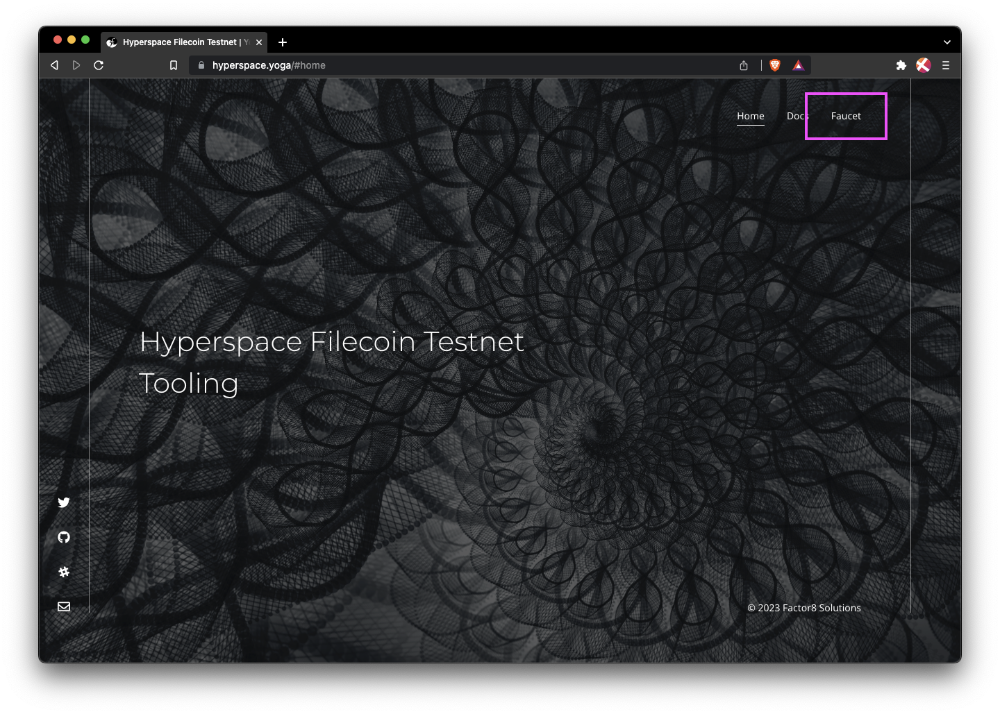

MetaMask is one of the easier ways to manage addresses on the Hyperspace testnet. MetaMask uses the `t4` [address type](), which allows developers to create and manage Solidity contracts easily. Follow the [Add to MetaMask guide]() if you havn't set up an address in your MetaMask wallet yet.
w

1. In your browser, open MetaMask and copy your address to your clipboard:

    

1. Go to [hyperspace.yoga](https://hyperspace.yoga) and click **Faucet** from the menu.

    

1. Paste your address into the address field, complete the **I am human** captcha, and then click **Send**:

    

1. The faucet should give you a link to the transaction:

    

1. The [block](https://docs.filecoin.io/reference/general/glossary/#block) explorer will show you the transaction history for your address. After a couple of minutes, you should see 5 `tFIL` transferred to your address.

    

1. Open MetaMask to confirm that you received the `tFIL`:

    

That's all there is to it! Getting `tFil` is easy!
