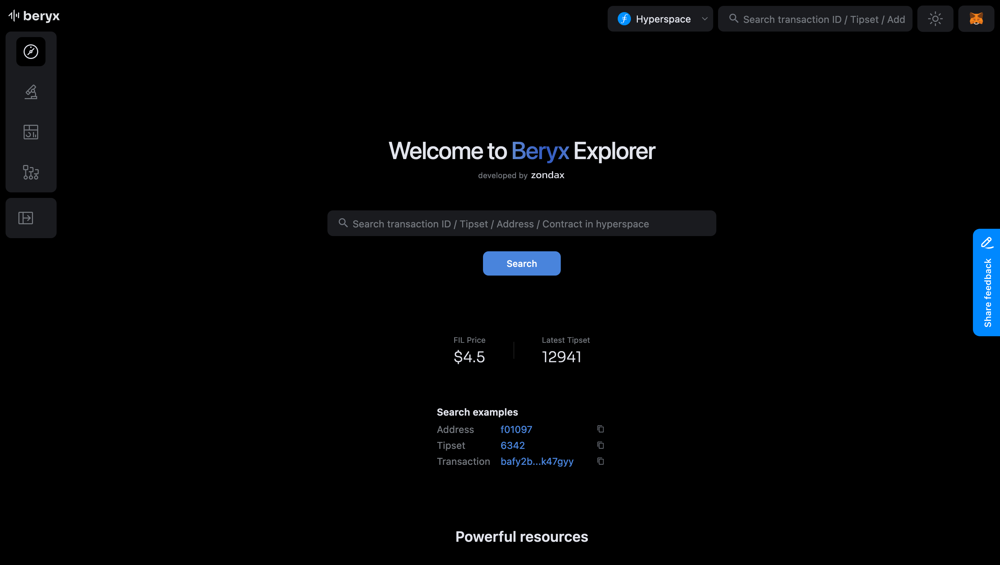
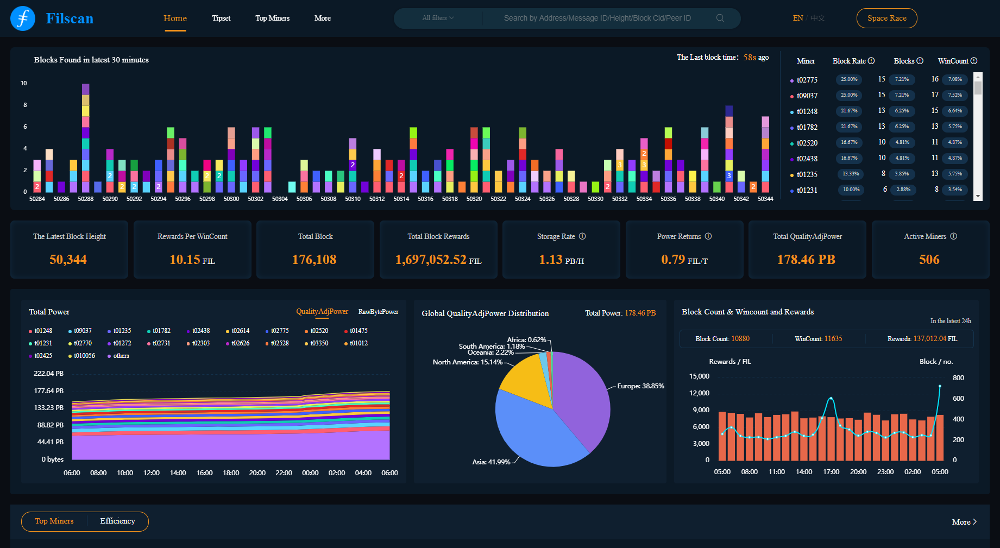
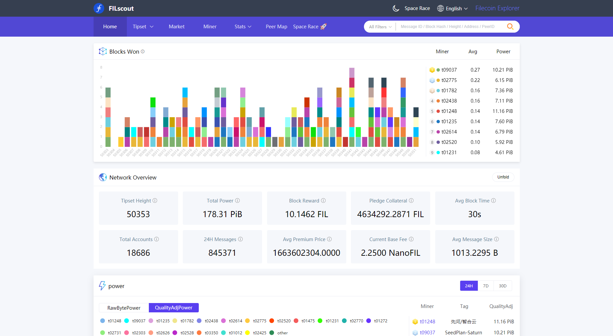

## Account, actor & message explorers

These explorers allow you to view the states of Filecoin accounts and actors (smart contracts) and the details of messages sent across the network.

### Glif Explorer

Website: [explorer.glif.io](https://explorer.glif.io)

## Block explorers

Block explorers allow you to view the details of the Filecoin network on a single website. Individual block explorers contain different features that may be useful. None of these sites are created or maintained by Protocol Labs or the Filecoin Foundation. This list is in alphabetical order:

### Beryx

Website [beryx.zondax.ch](https://beryx.zondax.ch/)



### Filfox

Website: [filfox.io](https://filfox.io)


### Filexplore

Website: [explorer.filmine.io](https://explorer.filmine.io/)


### Filscan

Website: [filscan.io](https://filscan.io)



### Filscout

Website: [filscout](https://filscout.io)



### Starboard

Website: [fvm.starboard.ventures](https://fvm.starboard.ventures/)


## API requests

If you have access to a Filecoin node, you can send a JSON-RPC request to get block information.

To get the head tipset:

```shell
curl --location --request POST 'https://api.node.glif.io/rpc/v1' \
--header 'Content-Type: application/json' \
--data-raw '{
    "jsonrpc":"2.0",
    "method":"Filecoin.ChainHead",
    "params": null,
    "id":1
}' | jq
```

```plaintext
{
  "jsonrpc": "2.0",
  "result": {
    "Cids": [
      {
        "/": "bafy2bzacebpgpa7elb5uwqxbiljlzgbmpenv4yw2e3gpcjk7ssxv2ijv3ecv2"
      },
      {
        "/": "bafy2bzacebfsx4shadra7lexbmtbshv5xgpgtcthyo5zkfgpzyb2ck7xbsgt4"
      },
      {
        "/": "bafy2bzaced7yflfg3b74rauvstrkemwlg4erz2vo5nrk7daawdq7jxzbtrzbc"
      },
      {
        "/": "bafy2bzacedzxnhhaxsht566onhdtcmcyt2kqivmcjqzjixtbbwll42h6yjrjg"
      }
    ],
    "Blocks": [
      {
        "Miner": "t01130",
        "Ticket": {
          "VRFProof": "t+mU8Mn6t8f9f0H9/7qfr42neKY6OnQxlZzACLpXDJARE9YLBYDJCLSIBiuxrjbNGT01WejDz1/UUJuXTr6xkORObvNmUOmNB7IBlUW9Arp9YYHEK/rhDQpiYky7bsoE"
        },
...
```

Print a block:

```shell
curl --location --request POST 'https://api.node.glif.io/rpc/v1' \
--header 'Content-Type: application/json' \
--data-raw '{
    "jsonrpc":"2.0",
    "method":"Filecoin.ChainGetBlock",
    "params": [{"/": "bafy2bzacebpgpa7elb5uwqxbiljlzgbmpenv4yw2e3gpcjk7ssxv2ijv3ecv2"}],
    "id":1
}' | jq
```

```plaintext
{
  "jsonrpc": "2.0",
  "result": {
    "Miner": "t01130",
    "Ticket": {
      "VRFProof": "t+mU8Mn6t8f9f0H9/7qfr42neKY6OnQxlZzACLpXDJARE9YLBYDJCLSIBiuxrjbNGT01WejDz1/UUJuXTr6xkORObvNmUOmNB7IBlUW9Arp9YYHEK/rhDQpiYky7bsoE"
    },
    "ElectionProof": {
      "WinCount": 1,
      "VRFProof": "ommtXiL1nf41+z9v15DhXMz9CB78IJ7cxb4Ke3Zy5jj5E3dscwBA6xNO6CyCx4+tCmABxDJxKKoFGvOTR1SEsY2lcJGR80eGiZwwDNNzQ+KG6CIZ+/5K1lvrHj+MDDZl"
    },
    "BeaconEntries": [
      {
        "Round": 2626854,
        "Data": "iFU2QdKriZGEfxg6+MELqyvBMuMVUSQi3CmDe+0FM7UIj906jueb6DVenRza4hikGGhbgliQ+Xa48cdqtx7J07liv9MFIGbNaUPpj0s1QWnr/hvESJtHyRcVb+Ct06q9"
      }
    ],
...
```

Print message information:

```shell
curl --location --request POST 'https://api.node.glif.io/rpc/v1' \
--header 'Content-Type: application/json' \
--data-raw '{
    "jsonrpc":"2.0",
    "method":"Filecoin.ChainGetMessage",
    "params": [{"/": "bafy2bzacebpgpa7elb5uwqxbiljlzgbmpenv4yw2e3gpcjk7ssxv2ijv3ecv2"}],
    "id":1
}' | jq
```

```plaintext
{
    "jsonrpc": "2.0",
    "result": {
        "Version": 42,
        "To": "f01234",
        "From": "f01234",
        "Nonce": 42,
        "Value": "0",
        "GasLimit": 9,
        "GasFeeCap": "0",
        "GasPremium": "0",
        "Method": 1,
        "Params": "Ynl0ZSBhcnJheQ==",
        "CID": {
            "/": "bafy2bzacebbpdegvr3i4cosewthysg5xkxpqfn2wfcz6mv2hmoktwbdxkax4s"
        }
    },
    "id":1
}
```
