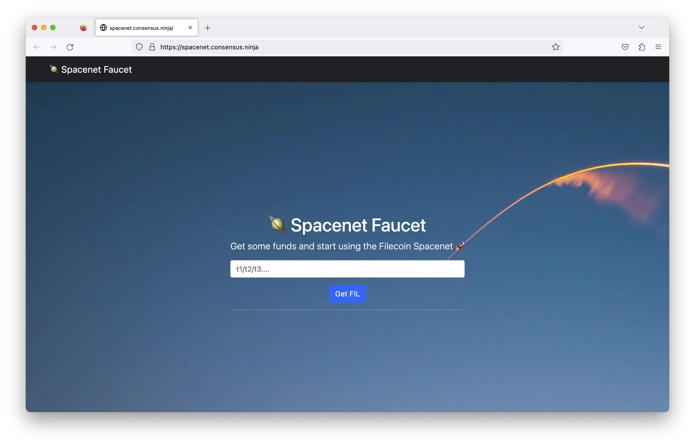

A faucet is available at [faucet.spacenet.ipc.space](https://faucet.spacenet.ipc.space) for developers to get test Filecoin (tFIL) on the Spacenet testnet. The faucet has the following restrictions:

- The per-request allowance given by the faucet is of 10 tFIL.
- There is a daily maximum of 20 tFIL per address.
- And we have also limited the maximum amount of funds that the faucet can withdraw daily.

## Request more funds

If you need more Spacenet tFIL for your application, feel free to drop us a message in one of the following locations:

- The [`#spacenet` channel in Filecoin Slack](https://filecoinproject.slack.com/archives/C043ZAHPFKL)
- Email [ipc@protocol.ai](mailto:ipc@protocol.ai)
- Submit the [request form](https://docs.google.com/forms/d/1O3_kHb2WJhil9sqXOxgGGGsqkAA61J1rKMfnb5os5yo/edit).
