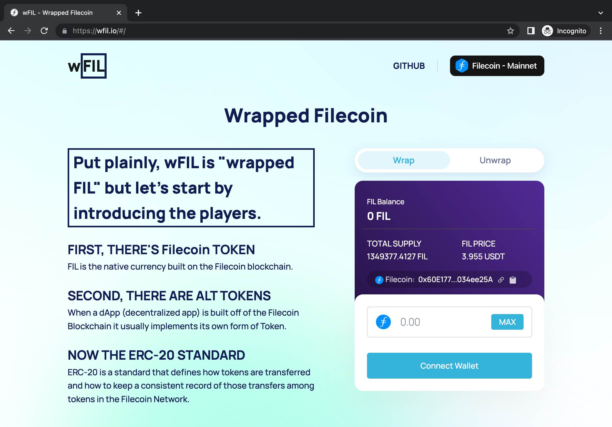
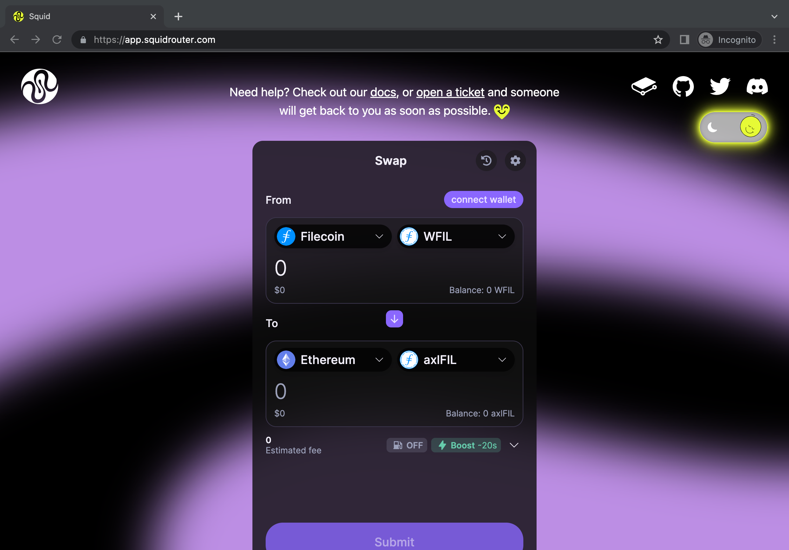

wFIL is a wrapper token implemented based on the ERC-20 token standard for Filecoin native token (FIL). It allows FIL to be bridged and used in Ethereum-compatible decentralized applications (dapps) hosted on other blockchains, such as decentralized exchanges (DEXs) and lending platforms, where FIL is not natively supported.

wFIL operates like any other "ERC20 Wrapped" native blockchain token - a user deposits FIL into wFIL, and in return, gets back an equal number of wFIL tokens. To obtain wFIL, FIL holders can lock up their FIL through a smart contract and receive an equivalent amount of wFIL. When they want to convert their wFIL back to FIL, they can simply burn the wFIL and unlock the same amount of FIL that was locked up initially.

Overall, wFIL provides additional liquidity and interoperability for FIL tokens, making it more accessible for a wider range of use cases within the Defi ecosystem across multiple blockchains.

 Be cautious when you wrap and unwrap FIL, and ensure you are using the correct wFIL contract address on Filecoin.

**wFIl token address on Filecoin**

  - Filecoin mainnet:`0x60E1773636CF5E4A227d9AC24F20fEca034ee25A`
  - Calibration testnet: `0xaC26a4Ab9cF2A8c5DBaB6fb4351ec0F4b07356c4`

### Wrap and Unwrap FIL token
There are a couple of options for users to wrap and unwrap FIL via web UI.
- [Glif](https://www.glif.io/)
- [wfil.io](https://wfil.io/)

To wrap FIL and obtain wFIL, users need to follow the following steps:
1. **Obtain FIL**: Make sure you have FIL in your MetaMask wallet before you can wrap it.
2. **Connect your wallet**: You will need to connect your wallet to a platform which supports wFIL wrapping, such as [Glif](https://www.glif.io/) and [wfil.io](https://wfil.io/). 
3. **Wrap your FIL**: After you've connected your wallet, you can wrap your FIL by following the platform's instructions. Generally, you'll need to select the amount of FIL you want to wrap and confirm the transaction on MetaMask. The platform will then mint an equivalent amount of wFIL, which will be deposited into your wallet.
    
4. **Use wFIL**: Once you have wFIL in your wallet, you can use it on various Defi products that support token swapping or briding wFIL to other blockchains. For example, [celer bridge](https://cbridge.celer.network/314/1/WFIL), [Squid](https://app.squidrouter.com/), etc.
    

To unwrap FIL and receive FIL back to your wallet, users can directly go to supported platforms (e.g. [Glif](https://www.glif.io/) and [wfil.io]() ) to unwrap FIL following the platform's instructions. Once the unwrap transaction is confirmed on the Filecoin network, FIL tokens will be transferred back to your wallet address.

#### Wrap and Unwrap FIL programmable

For developers who are integrating wFIL into your applications or protocols, you can wrap and unwrap FIL in your projects. wFIL smart contract is deployed at both Filecoin mainnet and Calibration testnet.

**Wrap FIL**

To write code to wrap FIL in your project, you'll need to interact with the wFIL smart contract that manages the wFIL minting and burning process. The source code of wFIL smart contract can be found in [wFIL GitHub repo](https://github.com/glifio/wfil). 

 Please do not directly send FIL to wFIL contract address. Also, ensure you do NOT send the FIL via METHOD_SEND - always use InvokeEVM method.


There are two options to wrap FIL.

1. Calling `deposit()` method in wFIL contract, and attach the amount of FIL tokens users want to wrap. This process will mint wFIL 1:1 and transfer to msg.sender address.

   ```solidity
   function deposit() public payable virtual {
      _mint(msg.sender, msg.value);
      emit Deposit(msg.sender, msg.value);
   }
   ```

2. Since wFIL implemented the receive function, you can send FIL to wFIL contract using `InvokeEVM` method to wrap FIL. It will trigger the `deposit` function, minting the caller with wFIL 1:1.

   ```solidity
   receive() external payable virtual {
      deposit();
   }
   ```

**Unwrap FIL**

To unwrap FIL from wFIL, you just need to call `withdraw` method in wFIL contract and specify how many wFIL you would like to unwrap to FIL. The source code of `withdraw`.

```solidity
function withdraw(uint _amount) public virtual {
   _burn(msg.sender, _amount);
   emit Withdrawal(msg.sender, _amount);
   payable(msg.sender).sendValue(_amount);
}
```

This process will burn the amount of wFIL from the caller's balance, and transfer the unwrapped FIL 1:1 back to the caller's address. 