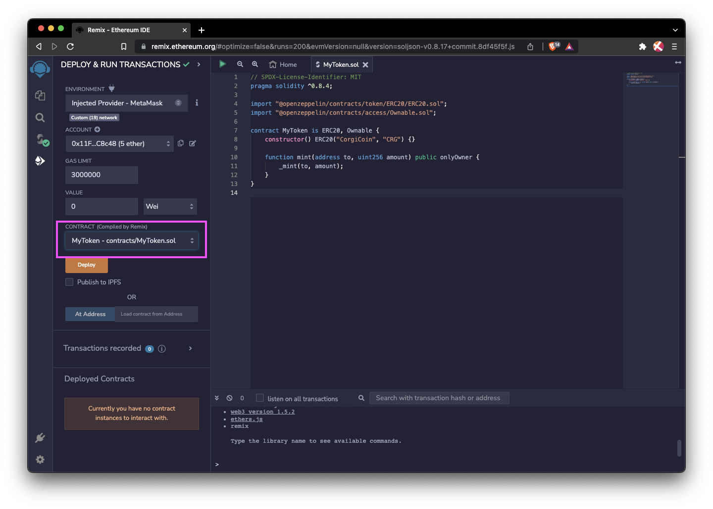

A Solidity library is a type of smart contact that either implements existing reusable behaviors or implements various smart contract standards. Those libraries can be used as building blocks to expedite the development of new smart contracts.

In the Ethereum ecosystem, there are many open-source smart contract libraries to provide reusable implementations that facilitate the development of new contracts. For instance, [OpenZeppelin](https://www.openzeppelin.com/contracts) is one of the most popular and widely used smart contract libraries.

Since the FVM is EVM-compatible, Solidity developers are able to use those existing Ethereum smart contract libraries directly in their FVM smart contract projects.

## OpenZeppelin

OpenZeppelin contracts offer a modular, reusable, and secure smart contracts library written in Solidity for fast and secure smart contract development. It offers:

- Implementations of standards like ERC20, ERC721, and ERC1155.
- Flexible access control schemes like `Ownable`, `AccessControl`, and `onlyRole`.
- Useful and secure utilities like verifying a signature, `SafeMath`, and powerful collections.

These features can be used by inheritance or simply as imported libraries. First, you need to install the libraries, import the specific library you want to use, and then inherit it in your smart contract.

```bash
npm install @openzeppelin/contracts
```

Here is a simple Solidity contract as an example:

```solidity
// contracts/GLDToken.sol
// SPDX-License-Identifier: MIT
pragma solidity ^0.8.0;

import "@openzeppelin/contracts/token/ERC20/ERC20.sol";

contract MyToken is ERC20 {
    constructor(uint256 initialSupply) ERC20("FVM Token", "FVM-T") {
        _mint(msg.sender, initialSupply);
    }
}
```

The token standards are the most widely used smart contract libraries from OpenZepplin. These contracts implement both _fungible_ and _non-fungible_ tokens:

- [ERC20](https://docs.openzeppelin.com/contracts/4.x/erc20): the most widespread token standard for fungible assets; albeit somewhat limited by its simplicity.
- [ERC721](https://docs.openzeppelin.com/contracts/4.x/erc721): the de-facto solution for non-fungible tokens, often used for collectibles and games.
- [ERC777](https://docs.openzeppelin.com/contracts/4.x/erc777): a richer standard for fungible tokens, enabling new use-cases and building on past learnings. Backward compatible with ERC20.
- [ERC1155](https://docs.openzeppelin.com/contracts/4.x/erc1155): a novel standard for multi-tokens, allowing for a single contract to represent multiple fungible and non-fungible tokens, along with batched operations for increased gas efficiency.

Solidity smart contracts inherited from those libraries can be integrated and deployed into the Filecoin network and run _as normal_ due to the Filecoin EVM-runtime.

Let's take an ERC20 contract as an example to write and deploy it on the Hyperspace testnet using Remix & MetaMask:

## ERC20 Contract

Before we begin, make sure you have [connected your MetaMask wallet to the Hyperspace testnet] , and grabbed some tFIL from the faucet.

### Create an ERC20 workspace

1. Go to [remix.ethereum.org](https://remix.ethereum.org/) and click the `+` icon next to **Workspaces** to create a new workspace.
2. In the **Choose a template** dropdown, select **ERC 20**, then select the **Mintable** checkbox.

   

3. Once you click **OK** to create your new workspace, you will have an ERC token created called **MyToken.sol**.
4. Under the **contract** directory, open **MyToken.sol** and change the Token name and symbol.

   

That's all we need to change within this contract. You can see on line 4 that this contract is importing another contract from `@openzeppelin` for us, meaning that we can keep our custom token contract simple.

### Compile & Deploy your contract on Filecoin

1. Click the green play symbol at the top of the workspace to compile your contract.

   

2. Once you have successfully compiled our contract, you can open the **Deploy** tab from the left.
3. Under the **Environment** dropdown, select **Injected Provider - MetaMask** and then confirmed connection in the MetaMask popup window.
4. Back in Remix, under the **Account** field, you'll see the connected wallet `0x11F... (5 ether)`, which is 5 `tFIL`, and the compiled token contract.

   

5. Click **Deploy**, and confirm the transaction on MetaMask. Your token contract will be deployed to Filecoin Hyperspace after the transaction is confirmed on-chain.

### Mint your tokens

After the contract is deployed to Filecoin, you can interact with it. Let's call the deployed contract to mint some tokens.

1. Back in Remix, open the **Deployed Contracts** dropdown. Expand the `mint` method. You must fill in two fields here: `to` and `amount`.
1. Input your own wallet address into the `to` and `100000000000000000000`, which represents 1 `FIL` into the `amount`.

   

1. Click **Transact**, and confirm the transaction on MetaMask. Wait for the network to process the transaction, then you will have 1 ERC20 token minted to your wallet address.

Here is a basic example to demonstrate that developers can easily use existing Ethereum libraries to create their Solidity smart contracts on the Filecoin Network. If you want to learn more about how to use OpenZeppelin, check their resources.

- [OpenZeppelin Contracts website](https://www.openzeppelin.com/contracts)
- [Documentations](https://docs.openzeppelin.com/contracts/4.x/)
- [GitHub](https://github.com/OpenZeppelin/openzeppelin-contracts)

## Other libraries

DappSys: safe, simple, and flexible Ethereum contract building blocks have solutions for common problems in Ethereum/Solidity.

- [Documentations](https://dappsys.readthedocs.io/en/latest/)
- [GItHub](https://github.com/dapphub/dappsys)

0x protocol: a set of secure smart contracts that facilitate the peer-to-peer exchange of Ethereum-based assets.

- [Documentations](https://docs.0x.org/introduction/introduction-to-0x)
- [GitHub](https://github.com/0xProject)
