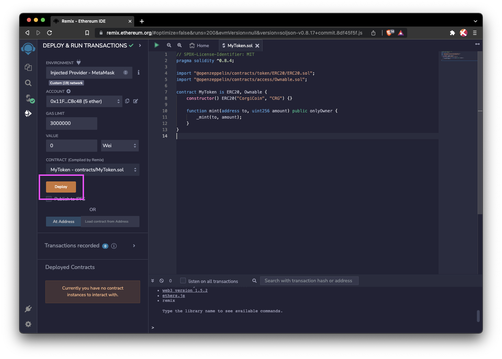

## OpenZeppelin

[OpenZeppelin](https://www.openzeppelin.com/contracts) provides a library of battle-tested smart contract templates, including widely used implementations of ERC token standards. For a guided example that implements an ERC20 token on the Filecoin network, see [Example using an ERC20 contract](#example-using-an-erc20-contract).

### Benefits

OpenZeppelin offers the following to smart contract developers:

- Implementations of standards like ERC20, ERC721, and ERC1155.
- Flexible access control schemes like `Ownable`, `AccessControl`, and `onlyRole`.
- Useful and secure utilities for signature verification, `SafeMath`, etc..

Token standards, such as [ERC20](https://docs.openzeppelin.com/contracts/4.x/erc20), are the most widely used smart contract libraries from OpenZeppelin. These contracts, listed below, implement both _fungible_ and _non-fungible_ tokens:

- [ERC20](https://docs.openzeppelin.com/contracts/4.x/erc20) is the simplest and most widespread token standard for fungible assets.
- [ERC721](https://docs.openzeppelin.com/contracts/4.x/erc721) is the standard solution for non-fungible tokens and is often used for collectibles and games.
- [ERC777](https://docs.openzeppelin.com/contracts/4.x/erc777) provides a richer standard for fungible tokens, supporting new use cases and backwards compatibility with ERC20.
- [ERC1155](https://docs.openzeppelin.com/contracts/4.x/erc1155) is a new standard for _multi-tokens_, where a single contract represents multiple fungible and non-fungible tokens, and operations are batched for increased gas efficiency.

### Using OpenZeppelin with FVM

The _general_ procedure for using OpenZeppelin with FVM is as follows:

1. Install OpenZeppelin. For example, using `npm`:

   ```bash
   npm install @openzeppelin/contracts
   ```

1. Import the specific library you want to use.
1. In your smart contract, inherit the library.

Thanks to the FVM, your contract can be integrated and deployed on the Filecoin network with OpenZeppelin inheritance. For a guided example that implements an ERC20 token on the Filecoin network, see [Example using an ERC20 contract](#example-using-an-erc20-contract).

### Example using an ERC20 contract

In the following tutorial, you'll write and deploy a smart contract that implements the [ERC20](https://docs.openzeppelin.com/contracts/4.x/erc20) on the Hyperspace testnet using Remix and MetaMask:

#### Prerequisites

Before you begin, you must have:

- Remix.
- MetaMask.
- [MetaMask connected to the Hyperspace testnet]().
- Test tokens (tFIL) [from the faucet]().

#### Procedure

In this procedure, you will create, deploy, mint and send an [ERC20](https://docs.openzeppelin.com/contracts/4.x/erc20) token on Hyperspace using Remix and MetaMask.

1. Navigate to [remix.ethereum.org](https://remix.ethereum.org/).

1. Next to **Workspaces**, click the **+** icon to create a new workspace.

1. In the **Choose a template** dropdown, select **ERC 20** along with the **Mintable** checkbox.

   

1. Click **OK**.

   
   **Checkpoint**

   A new workspace and an ERC20 token called `MyToken.sol` have been created.
   

1. In the **contract** directory, open **MyToken.sol**.

1. Set the token `<name>` and `<symbol>`:

   ```solidity
   // contracts/GLDToken.sol
   // SPDX-License-Identifier: MIT
   pragma solidity ^0.8.0;

   import "@openzeppelin/contracts/token/ERC20/ERC20.sol";

   contract MyToken is ERC20 {
      constructor(uint256 initialSupply) ERC20(<name>, <symbol>) {
         _mint(msg.sender, initialSupply);
      }
   }
   ```

   Next, compile and deploy the contract on Filecoin.

1. At the top of the workspace, click the green play symbol to compile the contract.

   

1. Once the contract compiles, open the **Deploy** tab on the left.

1. Under the **Environment** dropdown, select **Injected Provider - MetaMask**.

1. In the MetaMask pop-up window, select **Confirmed connection**.

   

1. Click **Deploy**.

1. In MetaMask, confirm the transaction.

   
   **Checkpoint**

   After the transaction is confirmed on-chain, your token contract is deployed to the Hyperspace network. Now, you can mint tokens.
   

1. In Remix, open the **Deployed Contracts** dropdown.

1. In the `mint` method, set:
   - `to` to your wallet address.
   - `amount` to `100000000000000000000` (1 `FIL`).

   

1. Click **Transact**.

1. In MetaMask, confirm the transaction.

Once the network processes the transaction, the token is minted and sent to your network address. Congratulations, you've completed the tutorial!

### Additional resources

Learn more about OpenZeppelin with the following resources:

- [OpenZeppelin Contracts website](https://www.openzeppelin.com/contracts)
- [Documentation](https://docs.openzeppelin.com/contracts/4.x/)
- [GitHub](https://github.com/OpenZeppelin/openzeppelin-contracts)

## DappSys

The DappSys library provides safe, simple, and flexible Ethereum contract building blocks for common Ethereum and Solidity use cases.

- [Documentation](https://dappsys.readthedocs.io/en/latest/)
- [GitHub](https://github.com/dapphub/dappsys)

## 0x protocol

 The 0x protocol library provides a set of secure smart contracts that facilitate peer-to-peer exchange of Ethereum-based assets.

- [Documentation](https://docs.0x.org/introduction/introduction-to-0x)
- [GitHub](https://github.com/0xProject)
