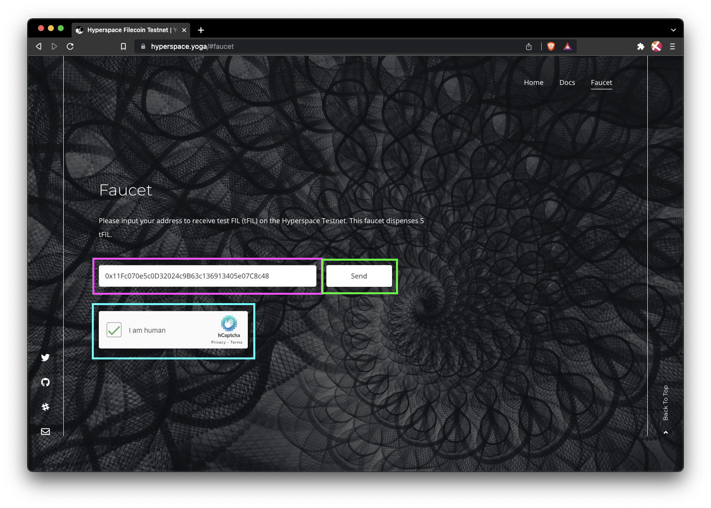
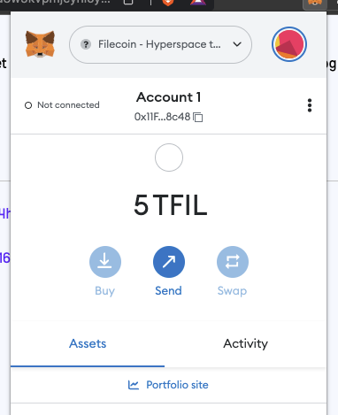

## Hyperspace testnet

MetaMask is one of the easier ways to manage addresses on the Hyperspace testnet. MetaMask uses the `t4` [address type](), which allows developers to create and manage Solidity contracts easily. Follow the [Add to MetaMask guide]() if you havn't set up an address in your MetaMask wallet yet.
w

1. In your browser, open MetaMask and copy your address to your clipboard:

    

1. Go to [hyperspace.yoga](https://hyperspace.yoga) and click **Faucet** from the menu.

    

1. Paste your address into the address field, complete the **I am human** captcha, and then click **Send**:

    

1. The faucet should give you a link to the transaction:

    

1. The block explorer will show you the transaction history for your address. After a couple of minutes, you should see 5 `tFIL` transferred to your address.

    

1. Open MetaMask to confirm that you received the `tFIL`:

    

That's all there is to it! Getting `tFil` is easy!

## Local testnet

Before we begin, you must have a local testnet running. Follow the [Run a local network guide]() if you haven't got a local testnet set up yet.

1. Change directory to where you created the `lotus` and `lotus-miner` binaries. If you followed the [Run a local network guide]() these binaries will be in `~/lotus-devnet`:

    ```shell
    cd ~/lotus-devnet
    ```
    
1. View the wallets available on this node with `lotus wallet list`:

    ```shell
    ./lotus wallet list
    ```

    ```plaintext
    Address                                                                                 Balance                          Nonce  Default
    t1snly7vh4mjtjznwze56ihrdhzfwvbajywwmrenq                                               0 FIL                            0
    t3q4o7gkwe7p7xokhgws4rwntj7yqfhpj5pm6cqc7dycl7cwk4uvgh2odwdvge5re7ne5gcc6xluifss5uu5cq  49999999.999763880085417692 FIL  2      X
    ```

1. Create the send request with `lotus send`, supplying the pre-mined `t3q4o...` address as the `--from` address, the new `t1snl...` address as the receiving address, and the amount of FIL we want to send:

    ```shell
    ./lotus send --from <PRE-MINED ADDRESS> <TO ADDRESS> <VALUE>
    ```

    For example:

    ```shell
    ./lotus send --from t3q4o7gkwe7p7xokhgws4rwntj7yqfhpj5pm6cqc7dycl7cwk4uvgh2odwdvge5re7ne5gcc6xluifss5uu5cq t1snly7vh4mjtjznwze56ihrdhzfwvbajywwmrenq 2000
    ```

    ```plaintext
    bafy2bzaceaqzbgiazwvtpago6wpkxl42puxfkvwv5cwjpime2irqatamji2bq
    ```

1. Check the balance of your new `t1snl...` address with `lotus wallet balance`:

    ```shell
    ./lotus wallet balance <ADDRESS>
    ```

    For example:

    ```shell
    ./lotus wallet balance t1snly7vh4mjtjznwze56ihrdhzfwvbajywwmrenq
    ```

    ```plaintext
    2000 FIL
    ```

If you want to manage your local testnet tokens in MetaMask you will need to create a `t4` address. You can create a `t4` address using `lotus wallet new deleated`. Once you have a `t4` address you can [connect MetaMask to your local testnet]() to see the new balance within the MetaMask extension.
