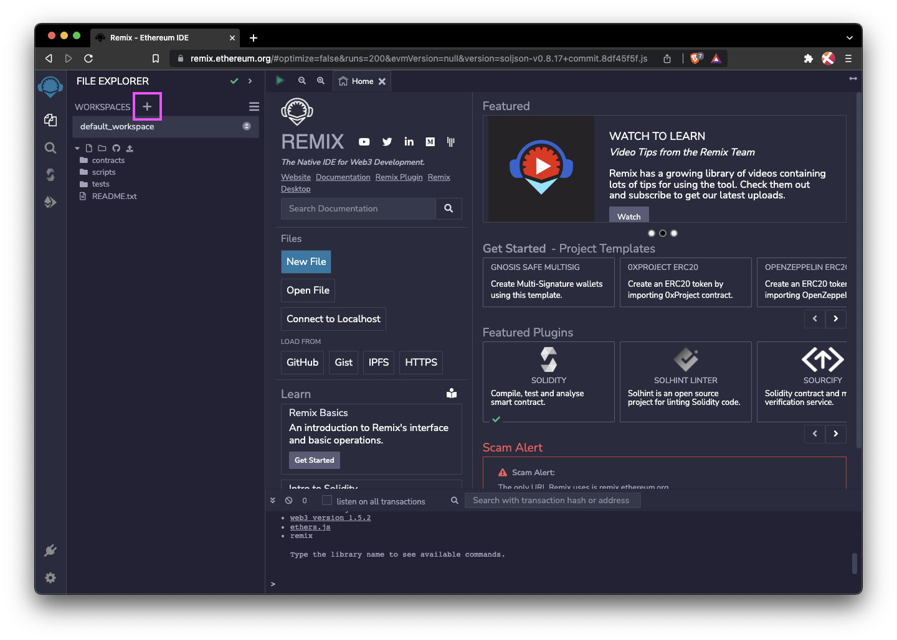

## Launch an ERC-20 token

As a simple introduction, we're going to use Remix to create an ERC-20 token on the Filecoin network. In this guide, we're using the Calibration testnet, but this process is the same for mainnet.


This guide assumes you've already connected your MetaMask extension to a Filecoin network. If you haven't done so yet, [check out this guide to add the Hyperspace testnet to MetaMask]().


### Create a workspace

In Remix, workspaces are where you can create a contract, or group of contracts, for each project. Let's create a new workspace to create our new ERC-20 token.

1. Open [remix.ethereum.org](https://remix.ethereum.org).
1. Click the `+` icon next to **Workspaces** to create a new workspace:

    

1. In the **Choose a template** dropdown, select **ERC 20**.
1. Select the **Mintable** checkbox.
1. Enter a fun name for your token in the **Workspace name** field. Something like `CorgiCoin` works fine.
1. Click **OK** to create your new workspace.

    

### Customize the contract

The contract template we're using is pretty simple. We just need to modify a couple of variables.

1. Under the **contract** directory, click **MyToken.sol**.

    

1. In the editor panel, replace `MyToken` with whatever you'd like to name your token. In this example, we'll use `CorgiCoin`.

    

1. On the same line, replace the second string with whatever you want the symbol of your token to be. In this example, we'll use `CRG`.

    

That's all we need to change within this contract. You can see on line 4 that this contract is importing another contract from `@openzeppelin` for us, meaning that we can keep our custom token contract simple.

### Compile

1. Click the green play symbol at the top of the workspace to compile your contract. You can also press `CMD` + `s` on MacOS or `CTRL` + `s` on Linux and Windows.

    

1. Remix automatically fetches the two `import` contracts from the top of our `.sol` contract. You can see these imported contracts under the `.deps` directory. You can browse the contracts there, but Remix will not save any changes you make.

    

### Deploy

Now that we've successfully compiled our contract, we need to deploy it somewhere! This is where our previous MetaMask setup comes into play.


This guide assumes you've already connected your MetaMask extension to a Filecoin network. If you haven't done so yet, [check out this guide to add the Hyperspace testnet to MetaMask]().


1. Click the **Deploy** tab from the left.

    

1. Under the **Environment** dropdown, select **Injected Provider - MetaMask**.

    

1. MetaMask will open a new window confirming that you want to connect your account to Remix.
1. Click **Next**:

    

1. Click **Connect** to connect your `tFIL` account to Remix.

    

1. Back in Remix, under the **Account** field, you'll see that it says something like `0x11F... (5 ether)`. This value is 5 `tFIL`, but Remix doesn't support the Filecoin network, so it doesn't understand what `tFIL` is. This isn't a problem; it's just a little quirk of using Remix.

    

1. Under the **Contract** dropdown, ensure the contract you created is selected.

    

1. Click **Deploy**.

    

1. MetaMask will open a window and as you to confirm the transaction. Scroll down and click **Confirm** to have MetaMask deploy the contract. If you're deploying to mainnet, we advise you to [adjust your gas fees](#adjusting-your-gas-fees) for a cheaper deployment.

    

1. Back in Remix, a message at the bottom of the screen shows that the creation of your token is pending.

    

1. Wait around 90 seconds for the deployment to complete.

    

On the Filecoin network, a new set of blocks, also called a tipset, is created every thirty seconds. When deploying a contract, the transaction needs to be received by the network, and then the network needs to confirm the contract. This process takes around one to two tipsets to process -- or around 60 to 90 seconds.

## Use your contract

Now that we've compiled and deployed the contract, it's time to actually interact with it!

### Mint your tokens

Let's call a method within the deployed contract to mint some tokens.

1. Back in Remix, open the **Deployed Contracts** dropdown, within the **Deploy** sidebar tab.

    

1. Expand the `mint` method. You must fill in two fields here: `to` and `amount`.

    

1. The `to` field specifies where address you want these initial tokens sent. Open MetaMask, copy your address, and paste it into this field.

    

1. This field expects an `attoFil` value. 1 `FIL` is equal to 1,000,000,000,000,000,000 `attoFil`. So if you wanted to mint 100 `FIL`, you would enter `100` followed by 18 zeros: `100000000000000000000`.
1. Click **Transact**.

    

1. MetaMask will open a window and ask you to confirm the transaction:

    

Again, you must wait for the network to process the transaction, which should take about 90 seconds. You can move on to the next section while you're waiting.

### Add to MetaMask

Currently, MetaMask has no idea what our token is or what it even does. We can fix this by explicitly telling MetaMask the address of our contract.

1. Go back to Remix and open the **Deploy** sidebar tab.
1. Under **Deployed Contracts**, you should see your contract address at the top. Click the copy icon to copy the address to your clipboard:

    

1. Open MetaMask, select **Assets**, and click **Import your tokens**:

    

1. In the **Token contract address** field, paste the contract address you just copied from Remix and then click **Add custom token**. MetaMask should autofill the rest of the information based on what it can find from the Filecoin network.

    

1. Click **Import token**:
1. You should now be able to see that you have 100 of your tokens within your MetaMask wallet!

    

And that's it! Deploying an ERC-20 token on Filecoin is simple!

### Adjusting your gas fees

Remix uses a default of 2.5 nanoFIL per gas as a priority fee, which is usually too high for the Filecoin network. If you don't adjust this, you may end up overpaying when deploying to mainnet. We recommend that you switch from the site-suggested gas fees to oracle-supplied gas fees when deploying your contract.

1. When the deployment transaction confirmation pop-up window shows up, click on **Site suggested**.

    

1. Switch to **Market**, **Aggressive**, or **Low**. The **Market** option is generally suitable for most situations.

    
