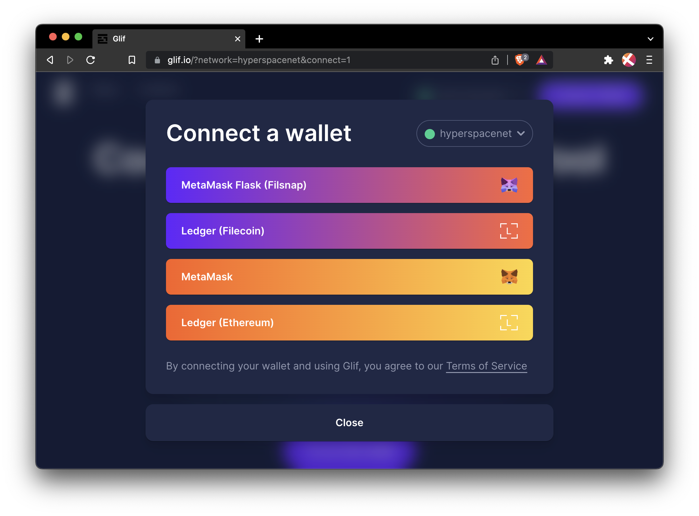
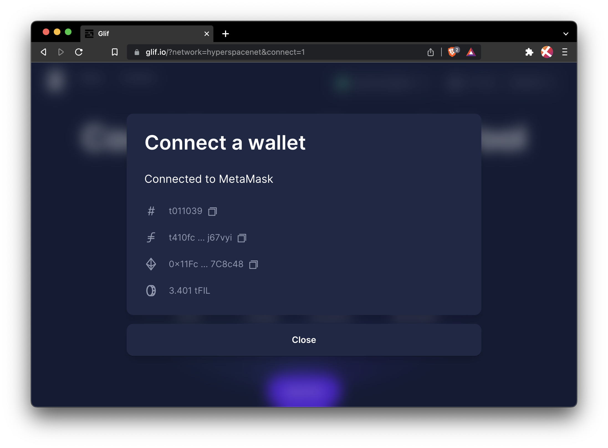
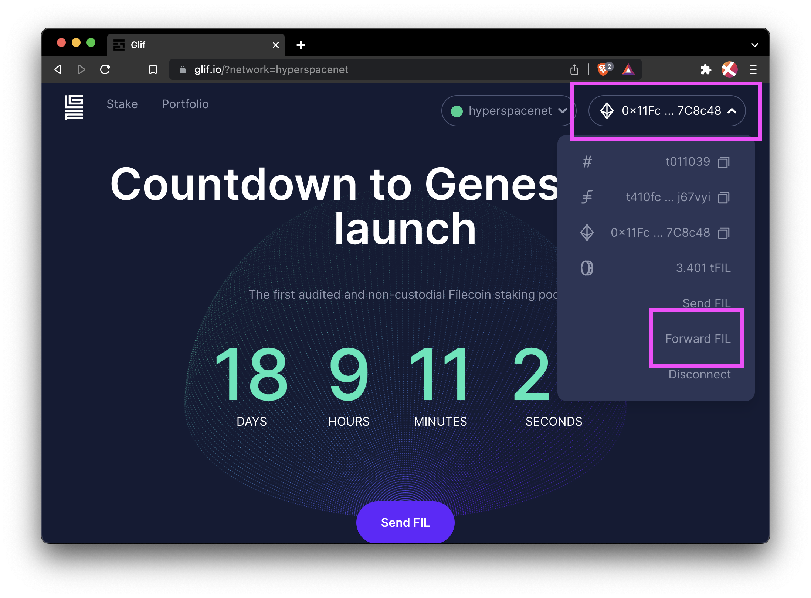
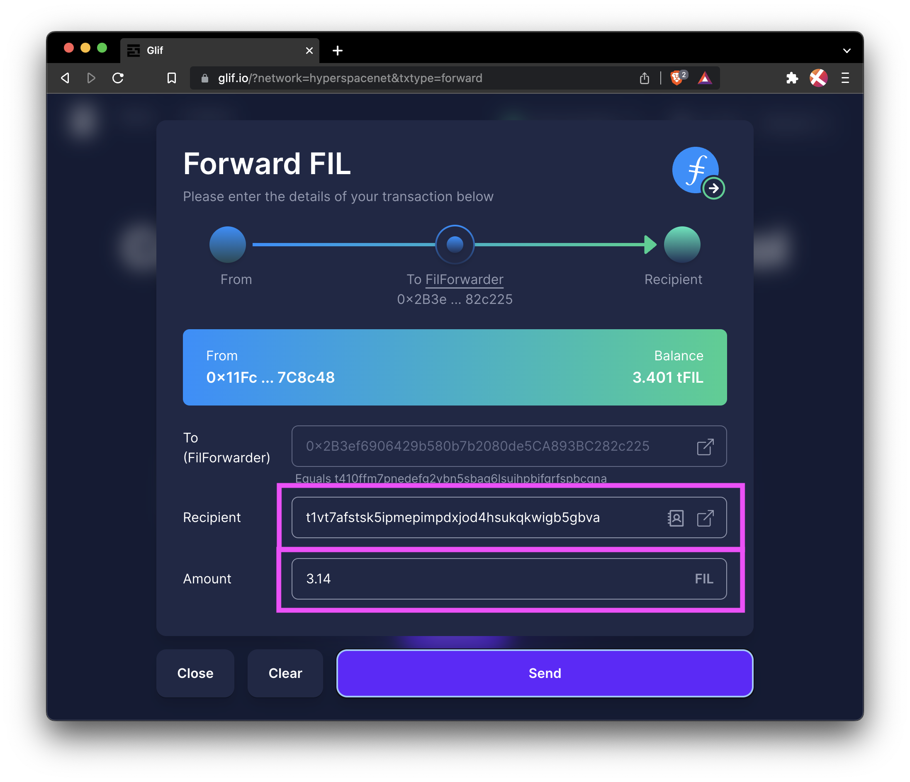
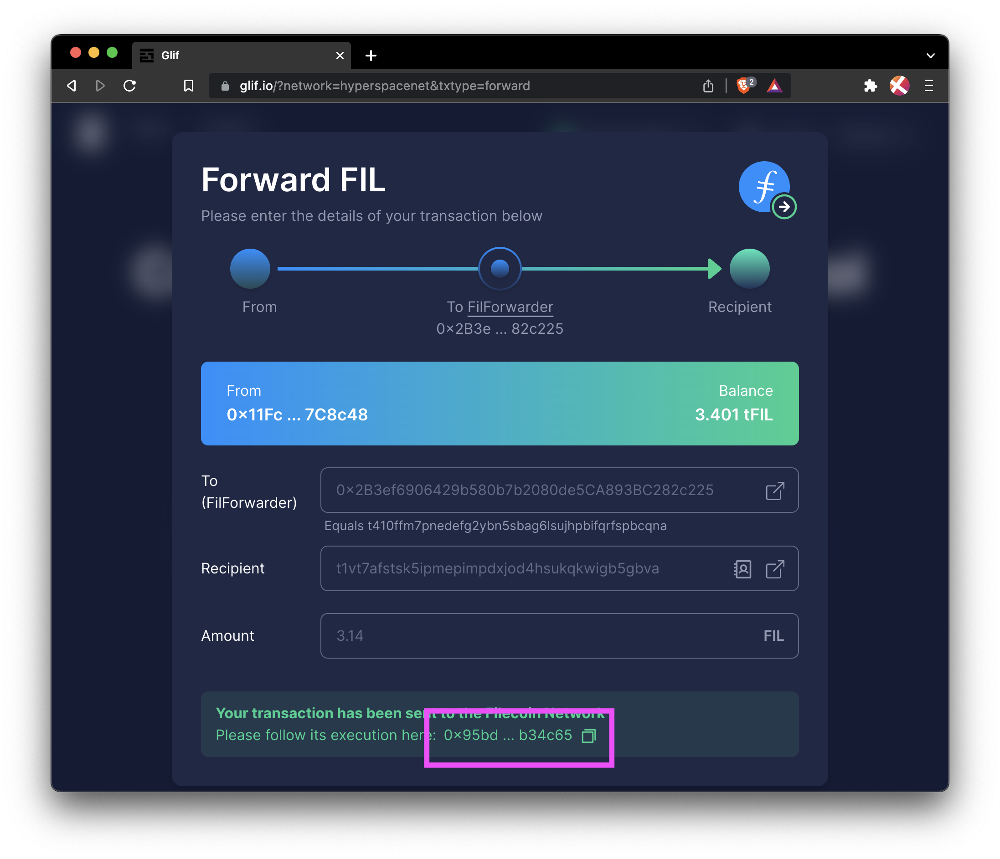
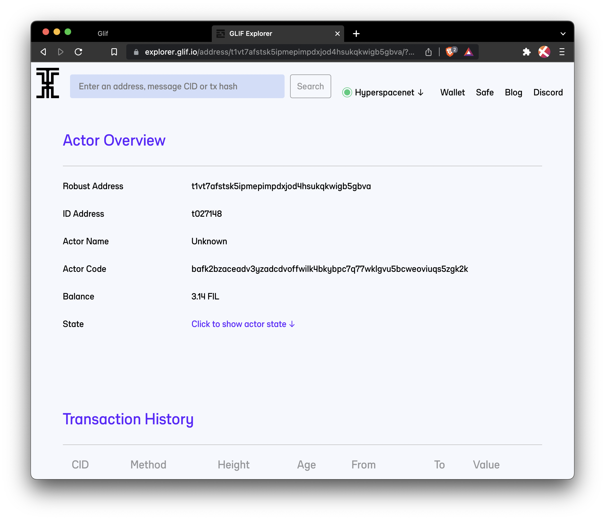
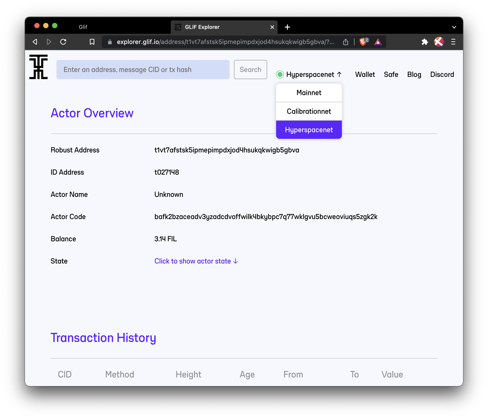

## The problem

Filecoin has multiple [address spaces](): `f0`, `f1`, `f2`, `f3`, and `f4`. Each address space fits a particular need for the Filecoin network. The `f410` address spaces allow Ethereum addresses to be integrated into the Filecoin network.

Users interacting with the Filecoin EVM runtime need to use `f4` addresses, masked to the Ethereum-style `0x` address. These addresses can be created from wallets like MetaMask, Coinbase wallet, or any other EVM-based wallet that allows for custom networks. There are use cases where a user with FIL in an `0x`-style address would want to send FIL to an `f1`, `f2`, or `f3` address. For example, taking FIL out of a smart contract and sending it to a multi-sig account or an exchange.

This is where the problem lies. Ethereum-based wallets do not recognize the `f1`, `f2`, or `f3` address formats, making it impossible to send FIL from an Ethereum-style address.

## The solution

The FilForwarder exposes a smart contract method called `forward` that takes a byte-level definition of a protocol address in an _f-style_ and a message value. It then uses the internal Filecoin APIs exposed using the Filecoin EVM runtime to properly send FIL funds reliably and as cheaply as possible. This also has the side effect of creating the actor ID should the address receiving address be considered new. In this way, using FilForwarder from an Ethereum wallet to any other Filecoin address space is safe and reliable.

## Use FILForwarder

You can use the FilForwarder contract in two ways:

- Using the Glif.io browser wallet
- Manually invoking the contract

### Glif.io

Before we start, make sure you know the address you'd like to forward your FIL to. You'll need to ensure that the `f410` Ethereum-style address has enough FIL to cover the transaction costs.

1. Go to [Glif.io](https://glif.io).
1. Select the network you want to use from the dropdown and click **Connect Wallet**.

    

    In this example, we're using the Calibration testnet.

1. Confirm that you want to connect your wallet to Glif.io. You will only be prompted to do this once.

    

1. Click **Close** on the connection confirmation screen.

    

1. Select your wallet address from the dropdown and click **Forward FIL**.

    

1. Enter the destination address for your FIL, along with the amount of FIL you want to send:

    

1. Double-check that your destination address is correct and click **Send**.
1. You can check the transaction by clicking the transaction ID.

    

1. Your funds should be available at the destination after around two minutes. You can check that your funds have arrived by searching for the destination address in a block explorer.

    

1. If you can't see your funds, make sure you're viewing the correct network.

    

It generally takes around two minutes for a transaction to complete and for the funds to be available at the destination.

### Manually

The FilForwarder contract can be interacted with using standard Ethereum tooling like Hardhat or Remix. In this guide, we're going to use Hardhat, but these steps can be easily replicated using the [web-based IDE Remix]().

#### Prerequisites

This guide assumes you have the following installed:

- [Yarn](https://yarnpkg.com/)
- A Filecoin address stored in [MetaMask]()

#### Environment setup

First, we need to grab the FilFowarder kit and install the dependencies:

1. Clone the FilForwarder repository and install the dependencies:

    ```shell
    git clone https://github.com/lotus-web3/FilForwarder
    cd FilForwarder
    ```

1. Use Yarn to install the project's dependencies:

    ```shell
    yarn install
    ```

    ```plaintext
    [1/4] 🔍  Resolving packages...
    [2/4] 🚚  Fetching packages...
    [3/4] 🔗  Linking dependencies...

    ...

    ✨  Done in 16.34s.
    ```

1. Create an environment variable for your private key.

    ```shell
    export PRIVATE_KEY='<YOUR PRIVATE KEY>'
    ```

    For example:

    ```shell
    export PRIVATE_KEY='d52cd65a5746ae71cf3d07a8cf392ca29d7acb96deba7d94b19a9cf3c9f63022'
    ```

Always be careful when dealing with your private key. Double-check that you're not hardcoding it anywhere or committing it to source control like GitHub. Anyone with access to your private key has complete control over your funds.

#### Invoke the contract

The contract is deterministically deployed on all Filecoin networks at `0x2b3ef6906429b580b7b2080de5ca893bc282c225`. Any contract claiming to be a FilForwarder that does not reside at this address should not be trusted. Any dApp can connect to the wallet and use the ABI in this repository to call this method using any frontend. See the [Glif section](#glifio) above for steps on using a GUI.

Inside this repository is a Hardhat task called `forward`. This task will use the private key to send funds using the contract. This task uses the `fil-forwarder-{CHAIN_ID}.json` file to determine the deployed contract address for a given network. These addresses should always be the same, but these files prevent you from having to specify it each time.

The `forward` command uses the following syntax:

```shell
yarn hardhat forward \
    --network <NETWORK> \
    --destination <DESTINATION_ADDRESS> \
    --amount <AMOUNT>
```

- `NETWORK`: The network you want to use. The options are `mainnet` and `calibration`.
- `DESTINATION_ADDRESS`: The address you want to send FIL to. This is a string, like `t01024` or `t3tejq3lb3szsq7spvttqohsfpsju2jof2dbive2qujgz2idqaj2etuolzgbmro3owsmpuebmoghwxgt6ricvq`.
- `AMOUNT`: The amount of FIL you want to send. The value `3.141` would be 3.141 FIL.

#### Examples

1. To send 9 FIL to a `t3` address on the Calibration testnet, run:

    ```shell
    yarn hardhat forward \
        --network calibration \
        --destination t3tejq3lb3szsq7spvttqohsfpsju2jof2dbive2qujgz2idqaj2etuolzgbmro3owsmpuebmoghwxgt6ricvq \
        --amount 9.0
    ```

1. To send 42.5 FIL to a `t1` address on the Calibration testnet, run:

    ```shell
    yarn hardhat forward \
        --network calibration \
        --destination t010135 \
        --amount 42.5
    ```
