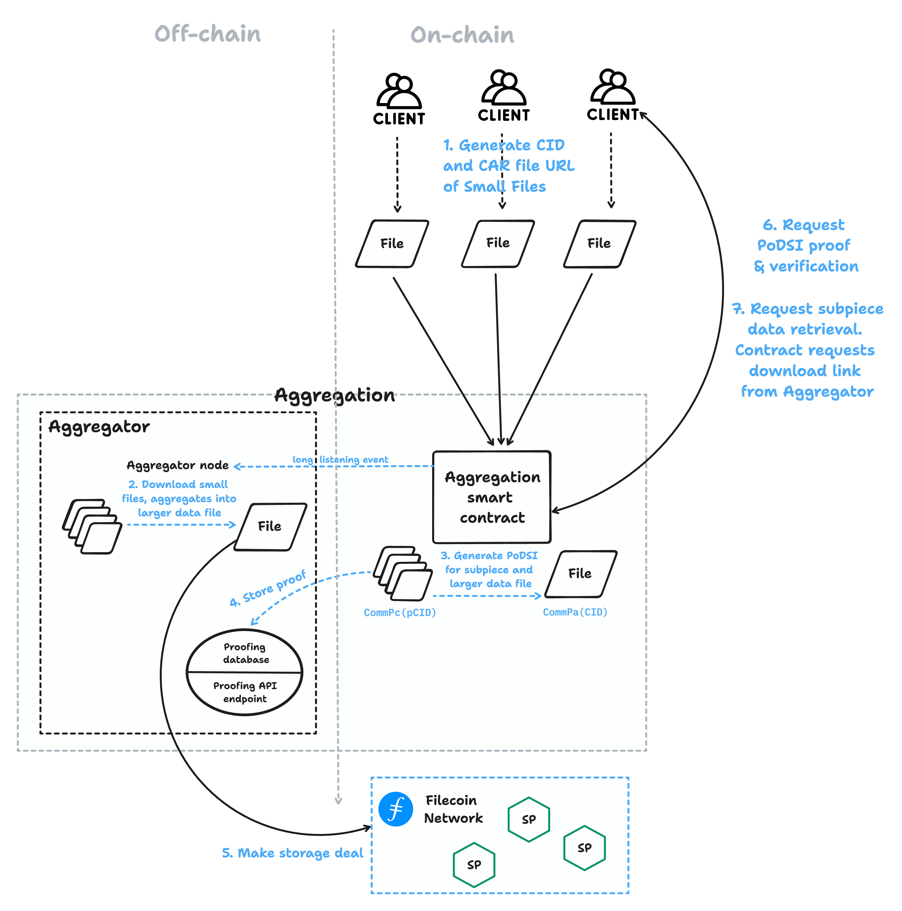
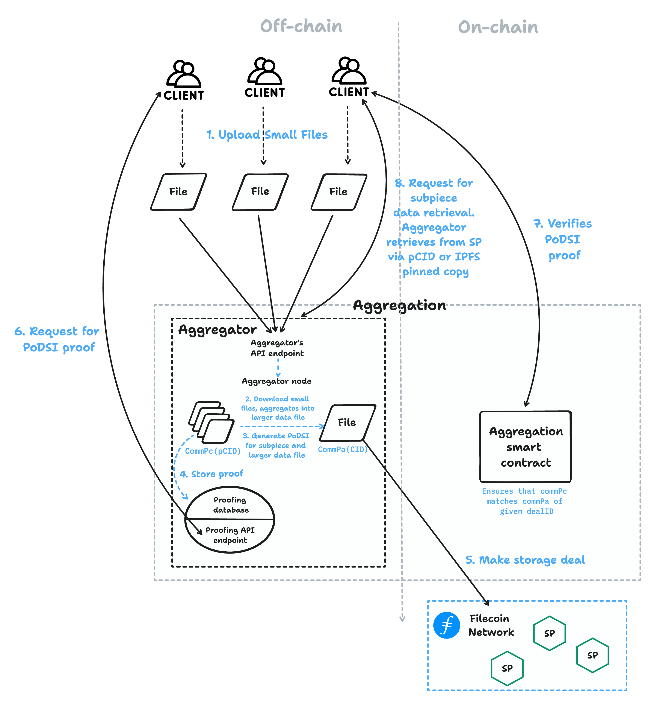

Aggregation is the process of combining multiple packages of _sub-piece data_ into a single package. This large package is stored on the Filecoin network instead of multiple smaller packages. Aggregation can be done off-chain or on-chain.

## Process

The base interface for aggregation requires the following components:

1. A client who has data to upload.
1. An aggregator platform that clients can interact with to make a deal and retrieve proof of storage.
1. **Off-chain**: an aggregation node to aggregate the sub-piece data into a larger file

    **On-chain**: an aggregation smart contract that clients can interact with to request to make a deal and verify proof of storage.

## Proof of Deal Sub-piece Inclusion (PoDSI)

Proof of Deal Sub-piece Inclusion (PoDSI) is motivated by a need for sub-piece data uploads to contain verification and proof that the data was included in an associated deal on Filecoin. PoDSI is heavily used in the aggregated deal-making workflow.

PoDSI is a proofing library that enables the generation of a proof for each sub-piece CID (within the large data segment) and stores it in an off-chain database.

The proof consists of two inclusion proofs:

- An inclusion proof of a sub-tree corresponding to the tree of the client’s data. Optionally, this sub-tree can be misaligned with the proving tree.
- An inclusion proof of the double leaf data segment descriptor within the data segment index.

A sample [proof is available at lighthouse.storage](https://docs.lighthouse.storage/lighthouse-1/filecoin-virtual-machine/podsi-a-simple-overview).

For further technical discussion, see the [Filecoin Improvement Proposal 512](https://github.com/filecoin-project/FIPs/discussions/512).

### On-chain

For on-chain aggregation smart contracts, developers interact with them to submit sub-piece data and verify proof of storage for their data. The contract also allows for verification of the provided PoDSI, which refers to the sub-piece proof.

Here is the process for on-chain aggregation:

1. The client submits a sub-piece CID (CommPc) with metadata (e.g., metadata of the sub-piece and URL to download the CAR file) directly to the aggregation smart contract.
1. The aggregator watches the aggregation contract, and when there are enough pieces to produce a 32GiB aggregated piece CID (CommPa), it downloads all sub-pieces for the aggregated piece from the CAR file URL.
1. The aggregator aggregates indexed data segments into a larger data file for deal-making (based on specs [here](https://github.com/filecoin-project/FIPs/discussions/512)).
1. The aggregator combines the sub-piece CIDs into the aggregated 32GiB CommP (CommPa) by computing within the aggregation smart contract.
1. The aggregator uses the [Boost API](https://boost.filecoin.io/experimental-features/fvm-contract-deals) to make storage deals with storage providers for the aggregated larger CAR file.
1. Storage Providers download the aggregated CAR file and publish storage deals. Upon the client's request, they can find the data via sub-piece CID.
1. Clients can query the aggregation smart contract, which notifies the aggregator to look up the sub-piece CID (pCID) in its aggregation node's database and return the PoDSI proof, aggregated CID, and associated deal ID.
1. Simultaneously, clients can use the sub-piece pCID for on-chain verification with the aggregation smart contract, which will verify the Merkle proof to ensure the pCID hash matches the commPa of the associated deal ID.

For uploading sub-piece data for off-chain aggregation with an SDK, check out one of the implementations at [Lighthouse.storage](https://docs.lighthouse.storage/lighthouse-1/lighthouse-sdk/functions/upload).

To build your own on-chain aggregator, check out one of the implementations with [Filecoin Data Tools](https://github.com/application-research/fevm-data-segment).

### Off-chain

For off-chain aggregation, developers interact with the aggregator platform instead, although all required components are managed by the platform for a simpler UI for clients. Typically, off-chain aggregation requires a centralized platform to host various components.

Here is the process for off-chain aggregation:

1. The client submits sub-piece data to an off-chain API. The API generates the sub-piece metadata and informs an Aggregator (e.g., sub-piece CID, known as pCID, and URL to download the CAR file).
1. The aggregator hosts an off-chain aggregation node, which downloads these sub-piece CAR files and aggregates them into a larger CAR file.
1. Simultaneously, the aggregator aggregates indexed data segments (based on specs [here](https://github.com/filecoin-project/FIPs/discussions/512)). It runs the PoDSI proofing library and generates proofs for each sub-piece pCID, storing them in an off-chain database.
1. The aggregator uses the [Boost API](https://boost.filecoin.io/experimental-features/fvm-contract-deals) (programmatic) or uses Lotus node (manual) to make storage deals with storage providers for the aggregated larger CAR file.
1. Storage Providers download the aggregated CAR file and publish storage deals.
1. Clients can query a proofing endpoint provided by the aggregator (example [here](https://docs.lighthouse.storage/lighthouse-1/filecoin-virtual-machine/podsi-and-deal-info), which will look up the sub-piece CID (pCID) in the database and return the PoDSI proof, aggregated CID, and associated deal ID.
1. Clients can use the sub-piece pCID for on-chain verification with the aggregation smart contract, which will verify the Merkle proof to ensure the pCID hash matches the commPa of the associated deal ID.

