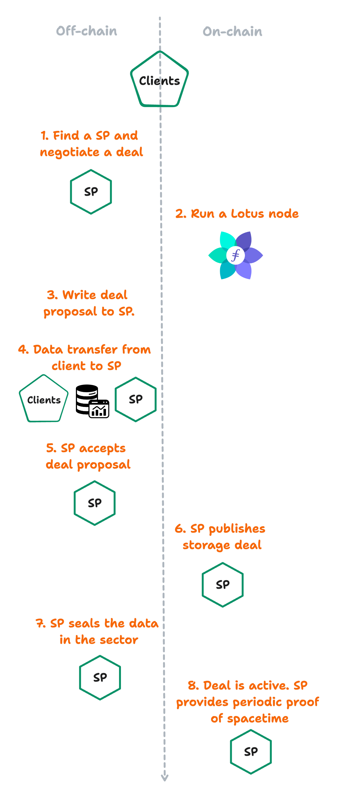

## Manual storage

A client must go through several steps to manually store something with a storage provider on Filecoin without using the FVM. These steps involve interacting with the Filecoin network, negotiating a deal with a storage provider, and performing various other operations to ensure the data is stored correctly and securely. We discuss how storage works in the [Basics section]() but let's quickly summarize the process here:

1. **Identify a storage provider (SP)**: Clients must identify storage providers who will store their data. Clients usually pick their storage providers based on geographic location and bandwidth limitations, although other factors may impact their decision.
1. **Negotiate a deal**: Clients negotiate deals with storage providers. These deals include terms like data size, price, deal duration, and collateral. The deal-making process happens off-chain, and once both parties agree to the terms of a deal, that deal is published on-chain for the rest of the network to see and validate. To successfully store data on Filecoin, clients need to have enough FIL to cover the deal's cost.
1. **Data preparation**: Before storing files on Filecoin, clients must import them into their local Filecoin node, which produces a data CID (Content Identifier) - an ID uniquely describing the content. Then, the data is transferred to the storage provider.
1. **Deal publication**: The deal is published on-chain, making the storage provider publicly accountable for the deal.
1. Sealing and proving storage**: The storage provider stores the data in sectors. Sectors are the basic units of provable storage where storage providers store clients’ data and generate Proof-of-Spacetime (PoSt) on behalf of the Filecoin network. Sectors have standard sizes and a lifetime that storage providers can extend before reaching the end of the lifetime.

## Programmatic storage

The [Filecoin virtual machine (FVM)]() is not designed to directly interact with data on Filecoin. Instead, it operates on blockchain state data, which includes metadata about stored data. The FVM's role is to compute over this state data and create logic around the storage and retrieval process. Storage and retrieval providers on the Filecoin network handle the actual process of storing and retrieving data.

Developers can use FVM actors (also called smart-contracts) to implement various use cases related to data storage and retrieval on the Filecoin network. For instance, they can automate the process of renewing and repairing storage deals, replicating data across multiple storage providers for redundancy, or implement access control for data.

This process for programmatically storing data on Filecoin differs depending on how much data you need to store. Anything less than 4 GiB of data is considered _small_, while anything 4 GiB or above is considered _large_. Lets cover the process for both _small_ and _large_ storage deals:

### Small-scale storage

Storage deals for less than 4 GiB of data are considered _small_ on the Filecoin network. This is because storage providers use sectors of either 32 GiB or 64 GiB. Because of these comparably large sector sizes, SPs are incentivized to accept storage deals closer to this cap size. An SP will receive more FIL rewards for storing a 31 GiB file rather than a 200 KiB file. Clients will have difficulty finding a storage provider to accept deals for small amounts of data.

To get around this problem, these developers can _aggregate_ their data into bundles. The deal-aggregation process bundles a collection of small storage deals with many others to create one large deal.

Checkout out [lighthouse.storage](https://lighthouse.storage/documentation) for an example of a deal aggregator.

### Large-scale storage

Storage deals for more than 4 GiB don't suffer from the limitations of small-scale storage deals. Large-scale deals can be processed and sent to an SP directly without aggregating data.

The client contract performs _direct_ deal making to automatically finds an SP to store your data. There are other considerations an SP must make when deciding to pick up your data deal proposals from the client contract. For example, some SPs may only deal with clients with whom they have an existing relationship with. For more information regarding client contracts and how they work, checkout the [client contract tutorial]().

1. **Upload data to a data depot**: Data depots hold your data for the duration of this process so that you don't have to maintain your connection to the network. Once an SP verifiably holds your data, the data depot discards your data. After uploading your data to a depot, the depot will give you all the information you need to fill out the client contract.
1. **Deploy a client contract**: The deal client contract coordinates the handshaking required on FVM to load your data into the Filecoin network.
1. **Create a deal-proposal payload**: Once your data is ready in the data depot and your client contract has been deployed, you can create your deal-proposal payload. This payload contains everything a storage provider needs to download and store a copy of your data.
1. **Deal publication and activation**: An SP picks up your contract and downloads the data from the data depot.

Check out the [Deal Making Starter Kit](https://github.com/filecoin-project/fvm-starter-kit-deal-making) for additional information on how this process works.

## Next

For additional resources for building on FVM, visit the [FVM Section in Awesome Filecoin](https://github.com/filecoin-project/awesome-filecoin#fvmfilecoin-virtual-machine).
