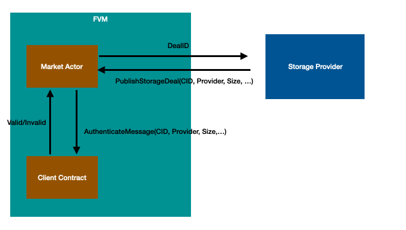
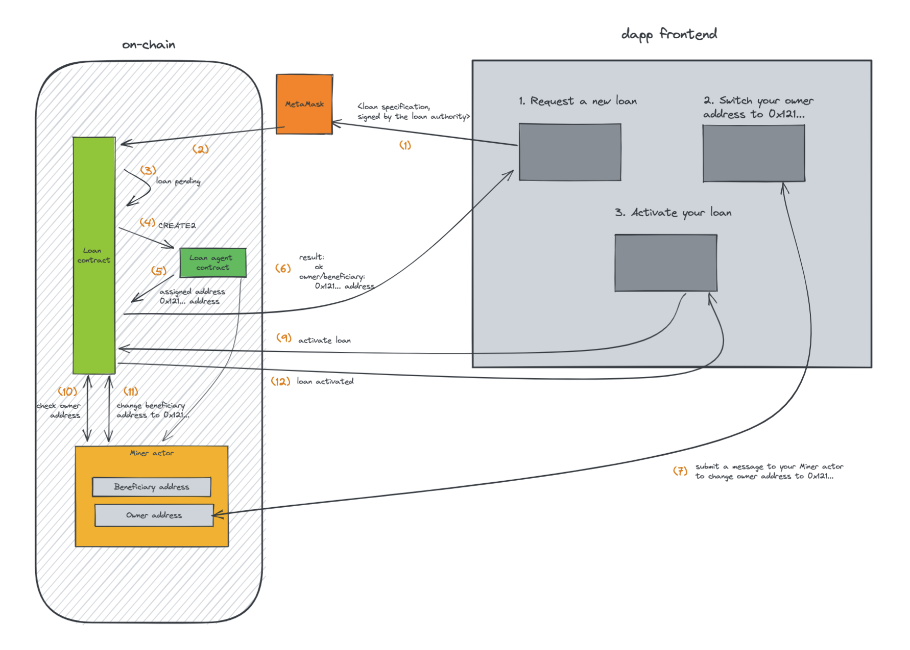

## Features

We created the FVM to enable developers to build new use cases on top of the Filecoin network, such as data access control, data DAOs, perpetual storage, loans, and Ethereum-compatible fungible and non-fungible tokens. To deliver a quality developer experience, we delayed development until the Filecoin network was stable, robust, and secure.

### Data access control

The FVM allows Filecoin network participants to limit individual data access, an advantage previously only available using centralized storage solutions.

### Data DAO

FVM data access control enables the creation and management of data centered decentralized-autonomous-organizations, which can govern and monetize data access and pool returns into a shared treasury.

### Perpetual storage

The FVM allows users to store data permanently, managed by repair and replication bots, which also benefit from Filecoin’s verifiable storage proofs.

### Loans

FIL token holders can use their holdings to provide storage collateral and receive interest, and community-generated reputation scores enable everyone to identify good borrowers.

### Ethereum compatibility

The FVM is fully EVM-compatible, allowing new ERC-20 tokens to be launched on the Filecoin network and enabling layer two networks to leverage its storage power and security.

## Use-cases

The FVM can be used for the creation of a new class of  , many of which will have the potential to become 10x improvements to the network’s functionality and beyond. The FVM team and members of the Filecoin community have discussed what can be built with the FVM. Some ideas are:

### Tokenized datasets and Data DAOs

Imagine kickstarting the dataset economy where you could capture and represent the value of those datasets to society. You could even exchange those data tokens between peers and request computation services on that data, such as validation, joins, analysis, feature detection, and extraction, moving into machine learning.

### Trustless reputation systems

Imagine an overlay network of nodes that could patrol the network performing random deals with Storage Providers (SPs) in order to gauge key metrics like quality of service guarantees, performance, latency, and region details. These nodes can then store SP reputation scores on-chain, making them traceable and verifiable while enabling users to decide on the terms of service of the SPs that they want to use for their data.

### Replication workers

Imagine anyone is able to write a new smart contract that makes new deals to maintain a specific level of replication of that dataset in the network. You could ensure the resiliency of your data by ensuring it is always stored n times automatically.

The smart contract could also be able to transfer your data just once into the filecoin network and have a trustless actor replicate and send that n times to multiple storage locations. You could even create a user-defined policy of rules for that data to obey - specifying things like region and location, latency, and even price. This can all be built right into the smart contract flow in FVM.

### Smarter storage markets

Imagine richer functionality in storage markets with features like auto-renewal of deals or self-repairing deals in the event of sector issues. Other possibilities are time-locked or event-driven data deals where retrieval only occurs under a specified timeframe or event trigger.

### The list goes on

There are many more use cases to unlock with FVM. Some other projects include:

- NFTs minted, exchanged, and stored under a single roof.
- Storage bounties and auction mechanisms.
- Enabling L2 bridges.
- Futures and derivatives on storage that compose in DeFi fashion.
- Conditional loans for sector pledging.

If you have a great idea or suggestion, join the discussion on the [FVM forum](https://fvm-forum.filecoin.io).

## Project blueprints

Here is a collection of blueprint examples that developers can use to design and create their projects on Filecoin.

### DataDAO solution

A Data DAO enables the creation of a dataset economy where users can capture and represent the value of those datasets to society. It's even possible to exchange those data tokens between peers and request computation services on that data, such as validation, joins, analysis, feature detection, and extraction.

There are many ways to create a DataDAO. so this document will only focus on one of the possibilities for the purpose of example.

As the [RFS](https://rfs.fvm.dev/) describes, DataDAOs enable groups of people to put together resources to preserve and utilize the data that are useful for their stakeholders. Imaging a DataDAO can mint a token $DATA, and incentivize Storage Providers to replicate the data it wants to store. The DataDAO can specify the data it wants to replicate and the number of replications it desires. For every replication, the DataDAO will mint some $DATA and send them to the SP as rewards. How datasets are chosen is left up to the governance process of the DataDAO.

#### Solution Architecture

I highly recommend that you read through the [“Core Idea” section in this README](https://github.com/lotus-web3/client-contract) before continue reading this document.

##### Role management

The contract has to specify the admin of the DataDAO either during the creation of the contract or through a permission change contract call

##### ERC20 token

The DataDAO should be the minter of a standard ERC20 token $DATA and have the ability to mint $DATA. For example, a [ERC20PresetMinterPauser contract](https://github.com/OpenZeppelin/openzeppelin-contracts/blob/master/contracts/token/ERC20/presets/ERC20PresetMinterPauser.sol) from OpenZeppelin can be used.

##### Publish a deal to the DataDAO

Storage provider should seal the data and publish the deal information to the market actor by calling `publish_deal` on the market actor. The DataDAO will act as the client of the deal. (The command to seal the data and generate deal information are under development and will be updated here when more information is available) (p.s. [`publish_deal` is called `publish_storage_deals` in the mock solidity API](https://github.com/Zondax/fevm-solidity-mock-api/blob/master/contracts/v0.8/MarketAPI.sol#L170)).

The market actor will call the [AuthenticateMessage](https://github.com/filecoin-project/FIPs/blob/master/FIPS/fip-0044.md) native method on the DataDAO contract to know if this deal should be created. This method will be called using the FRC42 method number as specified in the linked FRC.

You can handle this callback by exposing a `handle_filecoin_method(uint64, uint64, bytes)` Solidity method, which is how the FEVM runtime routes inbound FRC42 calls. See [this example](https://github.com/lotus-web3/client-contract/blob/8b53caadd9f7b028f897dfcd28ec2ca9ae98b9e3/src/DealClient.sol#LL49).

The DataDAO contract should check if the deal should be published according to its business logic. For our example:

- If the SP has `admin` role, all the deals created by the SP should be accepted, and the DataDAO contract should start tracking the proposal and the number of replications of this CID
- If the CID of the deal does not have enough number of replications, the DataDAO contract should allow the creation of this deal
- The DataDAO should reject other deals not in the above cases

The DataDAO contract should mint some $DATA and send it to the SP who have successfully published the deal

[Reference](https://github.com/lotus-web3/client-contract)

##### Retrieve the information and data from the DataDAO

- The DataDAO contract should have a method that provides all the deals managed by it.
- The DataDAO contract should have a method that provides all the CIDs it wants to replicate and the current number of replications and the desired number of replications.
    - It should have a mechanism to refresh the number of replications based on the `stard_epoch` and `end_epoch` attributes of each deal it manages.
- Users can retrieve the data of the CID by using `lotus client retrieve` command.

#### Possible future directions

Instead of letting contract admins decide which CIDs to preserve, the DataDAO contract can implement different mechanisms to decide what to store. For example, the contract can let users vote on what to store, or they can let $DATA holders vote

The DataDAO contract can decide how to incentivize SPs by implementing their business logic about how to distribute $DATA, or introduce tokenomics such as staking

### Perpetual Storage

There are many use cases in the world that need perpetual storage. For example, NFT owners would love the binary data of their NFT being safely stored and can be retrieved indefinitely.

Filecoin deals have an expiration date, usually a year, attached to it, and after the expiration date, deals will expire and data will be lost. With FVM, uploaders can specify the number of replications they want and the desired expiration date. The expiration date can be a long time into the future, or even indefinitely. As long as the uploader still has funds (FIL) in the contract account, the contract will keep incentivizing Storage Providers to create deals to meet the goal of replication.

#### Solution architecture

I highly recommend that you [read through the “Core Idea” section in this README](https://github.com/lotus-web3/client-contract) before continuing to reading this document.

[Reference](https://github.com/lotus-web3/client-contract)

##### Deposit

- Uploaders can deposit funds into the PerpetualStorage contract

##### PerpetualDeal creation

- The uploader should upload the file to a place where Storage Providers can download the data from, such as IPFS or AWS S3, and get the URL of the data
- The uploader should send URL of the data, the desired number of replication, and the desired expiration date to the PerpetualStorage contract to create a PerpetualDeal
    - The Dapp frontend can provide an estimation of how long the data can be stored based on the amount of FIL the uploader has in the contract.
    - The contract should reject the creation of the PerpetualDeal if the uploader does not have enough funds deposited in the contract.
- The PerpetualStorage contract should create and update PerpetualDealAd based on the storage situation of each PerpetualDeal.
    - The PerpetualStorage contract should determine the FIL it wants to give out for each PerpetualDealAd based on its business logic. For example, it can provide more bonuses if the PerpetualDeal does not have many replications or if its storage deals are about to expire.

##### PerpetualDeal information

- The PerpetualStorage contract should provide an interface for storage providers to query the information about PerpetualDeals, including the URL of the data, the desired expiration date, the current number of replication, and the storage deals created by other storage providers.
- The PerpetualStorage contract should provide an interface for storage providers to query PerpetualDealAd.
- The PerpetualStorage contract should provide an interface for storage providers to query the funds that the uploader has put into the PerpetualStorage contract.

##### Storage deals creation

- Storage Providers can look at the list of PerpetualDealAd and determine which PerpetualDealAd they want to store.
- Storage Providers should download the content of the PerpetualDealAd. They should try to download from the URL of the content or use the CID to download the content from other storage providers.
- Storage Providers should seal the data of the PerpetualDealAd and publish the deal information to the market actor by calling `publish_deal` on the market actor. The PerpetualStorage contract will act as the client of the deal. (The command to seal the data and generate deal information is under development and will be updated here when more information is available) (p.s. [`publish_deal` is called `publish_storage_deals` in the mock solidity API](https://github.com/Zondax/fevm-solidity-mock-api/blob/master/contracts/v0.8/MarketAPI.sol#L170)).
    - The storage provider should put the PerpetualDealAd’s id into the label (this is the field used to store arbitrary data) of the deal, so the PerpetualStorage contract can identify which PerpetualDealAd the storage provider is targeting.
    - The market actor will call the [AuthenticateMessage](https://github.com/filecoin-project/FIPs/blob/master/FIPS/fip-0044.md) native method on the PerpetualStorage contract to know if this deal should be created. This method will be called using the FRC42 method number as specified in the linked FRC.
    - You can handle this callback by exposing a `handle_filecoin_method(uint64, uint64, bytes)` Solidity method, which is how the FEVM runtime routes inbound FRC42 calls. [See this example](https://github.com/lotus-web3/client-contract/blob/8b53caadd9f7b028f897dfcd28ec2ca9ae98b9e3/src/DealClient.sol#LL49).
    - The PerpetualStorage contract should check if this replication is valid and send FIL to the storage provider if it successfully creates the deal.

### Lending pool

Storage providers (SPs) have to post collateral (in FIL) to onboard storage capacity to the network, and to accept storage deals. This collateral incentivises the storage provider to behave correctly, by presenting timely proofs of health of the data (PoRep, PoSt), or they risk getting slashed.

While important, the need to pledge collateral creates friction and an immediate barrier that throttles SP participation and growth. On the other hand, the Filecoin network has a large base of long-term token holders that would like to see the network grow, and are willing to lend their FIL to reputable and growth-oriented SPs.

A lending pool can solve this issue. Storage providers can borrow collateral from lenders and the smart contract will lock the future income (block rewards) until the storage providers have repaid their loan.

#### Required addresses

##### Owner address

- Income and returned collateral are paid to this address.
- This address is also allowed to change the worker address for the miner
- `change_owner_address` method can change the owner address

##### [Beneficiary address](https://github.com/filecoin-project/FIPs/blob/master/FIPS/fip-0029.md)

- Beneficiary is an entity the owner can declare that is allowed to withdrawal some of the miners FIL in available balance (as opposed to locked collateral)
- There is a [BeneficaryTerm](https://github.com/Zondax/fevm-solidity-mock-api/blob/97d1c578c2787868ac5fdd1de46ed9c4cd11cc97/contracts/v0.8/typeLibraries/CommonTypes.sol#L75) that indicates.
    - how much the beneficiary can withdraw from.
    - the expiration date.
    - how much the beneficiary has withdrawn from.
- The Beneficiary is set to the same address of Owner when first creating a miner without specifying a beneficiary address.
- [Get_beneficiary method](https://github.com/Zondax/fevm-solidity-mock-api/blob/97d1c578c2787868ac5fdd1de46ed9c4cd11cc97/contracts/v0.8/MinerAPI.sol#L64) can return current beneficiary information.
- [ChangeBeneficary method](https://github.com/Zondax/fevm-solidity-mock-api/blob/97d1c578c2787868ac5fdd1de46ed9c4cd11cc97/contracts/v0.8/MinerAPI.sol#L52) can specify a new beneficiary.

##### [Worker address](https://lotus.filecoin.io/storage-providers/operate/addresses/#the-worker-address)

#### Lending pool solution architecture

##### Deposit

- The capital contributor (lenders) can call a `deposit` method on the LendingMarket contract to deposit the FIL into the contract
- The LendingMarket keeps track of the amount each lender deposits and their gain/loss

##### Loan underwriting (can be custom to lender offchain)

- (offchain) The storage providers submits the desired loan amount and loan period to the loan market
- (offchain) The loan market determines the interest rate based on the on-chain information of the miner, such as slash rate, length of operations, power, …
- (offchain) The loan market generates a signed loan specification that can be submitted on chain including the loan amount, loan period, and interest rate.
- (offchain) The borrower submits the signed loan specification loan amount, loan period, and interest rate to the LendingMarket contract to create the loan

##### Creating miner actors, owner contract, and beneficiary contract

- The LendingMarket contract will create a smart contract (LoanAgent) using (CREATE2):
    - LoanAgent contract will serve as the owner and beneficiary of the miner actor
- The miner will transfer the ownership to the owner smart contract, through a separate message submitted externally (in the future, there will be a Miner method to change the owner address)
- The LendingMarket contract will check if the miner actor’s owner are the LoanAgent
- The LendingMarket calls the LoanAgent contract to call the ChangeBeneficiary method on the miner actor to specify the LoanAgent as its beneficiary

##### Repayment of loan

- The miner actor will accumulate block rewards as long as the storage providers keep providing storage to the network
- The storage providers should be able to call a method on the LendingMarket contract to get the repayment schedule
    - Including next payment date, and the amount expected to be paid
- The LoanAgent should pull the required fund from the actor according to the repayment schedule
- Whenever a repayment is made, the LendingMarket contract should calculate the interest each lender should get
- After all repayments are completed, the owner should propose changing the beneficiary to itself and the beneficiary should approve it

_Special thanks to the contribution and discussion of ideas from Glif and FVM community, together with Filecoin core developers._
