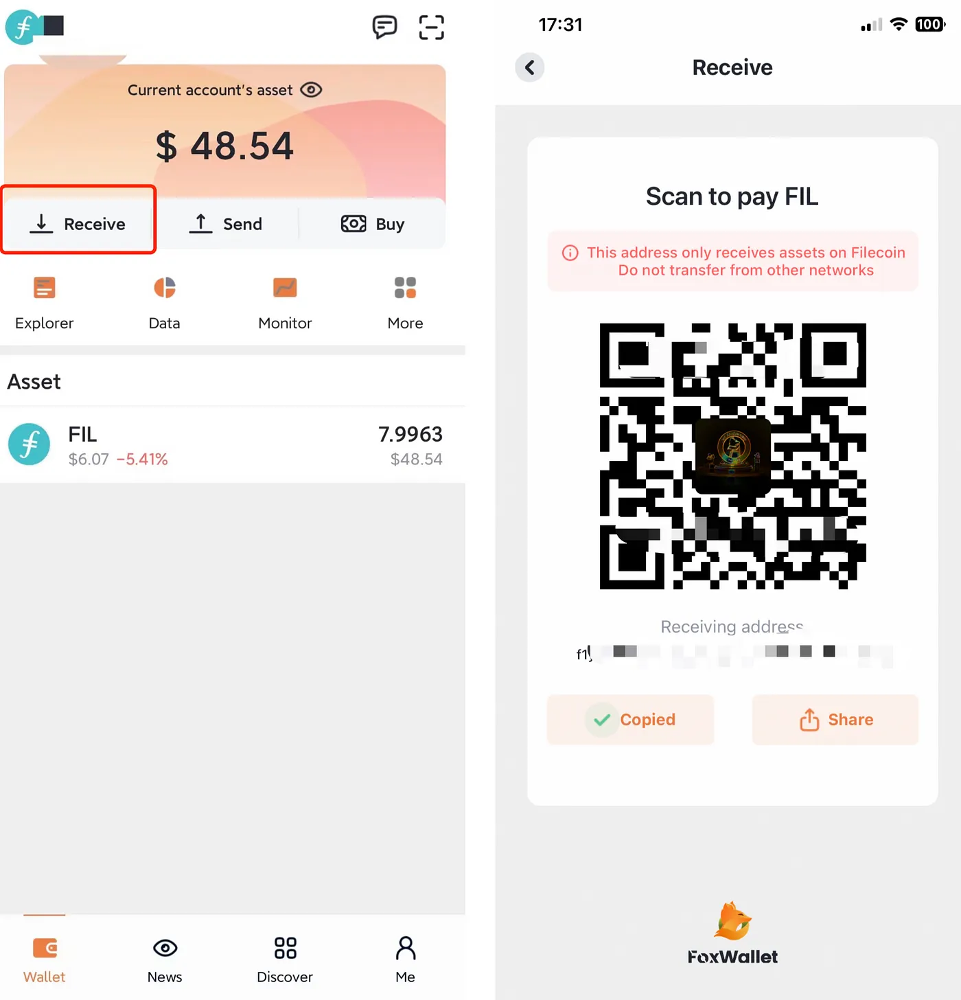
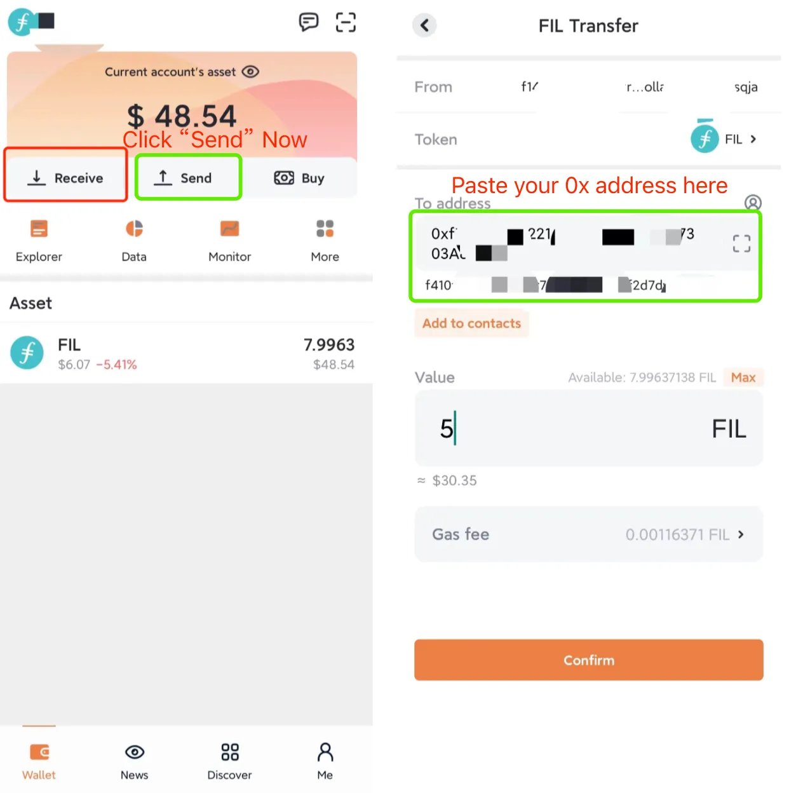

Through the built-in FilFowarder secured by Filcoin, [FoxWallet](https://foxwallet.com) provides an easy and reliable transaction experience for the end users. 
This guide shows you how to transfer FIL via Foxwallet.

## Configure FoxWallet
1. Create or import a wallet after [downloading FoxWallet](https://foxwallet.com/download).
2. In "Me" — "Networks", you can find `Filecoin` and `Filecoin EVM` out there. The `Filecoin` network uses the `f-style` address, while `Filecoin EVM` uses the Ethereum-style `0x` address.

## Transfer 
1. Go to the "Wallet" page. Choose `Filecoin` network.
2. Click "Receive" to get your `f-style` address. FIL can be transferred to this address via exchange withdrawals, or other tools that support `f1` address. 

    
3. Switch to the `Filecoin EVM` network. Click "Receive" to get your Ethereum-style `0x` address, copy it.
4. Back to the `Filecoin` network in FoxWallet. Click "Send" and paste your Ethereum-style `0x` address in the blank. The corresponding `f4` address will be displayed in FoxWallet.

    
5. Input the amount of FIL you’d like to transfer and then click "Confirm", check out your account later.
6. Reverse the steps 2,3,4 if you would like to transfer FIL from `0x(f4)` to `f1`. 

