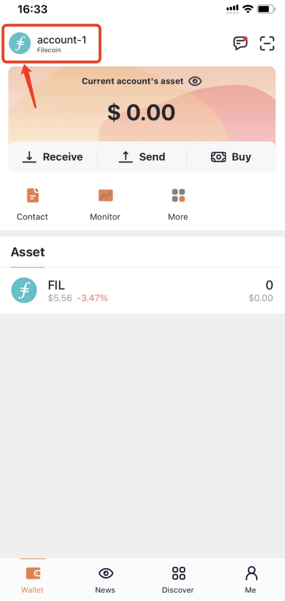
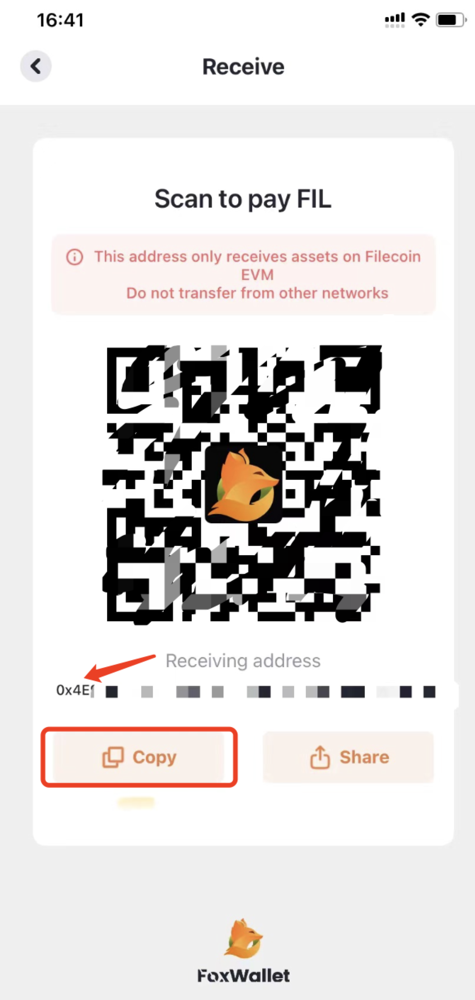
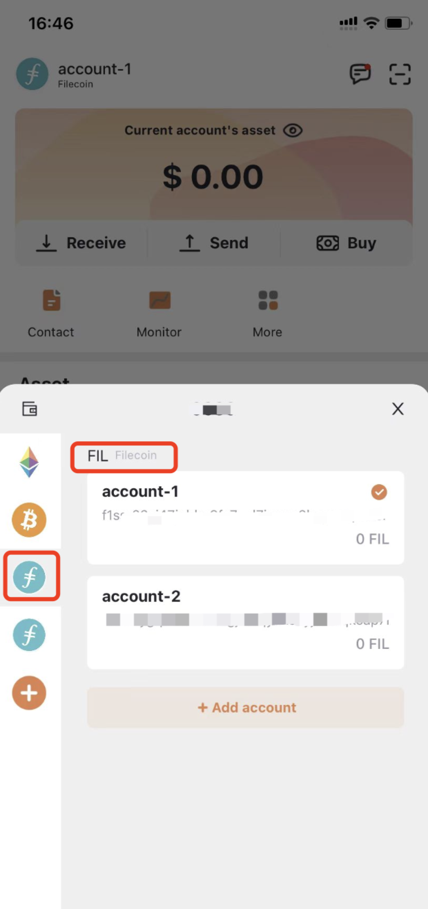
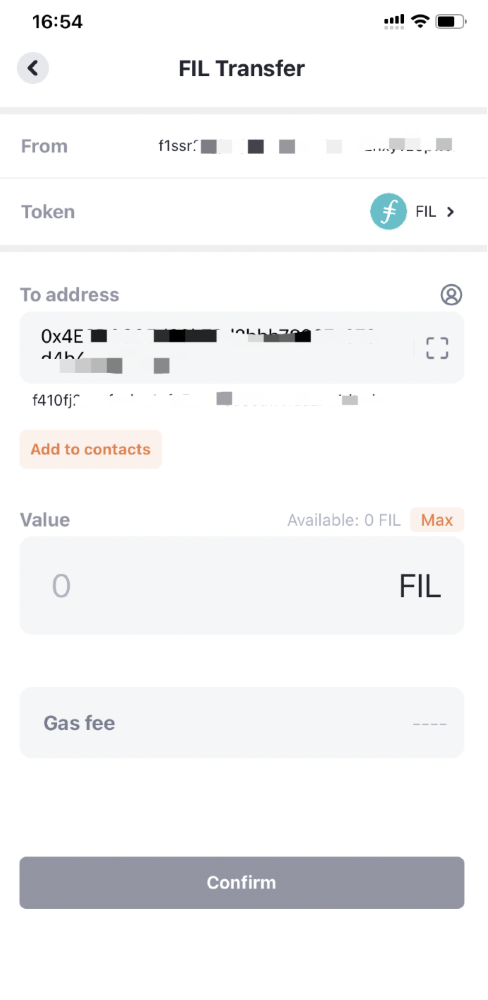
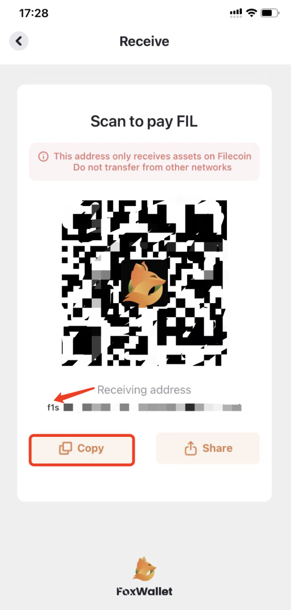
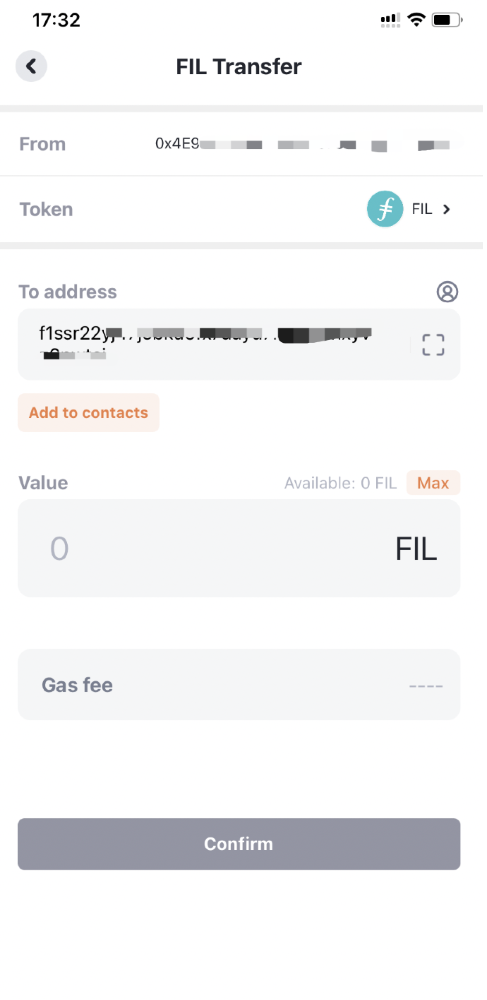

FoxWallet uses Filecoin's built-in [FilFowarder](), a smart contract that lets users transfer FIL from an Ethereum-based `f4` address to a Filecoin address of a different type, in the backend. This guide shows you how to transfer FIL between the two types of addresses via Foxwallet.

## Setup and configuration
1. [Download FoxWallet](https://foxwallet.com/download) 
1. Open the FoxWallet application.
1. For the purpose of this tutorial, we will save the steps in creating/importorting a wallet in the link [here](https://hc.foxwallet.com/docs/basic/create-wallet)

## Transfer from f1 to f4 
1. In "Me" — "Networks", you can find `Filecoin` and `Filecoin EVM` out there. The `Filecoin` network uses the `f1` address, while `Filecoin EVM` uses the Ethereum-style `0x` address. Select these two networks.

    

1. Go to the "Wallet" page. Tap the switch icon on the top left corner and choose `Filecoin EVM` network.

    

1. Click `Receive` to get your Ethereum-style `0x` address, copy it.

    

1. Switch to `Filecoin` network.

    

1. Click `Send` and paste the `0x` address you just copied in the blank under `To address`. The corresponding `f4` address will be displayed underneath automatically.

    

1. Input the amount of FIL you’d like to transfer and click `Confirm`, check out your account balance later.

## Transfer from f4 to f1
1. Go to the "Wallet" page. Tap the switch icon on the top left corner and choose `Filecoin` network.

    

1. Click `Receive` to get your `f1` address, copy it.

    

1. Switch to `Filecoin EVM` network.

    

1. Click `Send` and paste your `f1` address you just copied in the blank under `To address`. 

    

1. Input the amount of FIL you’d like to transfer and click `Confirm`, check out your account balance later.