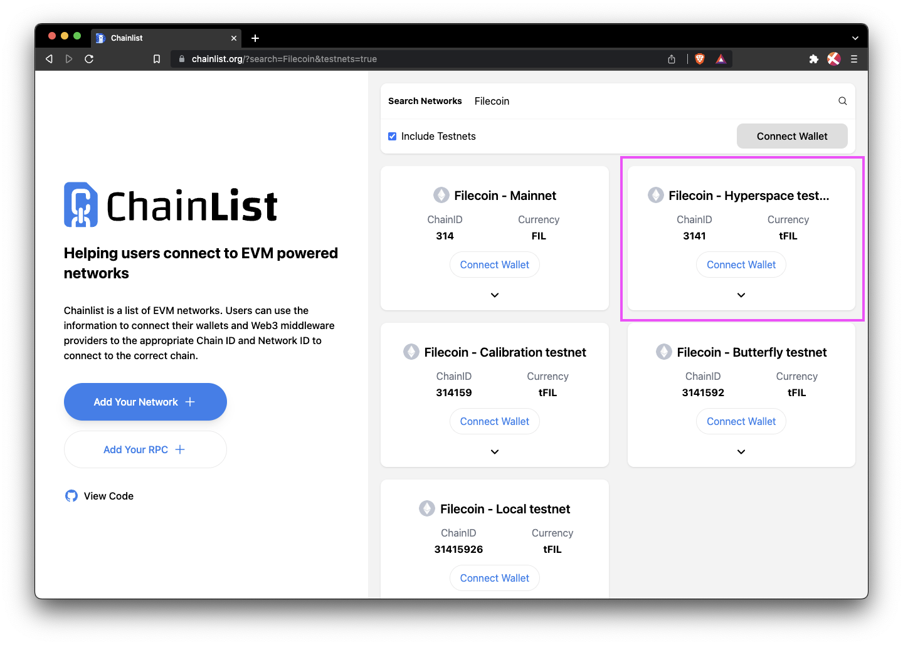
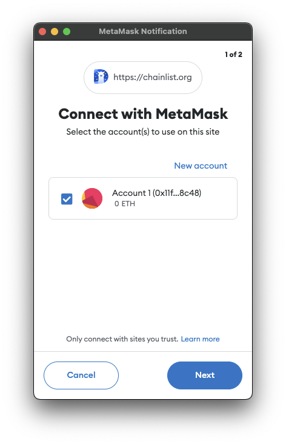
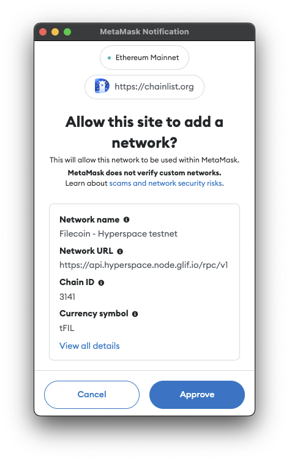
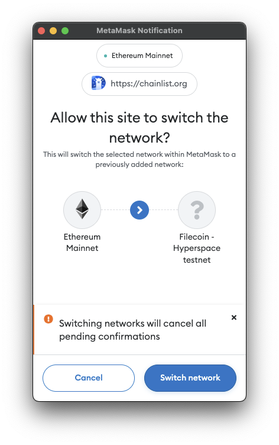
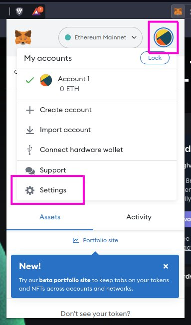

## Add to MetaMask

This guide shows you how to integrate the Filecoin network into MetaMask. This process is the same for mainnet, Hyperspace testnet, Calibration testnet, and a local testnet.

### Simple method

The easiest way to add a Filecoin testnet to your MetaMask is by using the pre-configured options at chainlist.org.

1. Go to [chainlist.org](https://chainlist.org/).
1. Enter `Filecoin` into the search bar. If you would like to connect to a testnet, enable the **Testnets** toggle:

    

1. Scroll down to find the network that you want to connect to:

    

1. In MetaMask, click **Next**.

    

1. Click **Connect**:

    

1. Click **Approve** when prompted to _Allow this site to add a network_:

    

1. Click **Switch network** when prompted by MetaMask:

    

1. Open MetaMask from the browser extensions tab:

    

1. You should see the Filecoin Hyperspace testnet listed at the top:

    

### Manual process

If you can't or don't want to use Chainlist, you can add the Hyperspace network to your MetaMask manually.

#### Prerequisites

Before we get started, you'll need the following:

- A [Chromium-based browser](https://en.wikipedia.org/wiki/Chromium_web_browser#Browsers_based_on_Chromium), or [Firefox](https://www.mozilla.org/en-CA/firefox/products/).
- A browser with [MetaMask](https://metamask.io/) installed.

#### Steps

The process for integrating Filecoin into MetaMask is fairly simple but has some very specific variables that you must copy exactly.

1. Open your browser and open the MetaMask plugin. If you haven't opened the MetaMask plugin before, you'll be prompted to create a new wallet. Follow the prompts to create a wallet.
1. Click the user circle and select **Settings**:

    

1. Select **Networks**.
1. Click **Add a network**.
1. Scroll down and click **Add a network manually**.
1. Enter the following information into the fields:

    | Field | Value |
    | --- | --- |
    | Network name | `Filecoin Hyperspace testnet` |
    | New RPC URL | `https://api.hyperspace.node.glif.io/rpc/v1` |
    | Chain ID | `3141` |
    | Currency symbol | `tFIL` |

1. Pick one of the following block explorers, and enter the URL into the **Block explorer (optional)** field:

    - Glif Explorer: `https://explorer.glif.io/?network=hyperspace`
    - Filscan: `https://hyperspace.filscan.io/`

1. Review the values in the fields and click **Save**.
1. The Hyperspace testnet should now be shown in your MetaMask window.
1. Done!
