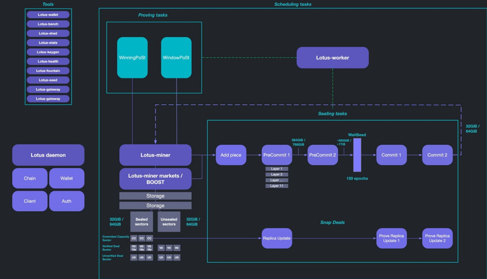

The diagram below shows the major components of Lotus:

[](lotus-components.png)

The following components, described on this page, are the most important to understand:

- [Lotus daemon]()
- [Lotus miner]()
- [Lotus worker]()

## Lotus daemon

The daemon is a key Lotus component that does the following:

- Syncs the chain
- Holds the wallets of the Storage Provider

The machine running the Lotus daemon must be continuously connection to the public internet for the Storage Provider to function. For information on connectivity requirements, see the [Lotus documentation](https://lotus.filecoin.io/storage-providers/setup/initialize/#connectivity-to-the-storage-provider). 

### Syncing the chain

Syncing the chain is a key role of the daemon. It syncs with the other nodes on the blockchain network by sending messages, which are in turn are collected into [blocks](https://docs.filecoin.io/reference/general/glossary/#block). Then, blocks are collected into [tipsets](https://docs.filecoin.io/reference/general/glossary/#tipset). Your Lotus daemon you then receives the messages on-chain. Due to the growth in the size of the chain since its genesis, it is not advised for Storage Providers to sync the entire history. Instead, use the available lightweight snapshots to import the most recent messages. One exception in which a provider would need to sync the entire chain would be to run a Blockchain Explorer like [Filfox](https://filfox.info).

The storage volume for the synced chain data should be an SSD at minimum, with NVMe recommended. A slow chain sync can lead to all kinds of unwanted effects in your Storage Provider setup. For instance, it can lead to delays in critical messages being sent on-chain from your Lotus miner, resulting in faulting of sectors and slashing of collateral.

Another important consideration is the size of the file system and available free space. Because the Filecoin chain grows every day<!--TODO STEF by how much, currently, and how big is it?-->, any available space will eventually fill up. Solutions like [SplitStore](https://lotus.filecoin.io/lotus/configure/splitstore/) and [compacting](https://lotus.filecoin.io/lotus/manage/chain-management/) reduce the storage space used by the chain <!--TODO STEF by what %-->.

### Holding wallets

Another key role of the Lotus Daemon is to host the Filecoin wallets that are required to run a Storage Provider setup. As a Storage Provider you will need a minimum of 2 wallets, an _owner wallet_ and a _worker wallet_. A 3rd type of wallet, the _control_ wallet, is required to scale your operations in a production environment and is described [here]().

To keep wallets safe, providers should consider physical access, network access, software security and making secure backups. As with any cryptocurrency wallet, access to the private key means access to your funds. Lotus supports [Ledger hardware wallets](https://lotus.filecoin.io/lotus/manage/ledger/), which are recommended for the owner wallet and the terminate wallet. The worker and control wallets can not be kept on a hardware device because Lotus requires frequent access to those types of wallets. For instance, depending on your setup, Lotus may require access to a worker or control wallet to send WindowsPoST proofs on-chain.


For information on how to view wallets and their funds, see [Helpful commands]().


For more information and instructions on integrating your Ledger device with Lotus, see the following video:


#### Control wallets

_Control wallets_ are required to scale your operations in a production environment. In production, just using the general worker wallet increases the risk of message congestion, resulting in delayed message delivery on-chain and potential sector faulting, slashing, or lost block rewards. Thus, it is recommended that providers create wallets for each subprocess. There are five different types of _control_ wallets that a storage provider can create:

- PoST wallet
- PreCommit wallet
- Commit wallet
- Publish Storage Deals wallet
- Terminate wallet

The PoST wallet is by far the most important wallet to split off from the main worker wallet for reasons explained in the next section.

## Lotus miner

The Lotus miner is the process that coordinates most of the Storage Provider activities. It has 3 main responsibilities:

- Storing sectors and data
- Scheduling jobs
- Proving the stored data

### Storing sectors and data

Storage Providers on the Filecoin network store [_sectors_](). There are two types of sectors that a provider may store:

- _Sealed sectors_, which may or may not actually contain data, but for which the provider is rewarded for capacity provided to the network. 
- _Unsealed sectors_, which are used when storing data deals, as retrievals happen from unsealed sectors.

Originally, the Lotus miner was the component with storage access. This resulted in miner hardware using internal disks, directly attached storage shelves like [JBODs](https://en.wikipedia.org/wiki/Non-RAID_drive_architectures#JBOD), Network-Attached-Storage (NAS), or a storage cluster. However, this design introduced a bottleneck on the Lotus miner.

More recently, Lotus has added a more scalable storage access solution in which workers can also be assigned storage access. This removes the bottleneck from the Lotus miner. Low-latency storage access is critical because of the impact on Storage Proving processes.


For information on how to check the storage configuration for your Lotus miner instance, see [Helpful commands]().


It is extremely important to keep a backups of:

- Sealed sectors
- Unsealed sectors
- The _sectorstore.json_ file  


For information on how to back up Lotus miner state, see [Helpful commands]().


The latter file, which lives under your storage path,is also required for restoration in the event of a failure. You can read more about the file in the [lotus docs](https://lotus.filecoin.io/storage-providers/seal-workers/seal-workers/#sector-storage-groups).

## Scheduling jobs

Another key responsibility of the Lotus Miner is the scheduling of jobs for the [sealing pipeline]() and Storage Proving.


For information on how to view scheduled jobs, see [View scheduled jobs](). For information on how to see the workers on which the miner can schedule jobs, see [View available workers]().


### Storage proving

One of the most important roles of the Lotus miner is the process by which [storage is proved](). Both the [WindowPoSt](https://docs.filecoin.io/reference/general/glossary/#window-proof-of-spacetime-windowpost) and [WinningPoSt](https://docs.filecoin.io/reference/general/glossary/#winning-proof-of-spacetime-winningpost) processes are usually handled by the Lotus miner. For scalability and reliability purposes, providers can also run these processes on dedicated servers (workers) instead of using the Lotus miner. 

The proving processes require low-latency access to sealed sectors. The proving challenge requires a GPU to run on. The resulting `zkProof` will be sent to the chain in a message. Messages must arrive within 30 minutes for WindowPoSt and 30 seconds for WinningPoSt. Thus, it is extremely important that providers properly size and configure the proving workers, whether they are using the Lotus miner <!--TODO STEF this whole section mixes names for software processes and hardware instances a lot - suggest reviewing the whole thing to disambiguate-->or separate workers. Additionally, dedicated wallets, described in [Control wallets](), should be set up for these processes. 

Always check if there are upcoming proving deadlines before halting any services for maintenance. For detailed instructions, refer to the [Lotus maintenance guide](https://lotus.filecoin.io/storage-providers/operate/maintenance/). 


For information on how to check if there are upcoming proving deadlines, see [Helpful commands]().


## Lotus worker

The Lotus worker is the 3rd important software component in the Lotus architecture. There can be - and most likely will be - multiple workers in a single Storage Provider setup. Assigning designated roles to each worker in the setup allows for scaling the setup for higher throughput, [sealing Rate]()) and improved redundancy.

As mentioned above, proving tasks can be assigned to dedicated workers, and workers can also get storage access.
The remaining worker tasks are running [Sealing Pipeline]() which is discussed in the next section.

## Helpful commands

The following commands can help Storage Providers with their setup.


### Backup Lotus miner state
It is also imperative to have at least a daily backup of your Lotus miner state. Backups can be made using the following command:

```shell
lotus-miner backup
```

### View wallets and funds

You can use the following command to view wallets and their funds:

```shell
lotus wallet list
```

### Check storage configuration

Run the following command to check the storage configuration for your Lotus miner instance:

```shell
lotus-miner storage list
```

This command return information on your _sealed space_ and your _scratch space_ (otherwise known as a cache) if you have properly configured your miner by following the steps described in the [Lotus documentation](https://lotus.filecoin.io/storage-providers/operate/custom-storage-layout/).

### View scheduled jobs 

To view the scheduled sealing, run:

```shell
lotus-miner sealing jobs
```

### View available workers

To see the workers on which the miner can schedule jobs, run:

```shell
lotus-miner sealing workers
```

### View proving deadlines

To check if there are upcoming proving deadlines, run:

```shell
lotus-miner proving deadlines
```

