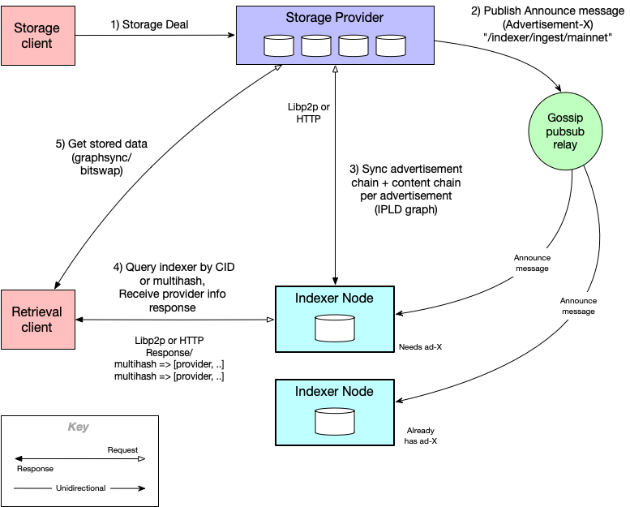

## What is a Network Indexer

A _Network Indexer_, also referred to as an _indexer node_ or _indexer_, maps content identifiers (CIDs) to records of who has the data and how to retrieve that data. These records are called _provider data records_. Indexers are built to scale in environments with massive amounts of data like the Filecoin network, and are also used by the IPFS network to located data. Because the Filecoin network stores so much data, clients can’t perform efficient retrieval without proper indexing; hence, indexer nodes work like a specialized key-value store for efficient retrieval of content-addressed data. for the following groups of users:

- _Storage providers_ advertise their available content by storing data in the indexer. This process is handled by the indexer's _ingest_ logic.
- _Retrieval clients_ query the indexer to determine which storage providers have the content, and what protocol to use (i.e. graphsync, bitswap, etc.). This process is handled by the indexer's _find_ logic.

## How does the Network Indexer work?

This diagram summarizes the different actors in the indexer ecosystem, and how they interact with each other:

For more info on how the indexer works, read this [blog post](https://filecoin.io/blog/posts/how-does-the-network-indexer-work/).

## IPNI and storage providers

Storage providers publish data to indexers so that clients can find that data using the CID or multihash of the content. <!-- TODO STEF is this like cid.contact? are there others? --> When a client queries the indexer using a CID or multihash, the indexer then responds to the client with the provider data record, which tells client where and how the content can be retrieved.

As a Storage Provider, you will need to run an indexer in your setup so that your clients know where and how to retrieve data. For more information on how to create an index provider, see the [IPNI documentation](https://github.com/ipni/storetheindex/blob/main/doc/creating-an-index-provider.md).
