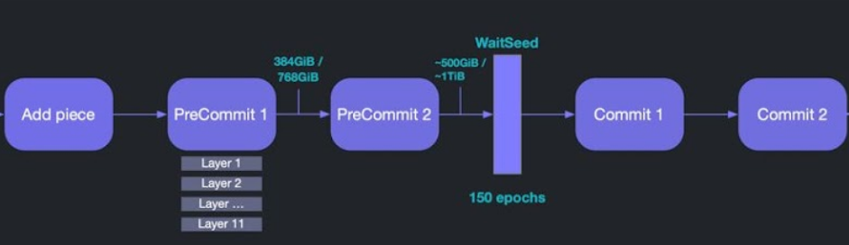

When you provide storage capacity to the Filecoin network (either as Committed Capacity or as Storage Deals), you need to create _sealed sectors_. Sealing is required convert the data sectors into a form which can provide the cryptographic proofs that demonstrate ongoing storage over time (Proof-of-SpaceTime). The process of sealing sectors goes through a series of steps which together form the _sealing pipeline_.

Having clear insights into the throughput you can expect from your sealing pipeline is crucial to consistently and efficiently onboarding data. Each step has different performance (memory, disk, cpu, gpu, etc) characteristics, and fine-tuning is required to align the different steps optimally. If you don't understand your expected throughput you may end up overloading your sealing pipeline, for example, by trying to seal too many sectors at once, or taking on a dataset which is too large for your infrastructure. We discuss [Sealing Rate]() in greater detail in the next chapter.

The sealing pipeline has the following tasks:

## AddPiece (AP)

The sealing pipeline starts with the AddPiece part. A Piece in Filecoin represents data in a prepared format. This is a CAR-file produced by an [IPLD DAG](https://ipld.io) with corresponding PayloadCID and PieceCID. A Piece can be any size up to the sector size (32 or 64GiB). If the content is larger than the sector size it must be split over multiple PieceCIDs during Data Preparation.

The AddPiece process takes the Piece and prepares it into the sealing scratch space for the next task (PC1) to take over.
AddPiece is not a very intensive process and only uses some CPU cores. It is typically colocated on a server with other processes of the sealing pipeline. Most logically it runs on the PC1-server, as PC1 is the next process to run.

## PreCommit 1 (PC1)

PreCommit 1 (PC1) is the most intensive process of the entire sealing pipeline. PC1 is the step in which a sector (regardless of whether it contains data or not) is cryptographically secured. The worker process loads cryptographic parameters from a cache location (which should be stored on enterprise NVMe). These parameters are then used to run PoRep SDR encoding against the sector that was put into the sealing scratch space. This task is single threaded and very CPU intensive and requires a CPU with SHA256 extensions. Typically this requires an AMD Epyc Milan/Rome or Intel Xeon Ice Lake of 32 cores or more.

The task will create 11 layers of the sector, using the scratch space. It is mandatory to have this scratch space on enterprise NVMe. This means every sector consumes 1+11 times its size on the scratch volume. This means for a 32GiB sector it takes 384GiB on the scratch volume, for a 64GiB sector that means 768GiB.

Additionaly the PC1 task requires 64GiB of memory per sector it seals.

In order to seal at a decent rate it, and to make use of all the sealing capacity in a PC1-server, you will run multiple PC1 processes in parallel on a system. More about this in the chapter on [Sealing Rate](). Sealing multiple sectors multiplies the requirements on CPU cores, RAM and scratch space by the amount of sectors done in parallel.

Even on enterprise hardware the process of sealing one 32GiB sector takes around **3 hours**.

## PreCommit 2 (PC2)

When PC1 has completed on a given sector, the entire scratch space for that sector (384GiB or 768GiB depending on the sector size) is moved over to the PC2 task. This task is typically executed on a different server than the PC1-server because it behaves differently.

The PC2 task uses the Poseidon hashing algorithm over the Merkle Tree DAG that was created in PC1. In short: PC2 validates PC1.

Where PC1 is very CPU-bound, PC2 is executed on GPU. This task is also notably shorter than PC1. PC2 typically runs for 10-20 minutes on a capable GPU. This requires a GPU of 24+GB memory and 8000+ CUDA cores / shading units (in case of NVIDIA). Slower GPU's are possible but might create a bottleneck in the sealing pipeline.

In case of a [Snap Deal]() an existing CC sector is filled with data. The PC1-task does not run again but the snapping process employs the PC2 task to add the data to the sector.

When PC2 is done for a sector, a "precommit" message is posted on-chain. Lotus will batch these messages to avoid sending messages to the chain for every single sector. Next to batching there is a configured timeout interval (24h by default) after which the message will be sent on-chain. These configuration parameters are found in the `.lotusminer/config.toml` file.

If you want to force the precommit-message on-chain (for testing purposes for instance), run:

    lotus-miner sectors batching precommit --publish-now

The sealed sector and its 11 layers are kept on the scratch volume until Commit 2 is complete.
<!-- to be verified with Angelo-->

## WaitSeed

WaitSeed is not an actual task that is executed but it is a step in the sealing pipeline. The blockchain forces the pipeline to wait for 150 epochs (with 30 second epochs this means 75 minutes) as a built-in security mechanism.

## Commit 1 (C1)

The Commit 1 (C1) phase is an intermediate phase that performs preparation necessary to generate a proof. It is CPU-bound and typically completes in seconds. It makes most sense to run this process on the server where PC2 was run.

## Commit 2 (C2)

The last and final step in the sealing pipeline is Commit 2 (C2). This phase involves the creation of a zkSNARK proof. This task is again GPU-bound and therefore best colocated with the PC2 task.

Finally the proof is committed on-chain in a message. As with the precommit messages, the commit messages are also batched and held for 24h by default before committing on-chain to avoid sending messages for each and every sector. You can again avoid this batching/waiting by running:

    lotus-miner sectors batching commit --publish-now

Finally the sealed sector is stored on the miner's long-term storage space, along with unsealed sectors which are required for retrievals (if configured to do so).
