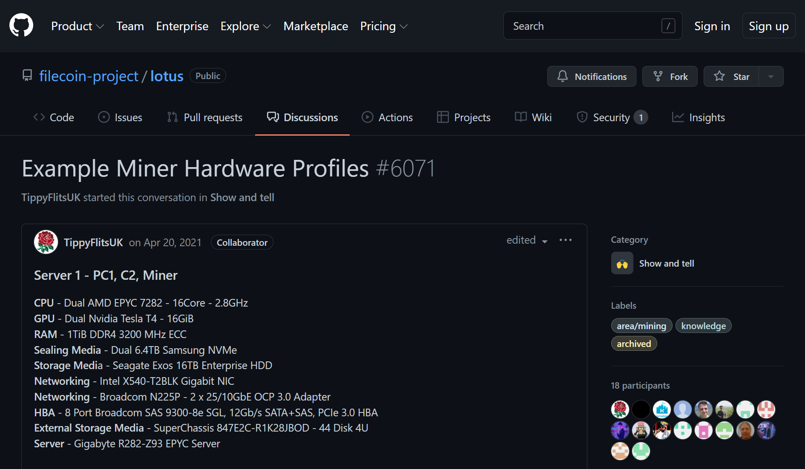
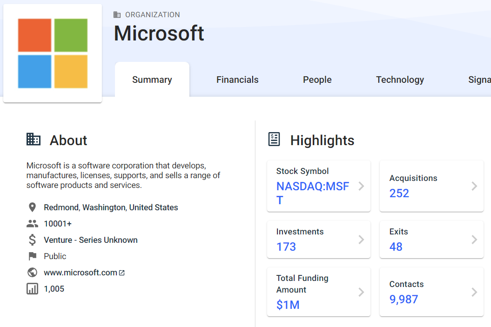

## Community suggestions 

Hardware requirements and architecture suggestions constantly evolve based on market demands and available hardware. Because of this, we aren't listing any recommendations or examples on this page. Instead, look at the [Example Miner Hardware Profiles](https://github.com/filecoin-project/lotus/discussions/6071) in the Lotus project GitHub discussions.

This discussion is ongoing and frequently updated with the new recommendation from community storage providers.

## Solo storage providing

Please take a look at the presentation Benjamin Hoejsbo gave where they examine solo storage provider setups.




We are working to improve this section. If you would like to share your mining setup, please create an issue in the [Filecoin Docs Github repository](https://github.com/filecoin-project/filecoin-docs/issues)!


