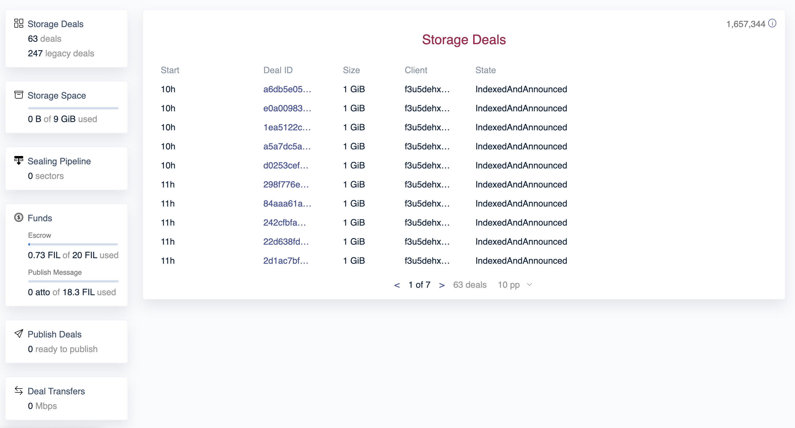

## Make storage deals with HTTP data transfer

Boost supports multiple options for data transfer when making storage deals, including HTTP. Clients can host their CAR file on an HTTP server, such as S3, and provide that URL when proposing the storage deal. Once accepted, Boost will automatically fetch the CAR file from the specified URL.

See [Getting started as a client]() for more details.

## Web UI

Boost comes with a web interface that can be used to manage deals, watch disk usage, monitor funds, adjust settings and more.

## Backwards compatibility with go-fil-markets package

Boost supports the same endpoints as `go-fil-markets` package for making storage and retrieval deals, getting the storage and retrieval ask, and getting the status of ongoing deals. This ensures that clients running lotus can make deals with Storage Providers running boost.

## A client for proposing deals that doesn't require a Lotus node

Boost comes with a client that can be used to make storage deals, and can be configured to point at a public Filecoin API endpoint. That means clients don't need to run a Filecoin node or sync from chain.

See [Getting started as a client]() for more details.
