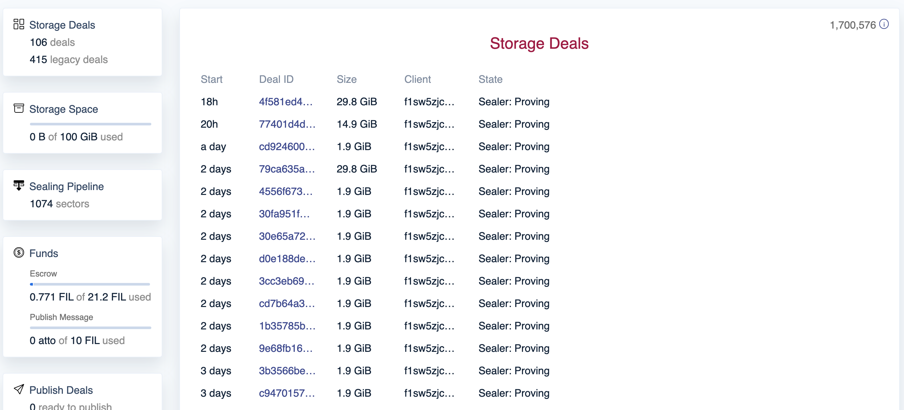
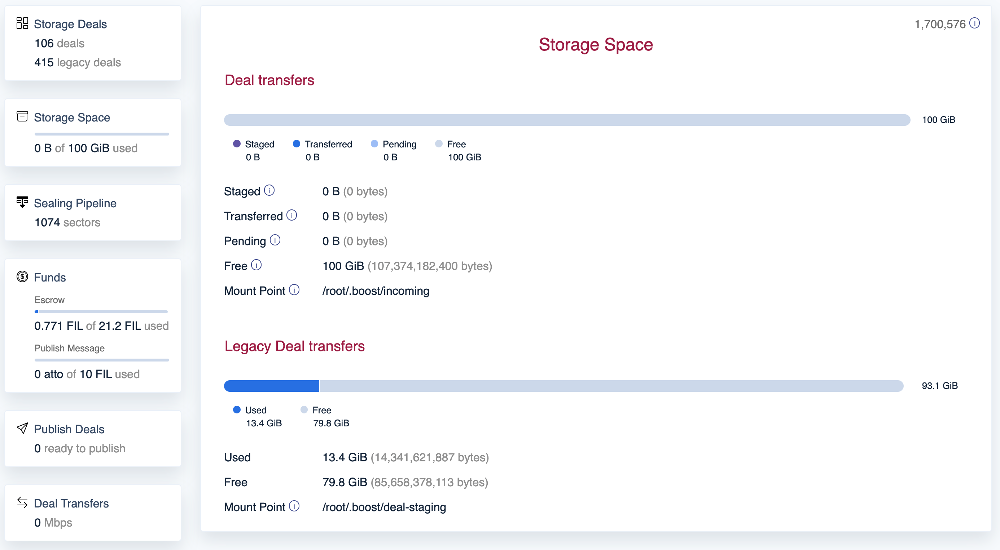
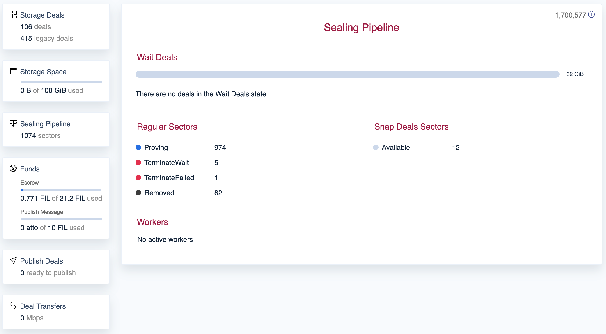

Boost exposes libp2p interfaces for making storage and retrieval deals, a web interface for managing storage deals, and a GraphQL interface for accessing and updating real-time deal information.

