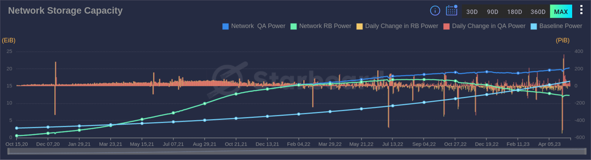
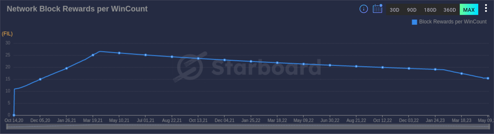

## Storage Capacity

The Filecoin network is composed of storage providers who offer capacity to the network. This capacity is used to secure the network as it takes a significant amount of storage to take part in the consensus mechanism. This large capacity makes is impossible for a single party to reach 51% of the network power. It is therefore important that the raw capacity (also referred to as "Raw Byte Power") remains high. The Filecoin spec also included a "baseline power" above which the network yields maximum returns for the storage providers.

The graph below shows the evolution of network capacity on the Filecoin network. As can be seen, the baseline power goes up over time (and becomes exponential). This means from May 2021 till February 2023 the network has yielded maximum returns for storage providers. In recent history however Quality Adjusted Power (QAP) took over as a leading indicator for relevance of the Filecoin network. QAP is the result of the multiplier when storing verified deals.

Check out the Starboard dashboard for the most up-to-date [Network Storage Capacity](https://dashboard.starboard.ventures/capacity-services#network-storage-capacity).

## Storage Economics

### Block Rewards

As mentioned before, when the Raw Byte Power is above the Baseline Power, storage providers yield maximum returns. When building a business plan as a storage provider, it is important not to solely rely on block rewards however. Block rewards are an incentive mechanism for storage providers. They are however volatile and depending on the state of the network, which is largely beyond the control of storage providers.

The amount of FIL that is flowing to the storage provider per earned block reward, is based on a combination of simple minting and baseline minting. Simple minting is the minimum amount of FIL any block will always have, which is 5.5. Baseline minting is the extra FIL on top of the 5.5 that comes from how close the Raw Byte Power is to the Baseline Power.

The below graph shows the evolution of FIL per block reward over time.

There is a positive side to releasing less FIL per block reward too. As Filecoin has a capped maximum token supply of 2 billion FIL, the slower minting rate allows for minting over a longer period. A lower circulating supply also has a potential positive effect on the price of FIL.

See the [Crypto Economics]() page of this documentation and the [Filecoin spec](https://spec.filecoin.io/#section-systems.filecoin_token.minting_model) for more information.
### Commit Pledge

### Gas fees